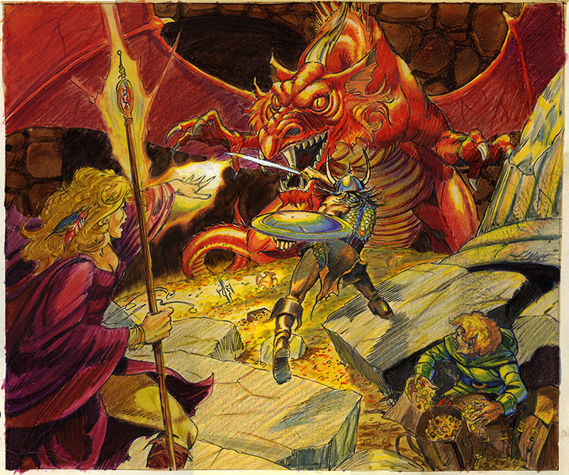

###### top
### Welcome to

# My Dungeons & Dragons Page!

##### My Goals

The following are my goals for these documents and how I hope they will improve the D&D games that I DM, in order of priority:
1. Answer player questions about **how I'll (try to) run the game** and adjudicate character actions as Dungeon Master.
1. Give players the **formal information** they need to make interesting and useful decisions, and to predict the consequences of their characters' actions.
1. Let players take the initiative in figuring out what options are available to their characters.
1. Flesh out **non-combat** parts of the game.
1. Generate tradeoffs and **interesting decisions** during gameplay.
    1. Use dice and risk to make sure that decisions don't have a straightforward "correct answer" despite being analyzable.
    1. Use ability checks and bonuses so that players get to take advantage of their characters' particular talents and strengths.
1. Make the game world more consistent and **reliable**.
1. Make combat more strategically interesting.
1. Come up with more interesting alternatives to replace random and arbitrary character deaths.
1. Share the responsibility of maintaining the game rules and world with the other participants.

Some outcomes I **don't** want:
1. Filling D&D with tedium simply because I like formal rules.
1. Spending a lot of time worrying about if rules are being correctly followed.
1. Simulating activities that exist in the real world simply for verisimilitude, and not because I expect them to be fun and interesting to play with in D&D.

# _Inspiration_ for everyone in the party!

Major thank yous to [Sly Flourish](https://slyflourish.com/) and [The Alexandrian](https://thealexandrian.net/gamemastery-101) for their thoughtful, and _extensive_, writing on the topic of running D&D games. I **enthusiastically** recommend Sly Flourish's _Return of the Lazy Dungeon Master_ book.

Thank you to [DM David](https://dmdavid.com/) for his many stories about the history of D&D and TTRPGs, along with his practical writing from his experiences being a DM.

Thank you to my GM, Doug, and Goodman Games for [_Dungeon Crawl Classics_](https://goodman-games.com/dungeon-crawl-classics-rpg/), which wonderfully depicts the brutal and cold reality of what a world would actually be like if it contained things like dungeons and dragons.

Thanks to Sage LaTorra and Adam Koebel for [_Dungeon World_](https://dungeon-world.com/), and Evil Hat Productions for [_FATE_](https://www.evilhat.com/home/fate-core/).

Thank you to WotC and everyone else who's worked on D&D or other TTRPGs for the years of fun, and thank you to the 5th edition D&D team, which I believe has successfully created a clean and elegant foundation of rules for DMs to build on and tell stories with.

Thank __you__ for reading, and I hope you have tons of fun playing whatever kind of D&D you want!

# 5th Edition Dungeons & Dragons

[My 5e Quick Rules Reference](homebrew/5e_reference.md#top)

[The Subtle Elegance of Fifth Edition D&D's Ability Checks](homebrew/5e_ability_checks.md#top)

[The Incredible Power in the Nine Sublime Pages of _Player's Handbook_ Chapter Eight](homebrew/5e_phb_chapter_eight.md#top)

[My Preferred 5e Optional and Homebrew Rules](homebrew/5e_homebrew.md#top). Check out some ways to trick out 5e!

[Welcome to _**The Adventurer's League!**_](homebrew/adventurers_league.md#top)

## Tomb of Annihilation

- [Documents for the Players](tomb_of_annihilation/player_notes/README.md#top)

- [Documents for the Dungeon Master](tomb_of_annihilation/dm_notes/README.md#top)

## Drafts and Misc

- [Some encumbrance rules](tomb_of_annihilation/player_notes/encumbrance.md#top)
- [Some initiative rules](homebrew/initiative.md#top)

---

[Back to top](#top)

