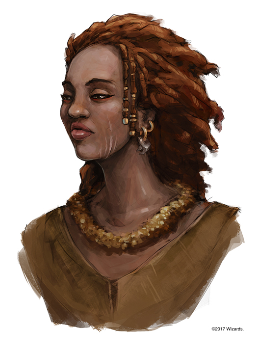

###### top

# DM Spoilers!
Port Nyanzaru character notes.

# Volothamp Geddarm

Janitor Ahti from Control:
- Incomprehensible metaphors about animals and monsters.
- Bizarre, inconsistent accent.
- "Jahaa, jaa-a, you think there's a dog buried in this?"
- "Hey, girl. For a Finn, holiday is holy, perkele!"
- "There be work for the axe, take them behind the sauna, jumalauta."
- "Yippii, saatana. It happened in the last drop."
- "Very well, I'll hit the facts on the table."
- "You better go now, so you don't have to run with your head as your third leg."

## Port Nyanzaru

# Syndra Silvane
Jane from Deadwood:
- Shy and meek, overcompensates with loudness.
- Noticeable accent.

# Lerek Dashlynd

Al Swearengen from Deadwood:
- Knows he's the top dog, expects everyone else to know it.
- Doesn't need to brag because of #1.
- Prying, paranoid.

Location:
- Meets associates in a small tavern named the Yawning Tortle.
- market ward
- Style and decor evokes Waterdeep, many (though not all) patrons speak with Whaterdhavian accents.
  
# Grandfather Zitembe

Reverend from Deadwood:
- Intense, flowery language.
- Takes an intense interest in one individual.

Location:
- Temple of Savras
- Merchant's ward

# Mother of Prosperity Sibonsensi

Max from Black Sails:
- Charismatic: warm, pleasant, inviting.
- Careful, worried about her position.

Location:
- Hall of Gold
- market ward

# Harbormaster Zindar

Location:
- Harbor ward
- Casting spells as part of his harbormaster duties
- For an isolated spot Zindar goes out to the end of the docks, where you can see the whole harbor and the statue of Na N'buso.

# K'lahu
Female bookie at the Executioner's Run.

> Help Wanted: Needs help collecting a 500gp debt from Taban the human gladiator. Pay is 10% of whatever is collected.

# Rokah
Male Zhentarim rogue

The Sleeping Dog tavern in the Tiryki Anchorage.

> Help Wanted: Needs someone to take him to Fort Beluarian and then create a distraction while he searches Liara Portyr's chambers.

# Undril Silvertusk
LG female half-orc priest of Torm works for the Order of the Guantlet

Topaz Yklwa Inn and Tavern, in the Old City. (topaz is orange)

> Help Wanted: Needs someone to escort her and her dispatches up the river Soshenstar to Camp Vengeance.

# Inete
Female acolyte of Savras, under Grandfather Zitembe.

Home outside the temple of Savras.

> Help Wanted: Inete has had visions of red-robed wizards working in the Aldani Basic. She's looking for a party that she can accompany to investigate.

# Eshek
Male acolyte of Savras.

- Stumbles on the party in a trance and whispers "speak to the wise guardian of Orolunga, east of Mbala. She can direct you to what you seek."
- Collapses, then has no memory of the past 12 hours except that he desperately needed to find people matching the Party's description.

# Xandala
- Psuedodragon named Summerwise.
- 

> Help Wanted: Find Artus Cimber

# Artus Cimber and Dragonbait

# Omala
Male master colorist in the dyeworks

# Belym and Draza
Two male commoners.

> Help Wanted: Draza is sentenced to die in the Executioner's Run, Belym begs someone to intervene.

## Merchant Princes

# Watanga O'tamu

E.B. Farnum from Deadwood:
- Prying for opportunities or useful information.
- Always excusing himself to wander off.
- Always offering useless help.

Owns:
- has a wizard's journal about Vorn

Villa:
- Continual flame spells and soft music is always playing
- Arcane locks on private chambers
- Swords are mounted on the walls, and various swords and rugs are secretly animated objects.

# Ekene-Afa

Personality:
- Expects others to brag.
- Explosive temper.
- DOESN'T LIKE SURPRISES.

Relationships:
- Husband Kura is a painter.
- Two teenage sons Soshen and Tiryk (city guard, dinosaur racer)

Villa:
- Ornate weapons and shields
- Framed paintings.
- Squawking parrots in gilded cages.

# Ifan Talro'a

Mr. Scott from Black Sails:
- Older, worried about the passions of youth.
- Knows his power is unstable, and he must be careful.

Relationships:
- Widower of ??? and their son ???, both lost when Mezro was destroyed.
- Ifan was travelling when Mezro was destroyed, and he never found his family's remains. He's afraid they've been transformed into undead.

Villa:
- Vases and relics from ancient Chultan cultures.
- Flying snakes

# Jessamine

Doctor Cochran from Deadwood:
- Quiet but emphatic.
- Straightforward when there's no need for deceit.
- Expects people to lie.
- Don't tell me my job.
 
Relationships:
- Daughter Ymezra
- Villa is decorated with serpent designs.

# Jobal

Jack Rackam from Black Sails:
- Nervous, talks too much.
- Always cooking up a scheme.

Relationships:
- Assistant is Aazon Talieri (Tethyrian)

Villa:
- silk draperies and tapestries
- mounted heads of beasts.

# Kwayothé

Personality:
- Calm and contemplative in a way that's vaguely menacing.

Eleanor Guthrie from Black Sails:
- Self-made woman.
- Proud of what she's accomplished, desperate to hold onto it.
- Hates people giving her instructions.

Relationships:
- Assistants: Ixis (f) and Indar (m)

Villa
- Reeks with scented perfumes
- Bowls of fresh fruit
- Burning oil lamps and braziers.

# Zhanthi

Cy Tolliver from Deadwood:
- Grinning, curious.
- Sophisticated and worldly.
- Rich, generous to buy friends.
- Don't take that tone with me.

Relationships:
- Ties with the Zhentarim.
- Doesn't trust the Flaming Fists.
- Her son Shago works as a guide for the Flaming Fists.

Villa:
- Standing suites of gold-plated armor
- Large potted plants.
- Bejeweled skulls of Zhanthi's ancestors

## Guides
# Azaka Stormfang

- Weretiger
- Acquantied with Saja N'baza
- Afraid of heights

> Help Wanted: Recover a stolen family heirloom from the pterafolk of Firefinger.

# Eku

- Disguised coatl
- Looking for adventurers to fight evil.
- Hates Nanny Pu'pu the hag at Mbala.
- Good terms with Kir Sabal.
- Numerous treks to Nangalore to gather flowers.
- Knows about the legendary oracle at Orolunga, recommends the players go there.

# Faroul and Gondolo

- Two incompetent dandies.
- Own a flatulent and slow racing Triceratops named Zongo.
- Have a map to Needle's Bones.
- Faroul is a Calishite human who brags of his battle prowess.
- Gondolo is a lightfoot halfling who fancies himself a poet, pugilist, and pilosopher. He'll make up important-sounding facts when he runs out of real ones.

> Help Wanted: Faroul and Gondolo want to get hired on as equal partners in an adventuring party, so they can investigate Needle's Bones and recover the dragon hoard there.

# Hew Hackinstone

- One-armed dwarf.
- Armor made from spatulate bones of dinosaurs, and worn with scarred by weapons, claws, and teeth.

> Help Wanted: Hew is seeking a party to return to Wyrmheart Mine and slay the red dragon there.

# Musharib

- Wooden maul named Skullbash.
- Tries to only talk to dwarven party members unless she has no choice.
- Tries to convince dwarven party members to retrieve Hrakhammar.

> Help Wanted: Musharib is looking for a party to retake Hrakhammar, or at least sneak in and retrieve Moradin's Guantlet.

# Qawasha and Kupalue

- Chultan Druid and vegepygmy
- They communicate with sign language
- Kupalee means "walking weed", and Qawasha refers to Kupalee as "weed"
- As a guide, Qawasha points out unique flora and fauna
- Recommends the party get a charter from the Flaming Fist

> Help Wanted: wants to rid the jungle of undead menace

# River Mist and Flask of Wine

.jpg)

- Tabaxi siblings who refer to each other as River and Flask
- Can guide to Firefinger and Dungrunghung
- Heard stories about an old woman in Mbala who can resurrect the dead into zombie bodies.

# Salida

- Spy
- Colorful insults and believable lies
- Tries to get hired on as a guide, warrior, or even laborer.

# Shago

- Son of Zhathi.
- Secretly loyal to the Flaming Fists.
- 

## Trickster Spirits
# I'jin

# Kubazan

# Moa

# Nangnang

# Obo'laka

# Papazotl

# Shagambi

# Unkh

# Wongo

---

[Back to top](#top)

