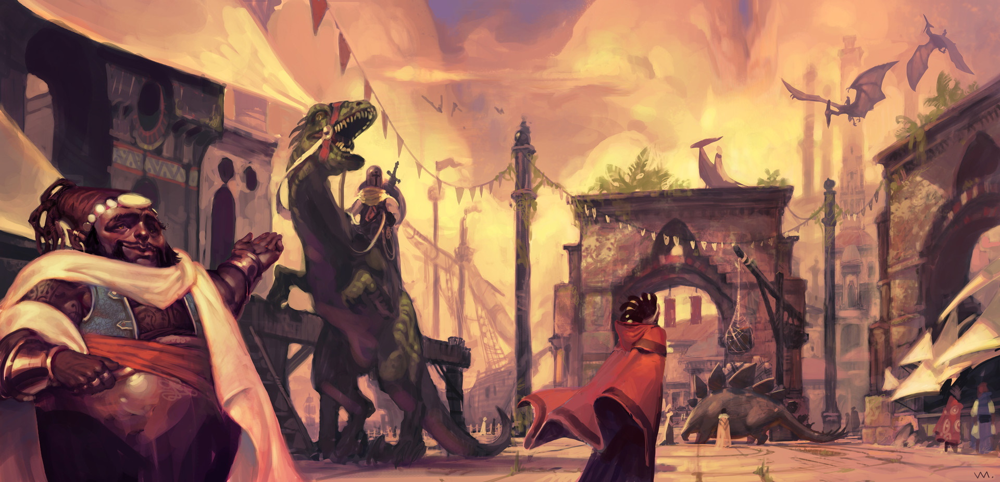
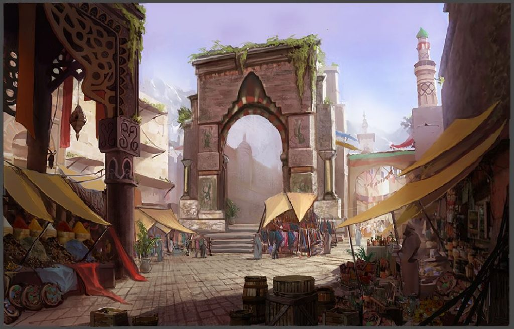
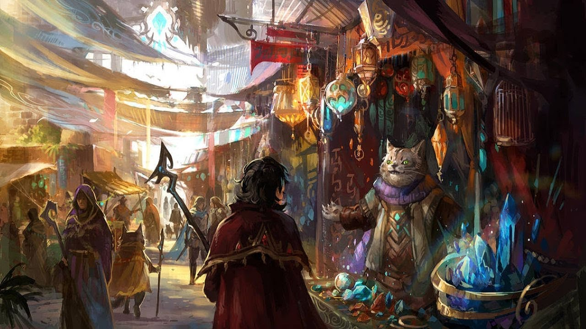
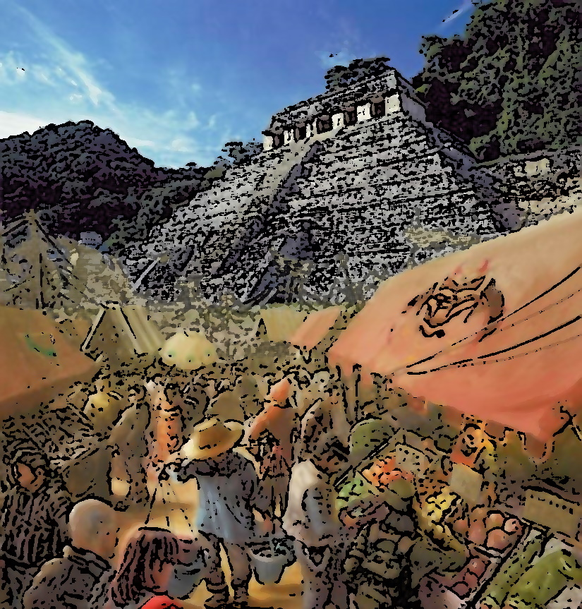
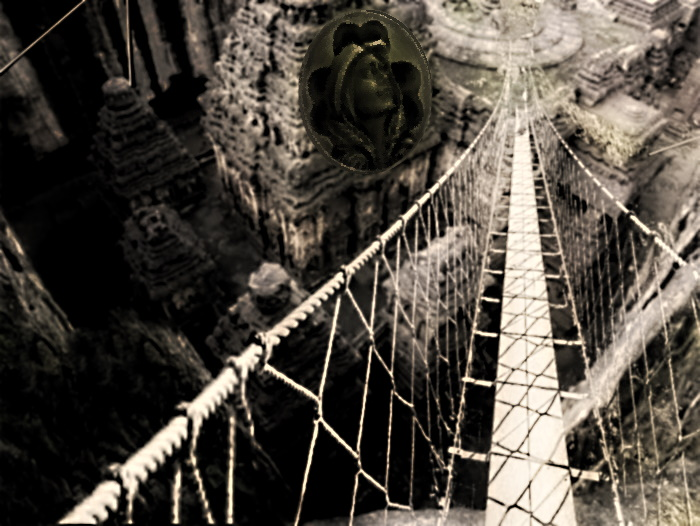

###### top

##### Tomb of Annihilation

# Welcome to **Port Nyanzaru**!

## Seven facts about Port Nyanzaru

1. Port Nyanzaru was a major trade hub for the nation of Amn until nine years ago, when the city's native merchant princes organized together and seized control of the city back from the foreign conquerer. Today a council of seven merchant princes rules over Port Nyanzaru, with each prince having a monopoly on certain kinds of trade.

2. A wide variety of dyes can be produced from materials in Chult, and Chultans dye both their clothes and buildings in bright colors. The city walls and guard towers are topped with colorful awnings to protect guards against the sun and rain.

3. Dinosaurs are used as beasts of burden throughout the city. Every tenth-day major streets are cleared for the immensely popular dinosaur races.

4. Port Nyanzaru is built to handle Chult's heavy rainfall and citizens ignore all but the worst storms. Rain catchers and waterwheels are visible on many buildings to make productive use of the rain. Immense rain gutters run along every street to prevent flooding.

5. Flowers and green plants sprout out of every crack and seam of the city's stone streets and buildings. Port Nyanzaru's residents must manage the plants to prevent damage to the city's structures, and a few abandoned buildings are collapsing under creeping vines and moss.

6. A gargantuan dragon turtle called [Aremag](dramatis_personae.md#aremag) patrols the Bay of Chult and demands treasure from ships that pass through while going to or from Port Nyanzaru.

7. In addition to trade from the Shining Sea and the Sea of Swords, the economy of Port Nyanzaru is based on mining, cutting lumber, hunting, and gathering rare materials from the jungle. Laborers living in hamlets and work camps in the jungle are in constant danger of being forced out by the undead and other dangers.

## Districts and Locations in Port Nyanzaru

# Harbor Ward
The harbor ward includes the extensive, and labyrinthine, cargo docks where ships load and unload trade goods, as well as the vast warehouses where those goods are stored. Port Nyanzaru is equipped to dock and deal with ships of any size, and traffic is constant during the day. Like many warehouse districts, at night the area is mostly abandoned and a fine place to meet in secret.

- An immense statue in the center of the harbor shows the ancient Chultan king [Na N'buso](dramatis_personae.md#na-nbuso) in full regalia.
- The harbor lighthouse.
- Fort Nyanzaru: guards the harbor entrance.
- The Royal Docks: restricted for the use of the merchant princes and their preferred guests.
- Dry docks for repairing ships.

---

# Market Ward

The market ward is where the majority of Port Nyanzaru's population lives. Parts of the market ward stay open all night, while other, more residential areas generally quiet down at night. The streets never become completely empty.

- _The Thundering Lizard Inn and Tavern_: for characters who want [a raucous time](Port_Nyanzaru_activities.md#port-nyanzaru-the-thundering-lizard-tavern). 1 electrum coin per night for a **poor lifestyle**.
- _Kaya's House of Repose_: for characters who want [a good night's sleep](Port_Nyanzaru_activities.md#port-nyanzaru-kayas-house-of-repose). 1 gold piece per night for a **modest lifestyle**.
- A district of [dyeworks](Port_Nyanzaru_activities.md#dyeing) where laborers work with rare and sometimes dangerous materials to produce dyes.
- A [public bathhouse](Port_Nyanzaru_activities.md#port-nyanzaru-public-baths-of-sune) run by worshippers of Sune.
- The [Grand Coliseum](Port_Nyanzaru_activities.md#port-nyanzaru-the-grand-coliseum), where violent gladiatorial games are held most afternoons.
- The __Red Bazaar__: an everyday [market](Port_Nyanzaru_activities.md#selling-loot-or-items) for Port Nyanzaru citizens. Famed for the large slabs of dinosaur meat available for sale.
- The __Hall of Gold__: a [temple](Port_Nyanzaru_activities.md#worshipping) to Waukeen, deity of trade and wealth. [Sibonseni](dramatis_personae.md#sibonseni-mother-of-prosperity), Mother of Prosperity, is the high priestess of the Hall of Gold, and the most important person in Port Nyanzaru besides the merchant princes.
- The Port Nyanzaru city fish market.

---

# Merchants' Ward
Port Nyanzaru's upper classes reside in the opulent merchants' ward. This area hosts the finest shops and the biggest market in the city during the day, while at night anyone trying to travel or do business in the district must submit to questioning by the numerous [Zhentarim](dramatis_personae.md#the-zhentarim) guard patrols.

- The mansions of the [merchant princes](Port_Nyanzaru_items.md#top).
- The Goldenthrone: palace and seat of Port Nyanzaru's government.
- The _**Grand Souk**_: the largest [market](Port_Nyanzaru_activities.md#selling-loot-or-items) in Port Nyanzaru, where international merchants come to trade.
- The **_Jewel Market_**: an exclusive and high-end market run by the merchant prince [Zhanthi](dramatis_personae.md#zhanthi) near the Grand Souk for the sale of jewelry, gems, [armor](Port_Nyanzaru_items.md#mundane-items), and [magic items](Port_Nyanzaru_activities.md#buying-a-magic-item).
- Temple of Gond, deity of artisans, craftspeople, and smiths.
- Temple of Savras, deity of divination and fate. [Grandfather Zitembe](dramatis_personae.md#grandfather-zitembe) is the high priest.
- Temple of Sune, deity of love and beauty. High priestess [Kwayothé](Port_Nyanzaru_items.md#kwayothé) is also a merchant prince, and controls all Port Nyanzaru trade in tej, wine, ale, fruit, oil, and perfume.

> _The Grand Souk in Port Nyanzaru's merchants' ward._

---

# Old City
The original Chultan city of Nyanzaru, which Amn conquered and expanded into the modern Port Nyanzaru. This section that was left outside the city walls has become a lower-class but still-respectable part of the city where many laborers live.

- The Beggars' Palaces: two massive stone ziggurats now crowded with newer construction.
- The [Executioner's Run](Port_Nyanzaru_activities.md#port-nyanzaru-the-executioners-run): a rectangular pit where criminals are sentenced to death via dinosaur. Visitors from all over the city come to watch.
- The city garbage dump.

---

_Velociraptors like those at the Executioner's Run._

---

# Tiryki Anchorage
A less-developed area outside the city walls, the Tiryki (tee-REE-kee) anchorage is home to "animal trainers, river folk, and [other](dramatis_personae.md#the-emerald-enclave) rough-and-tumble sorts", whatever that means. It's also where most of Port Nyanzaru's dinosaurs are kept in pens, either to rest after a day of working or in preparation for slaughter. Unlike Old City or Malar's Throat, there are no stone buildings to take shelter in outside the city walls: running for the Tiryki Gate is residents' only option when undead or other dangers come out of the jungle.

- Less developed (and less patrolled) docks are preferred by smugglers.
- Vast pens of dinosaurs, and many teams of dinosaur trainers, all under the authority of merchant prince [Ifan Talro'a](Port_Nyanzaru_items.md#ifan-talroa).

---

# Malar's Throat
People with nowhere else to go in Port Nyanzaru are eventually forced into Malar's Throat, the slum district outside the city walls.

Two deep, jungle-covered ridges flank a ravine filled with trash, which floods during heavy rains. Ramshackle housing is crammed into every available space on the ridges. Rope and bamboo bridges up to 200 feet long hang between them, allowing passage over the ravine. Pickpockets wait on the hanging bridges and use fishing lines to steal from victims.

- Temple of Tymora, goddess of good fortune.

# Further Reading

__Tomb of Annihilation__ [adventure introduction](introduction.md#top)

- Welcome to [Chult](introduction.md#welcome-to-chult)

[Inhabitants](chultans.md#top) of Chult

[Downtime activities](Port_Nyanzaru_activities.md#top) in Port Nyanzaru

[Items](Port_Nyanzaru_items.md#top) available in Port Nyanzaru

Tomb of Annihilation [homepage](README.md#top)

---

[Back to top](#top)

