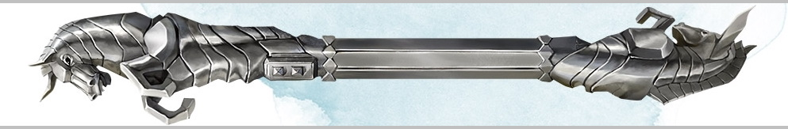

###### top

##### Tomb of Annihilation

# Short Rest Activities

During a [short rest](rules_for_short_rests.md#top), and at the very end of long rests, each character in the party may optionally choose a method to relax and recover. The character makes an ability check based on the method they've chosen. If they pass a **Moderate difficulty** then they also receive the bonus described in the table.

If a character rolling an ability check rolls a **Natural 1**, or their result fails to beat an **Easy difficulty**, then the character _fumbles_ and suffers the described setback.

> Any player who tells a story about their character's rest receives _Inspiration_ for that character, regardless of whether they make a check, or its result.

|Method|Ability|Proficiency|Bonus|Fumble|
|-|-|-|-|-|
|Attune a Magic Item|Intelligence|Arcana|Generally at least Moderate difficulty. Another character may assist you.|Some power or effect of the magic item is unleashed on the party.|
|Perform|Charisma|Perform|Every other party member gains Advantage on their short rest ability check.|Every other party member suffers Disadvantage on their check.|
|Chatting|Charisma|-|If you pass your check, roll a 1d4 for each of your character levels. Every _chatting_ character gains temporary hit points equal to the sum of all the chatting d4s.|The conversation turns into a shouting match and then sours, and every member of the party suffers Disadvantage on their rest roll, including characters that are _chatting_.|
|Healing|Wisdom|Medicine|One character of your choice gains advantage on their next saving throw.|Lose a charge from your medicine kit.|
|Drinking or Smoking|Constitution|_saving throw_|Each time you use up two of your own hit dice to heal during this rest, you may roll a third free hit die and gain stacking temporary hit points equal to the result. _You may use this bonus even if you fail or fumble your saving throw._|You are _poisoned_ for the hour following the rest. _You suffer this penalty unless your saving throw beats a Moderate difficulty._|
|Snacking|Constitution|Camping|Roll a 1d10 for each of your character levels, and gain that many temporary hit points.|You suffer disadvantage on your next initiative roll.|
|Polishing Arms and Armor|Dexterity|_proficiency with the items_|You gain 1d6 temporary hit points for each of your character levels.|You suffer disadvantage on your next initiative roll.|
|Stretching|Dexterity|Athletics or Acrobatics|You gain advantage on your next initiative roll.|You injure yourself and suffer disadvantage on your choice of either Dexterity ability checks or saving throws until your next long rest.|
|Blow Off Steam|Strength|Athletics or Acrobatics|You gain advantage on your next initiative roll.|You deal one successful, and non-crit, attack's worth of damage to one random party member, possibly yourself.|
|Meditation|Intelligence or Wisdom|Religion|You gain advantage on the next ability check or saving throw you roll that uses Intelligence, Wisdom, or Charisma.|You suffer disadvantage on the next saving throw or ability check you roll using Intelligence, Wisdom, or Charisma.|
|Gaming|_varies by gaming set_|_proficiency with the gaming set_|You gain advantage on your next initiative roll, **or** you gain the _Meditation_ bonus. If multiple characters play the same game together then the character(s) with the highest check result instead gains both advantages, each for their next **two** applicable rolls.|You suffer the _Meditation_ fumble.|
|Gambling|_varies by gaming set_|_proficiency with the gaming set_|Everyone gambling bets platinum coins until they all fold or stay. Roll three checks with bets in between, and the un-folded character with the highest sum of check results wins all the money.|You probably aren't winning that pot.|

[Back to top](#top)

[Rules for camping](rules_for_camping.md#top)

[Rules for travelling in the jungle](rules_for_travelling.md#top)

[Tomb of Annihilation homepage](README.md#top)

