###### top

##### Tomb of Annihilation

# Activities in Port Nyanzaru

While the party spends time in Port Nyanzaru, each character must spend coin daily to pay for food and lodging, and may choose how they spend their time each day.

For speed and simplicity plan the party's days a _tenday_ at a time.

#### Background Info
- [Welcome to Chult!](introduction.md#welcome-to-chult)
- [Welcome to Port Nyanzaru](Port_Nyanzaru.md#top)
- [Dramatis Personae](dramatis_personae.md#top)
- [Special items available for purchase in Port Nyanzaru](list_of_items_available_for_purchase_in_Port_Nyanzaru.md#top)
- [Coins in Port Nyanzaru](coinage.md#top)

#### Downtime day activities:
Common:
- [Working](#working)
- [Carousing](#carousing)
- [Healing](#healing)
- [Relaxing](#relaxing)
- [Gaming](#gaming)
- [Worshipping](#worshipping)

Useful:
- [Investigating](#investigating)
- [Casting a Ritual Spell](#casting-a-ritual-spell)
- [Buying and Selling](#buying-mundane-items)

Trouble:
- [Fighting](#fighting)
- [Dinosaur Racing](#dinosaur-racing)
- [Hunting Pirates](#hunting-pirates)
- [Sailing](#sailing)

Uncommon:
- [Training to Gain Experience Chunks](#sign-up-for-a-class-in-adventuring)
- [Retraining Class Options](#retraining)
- [Training with a Skill or Tool](#training-with-a-skill-or-tool)
- [Studying a New Language](#studying-a-language)
- [Teaching Another Character](#teaching-another-character)
- [Copying Spells into your Spellbook](#copying-spells-into-your-spellbook)
- [Developing Special Projects and Side Quests](#developing-relationships-investments-and-special-projects)

---

### Lifestyles
|Lifestyle|Activities Available|Expenses per Day|Potential Residences|
|-|-|-|-|
|Wretched|-|-|Sleeping in the Malar's Throat slums and consuming food and water from your inventory.|
|Squalid|-|1 silver coin|A shared room in the undeveloped Tiryki anchorage district.|
|Poor|*free while working*|1 electrum coin|A shared room in the ziggurats of the old city.|
||||A shared room at the _**Thundering Lizard Inn and Tavern**_ in the market ward.|
|Modest|Healing, Relaxing|1 gold coin|A shared room in the market ward or a private room in the old city.|
||||A private room at _**Kaya's House of Repose**_ in the market ward.|
|Comfortable|-|2 gold coins|A private room in the market ward.|
|Wealthy|Carousing|5 gold coins|A private residence in the market ward.|
|Aristocratic|-|at least 1 platinum coin|Residing in the merchants' ward as the guest of a merchant prince.|

[Districts and Locations in Port Nyanzaru](Port_Nyanzaru.md#top)

### Downtime Day Activities
For every __downtime day__ the party spends in Port Nyanzaru, each character may choose one of the following activities to spend their time on:

# Working
If nothing else strikes a character's fancy, they may work any trade or profession they know in order to maintain a **modest lifestyle for free**.

Out of each tenday spent working a character may choose **three days** they are off work without sacrificing their lifestyle. Alternatively, a character may work one or more of those days off to earn coin equal to their lifestyle's daily price.

> **Character Bonus:** If a character is a member of a guild, temple, or other professional organization in Port Nyanzaru, they can instead maintain a comfortable lifestyle when working.

### Port Nyanzaru: Street Performers

Street performers have a unique place in the hearts of Port Nyanzaru's citizens, and throughout the city one can find musicians, bards, dancers, magicians, Tabaxi minstrels, mimes, clowns, performers in dinosaur costumes, martial artists, and many others giving performances based upon native Chultan traditions, as well as a wide sampling from cultures across Faerûn.

> **Character Bonus:** A character proficient in Perform can maintain a wealthy lifestyle for free by working as a street performer.

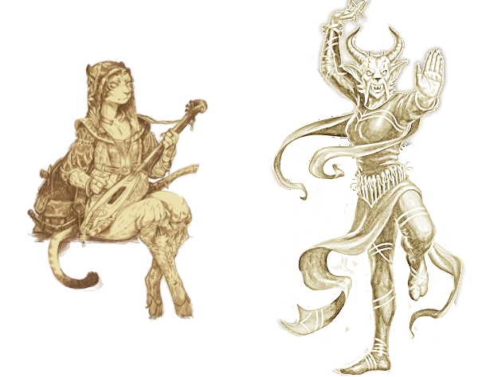

---

# Carousing
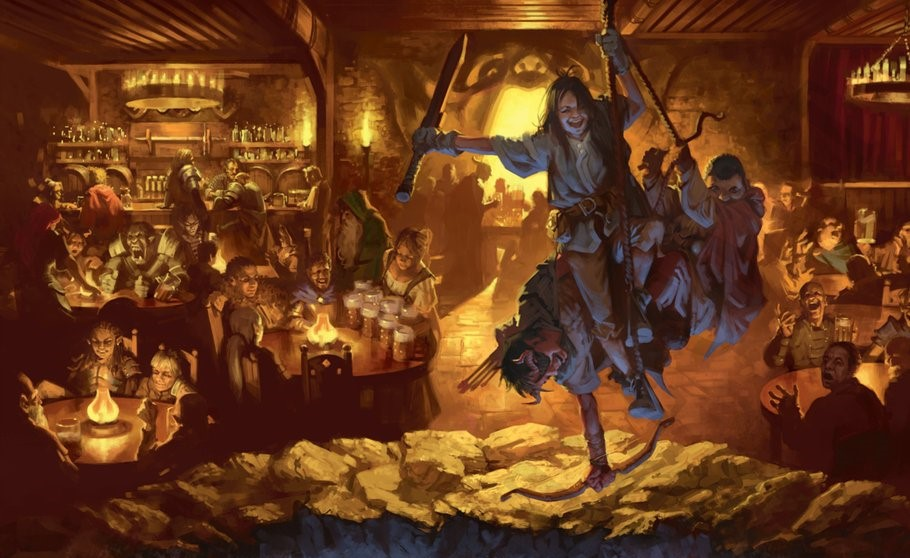

The reason adventurers go into ancient ruins and violently extract sacks full of gold is to make sure that they don't have to work, and may instead spend their downtime days partying late into the night at Port Nyanzaru's best taverns. Carousing requires that a character spend at least enough for a **wealthy lifestyle**, even if "Port Nyanzaru's best taverns" means dive bars in the Tiryki anchorage.

Carousing commonly involves **Charisma** ability checks, but often involves a variety of different ability checks as the day or night progresses.

### Port Nyanzaru: Dinosaur Races
Every **tenth-day** most of Port Nyanzaru gathers in the streets to watch the city's loud and spectacular [dinosaur races](#dinosaur-racing). The races last all day and the crowds are filled with music, vendors, bookies, and a variety of people from all the districts of the city and beyond. This is a _fantastic_ day to carouse.

### Port Nyanzaru: The Grand Coliseum
Most afternoons the Grand Coliseum in the market ward is open and hosting a variety of events. It's possible for a character to join as one of the gladiators [fighting](#fighting) in an event, or they may choose to carouse and spend an afternoon in the spectator stands watching the fights.

### Port Nyanzaru: The Executioner's Run

Outside the city walls in the Old City district is a rectangular pit, commonly called The Executioner's Run, that has been repurposed from an ancient sporting arena into a combat pit. Some varieties of petty legal disputes can be resolved here via trial by combat, and more serious criminals are sometimes sent here to be executed by a pack of velociraptors. Crowds from all over the city gather to watch the carnage from above. A character can try to get involved in the [fighting](#fighting), or they may carouse and spend the day watching the combats as part of the crowd.

### Port Nyanzaru: The Thundering Lizard Tavern
Syndra Silvane recommends the Thundering Lizard Inn for characters who are looking for "a raucous time". The inn's attached tavern faces the Red Bazaar in the market ward, and remains well-trafficked even during working hours; it's a fine place to carouse at any time of day.

---

# Healing
If a character that maintains **at least a modest lifestyle** spends their downtime days healing, after spending **at least three such days** they gain advantage on all saving throws and ability checks to resist or treat nonmagical diseases, poisons, exhaustion, and other health conditions. This includes treating both the character's own conditions and those of other characters.

### Port Nyanzaru: Kaya's House of Repose
Syndra Silvane recommends Kaya's House of Repose in the market ward for characters who are looking for a good night's rest. The inn is priced for a modest lifestyle and is in a residential section of the market ward, and Kaya strictly enforces quiet hours after sundown.

---

# Relaxing
Characters who are not ill might nonetheless take a day off from other activities in order to relax. A character might spend the day hanging out in a tavern, taking it easy at their Port Nyanzaru residence, visiting or corresponding with friends and family, or simply going out and exploring a location in the city with no particular end in mind.

A character that maintains **at least a modest lifestyle** and spends one downtime day relaxing gains the following benefits:
- **Inspiration** if that character doesn't already have it.
- Advantage on **ability checks, saving throws, and attack rolls** for that character's next **1d6** such rolls.

A character that spends additional days relaxing can reroll the 1d6 and keep the new result if it's higher, but they can't accumulate advantages beyond 6.

Characters that are relaxing while out and about in Port Nyanzaru are more likely to stumble across people and things in the city than characters that are in the city to accomplish something.

### Port Nyanzaru: Public Baths of Sune
Worshippers of Sune maintain the large public baths that can be found in the market ward of Port Nyanzaru. Citizens from every district come to enjoy these open-air baths, and despite the heavy traffic the city is justifiably proud of the cleanliness and quality of the baths. Giant rain catchers above the baths capture the daily rainfall of Chult for later use in refreshing the baths.

The baths are free but donations are requested, and expected by the citizens of Port Nyanzaru. The city's inhabitants are proud of their local institution and are generous in donating to the temple of Sune for the maintenance of the baths; even the poorest citizens make sure they bring at least a copper penny for the donation bin when they come to the baths.

Aside from the public baths of Sune, various private bathhouses can be found throughout Port Nyanzaru.

### Port Nyanzaru: The Thundering Lizard Tavern
A character doesn't necessarily need to expend the cost and energy needed to [carouse](#carousing) if they just want to spend the day hanging out in a place like the Thundering Lizard Tavern. Unlike when carousing, such characters avoid drawing attention to themselves, don't party with strangers, and try to stay out of any of fights that break out: if they do end up joining a fight then they spent their downtime day [fighting](#fighting) instead of relaxing.

You may be surprised to learn that, aside from the Thundering Lizard Tavern, taverns and other watering holes can be found throughout every district of Port Nyanzaru.

---

# Gaming
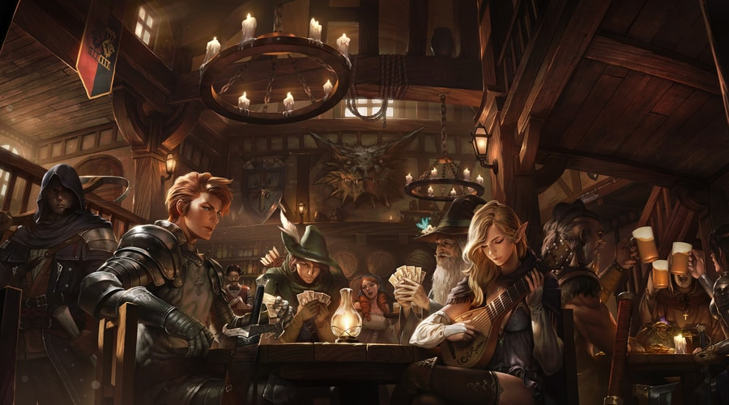

A character can spend their downtime day playing games and/or gambling. They might play cards at the Thundering Lizard, roll dice in an alley, or place bets while watching fights at one of Port Nyanzaru's [arenas](#fighting).

By default for **any game**, for each round of gaming or gambling a character will choose how much they want to risk, and have a simple **40% chance to win and receive double their risked coin back**, otherwise they lose it all. Characters who successfully cheat, bluff, or outplay their opponents can improve their odds.

A character that doesn't wish to gamble with coins may place bets to risk either gaining advantage or suffering disadvantage on their post-_gaming_ rolls, similar to [relaxing](#relaxing). A character may accumulate a maximum of 6 advantages or disadvantages from _gaming_ at a time.

> [**Yomi:**](http://www.sirlin.net/ptw-book/7-spies-of-the-mind) Regardless of whether they are gambling with coins or post-_gaming_ advantages, a character playing any __game of skill__ may place an optional bonus bet each round. Depending on their result, the character receives either advantage or disadvantage on their next rolls during their _gaming_ session, for a number of rolls equal to their bonus bet, up to a maximum of 6. Such advantages can't be used outside of _gaming_ activities: they can be held day-to-day while _gaming_ but are lost upon starting another activity.

##### Your fellow gamers
Characters trying to bet large sums of coin must make a **Charisma** ability check to find opponents willing to match their bets.

Getting involved in a game with someone in Port Nyanzaru, or spending an afternoon making bets with them at the dinosaur races, is often a good opportunity to meet or connect with them, or to get them drunk. Some people will want you to play to win, ruthlessly and to the best of your ability; others are only happy when they end up the winner.

Very few people tolerate cheaters, and _nobody_ likes unimpressive cheaters.

##### Your fellow tool fans
In 5e D&D a gaming set is considered to be a type of _tool_, and therefore a character must be _proficient_ with it to make ability checks proficiently while playing. Characters who aren't _proficient_ may play the game but are novices who don't yet completely understand the full rules and strategy of the game.

> **Character Bonus:** Since a gaming set is a _tool_, a character may [train to increase their proficiency bonus](#training-with-a-skill-or-tool) with a particular game. Additionally, many gamers are themselves tools.

|Game|Gaming Set Price|Gaming Set Weight|Description|
|-|-|-|-|
|Dice|1 silver coin|-|Beloved by people of all ages and cultures, but also the most common game of choice for gambling on the cheap.|
|Dragonchess|1 gold coin|1/2 lb.|A heavy game that involves contests of **Intelligence**.|
|Playing cards|1 electrum coin|-|Popular among explorers who often lack flat surfaces to roll dice on. Many card games involve contests of **Wisdom** that represent things such as: keeping track of the cards left in the deck, guessing at other players' hands, intuiting your odds for your next card draw, and, most importantly, dispassionately using that information to avoid being seduced by hot streaks, gambling fallacies, and gut feelings.|
|Three-Dragon Ante|1 gold coin|-|A bluffing game that involves contests of **Charisma**.|

##### Example ability checks related to gaming

|Ability|Two Example Tasks|
|-------|----------------|
|Strength|Win at a physical contest, such as arm wrestling or a running dash. Lift those heavy dragonchess pieces.|
|Dexterity|Cheat at cards or dice. Secretly modify or mark game pieces beforehand for a later advantage.|
|Constitution|Stay clear(ish)headed while drinking your opponent under the table. Play well while distracted by the noise, smell, and dust of dinosaur races.|
|**Intelligence**|**Analyze your opponent's strategy. Remember an obscure but advantageous rule.**|
|**Wisdom**|**Feel out your opponent's mood. Count cards. Detect a bluff.**|
|**Charisma**|**Distract your opponent. Extract information from someone while they're distracted by a game. Bluff.**|

# Worshipping

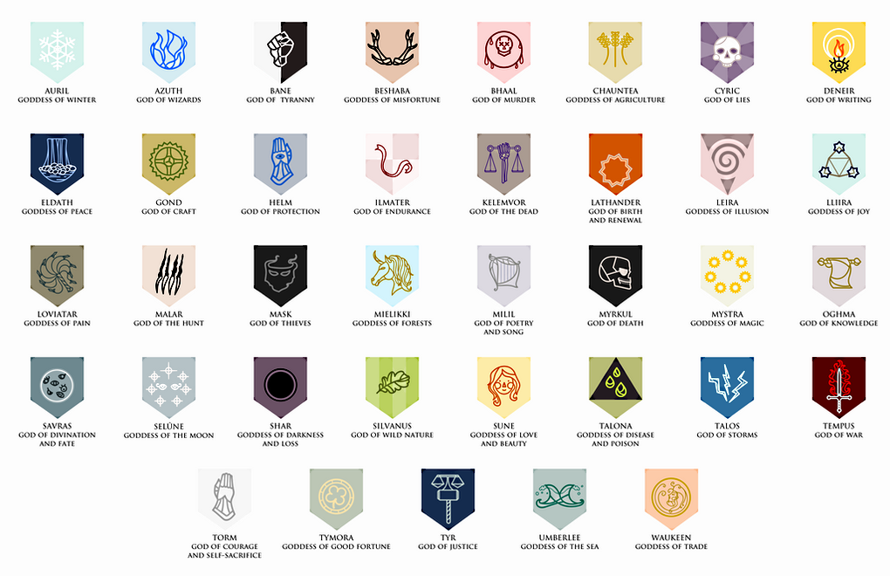

Port Nyanzaru has five major temples and numerous smaller shrines, where crowds of diverse people from all over the city gather to honor their deities, to pray for guidance and relief, or to listen to "less-orthodox" preachers yelling in the street.

The people of Faerûn have a practical and unsentimental relationship with their often mercenary gods, and it's generally understood that petitioners will either bring a material sacrifice with them or purchase one upon arriving at their local shrine or temple.

> The temple in Malar's Throat to Tymora, goddess of good fortune, is open to all without regard for their wealth, and is the temple of choice for those who have rendered themselves destitute from [gaming](#gaming).

> The Calendar of Harptos orders life in Faerûn, including the rhythm of religious ceremonies and holidays. The calendar consists of twelve months, each with three **tendays** or weeks, and five annual holidays that occur between the months. The days in a tenday are described with the plain names first-day, second-day, third-day, and so on until tenth-day.

##### Temples
|Temple|Deity|District|High Priest|
|-|-|-|-|
|Temple of Gond|Gond, deity of artisans, craftspeople, and smiths|Merchants' Ward|-|
|Temple of Savras|Savras, deity of divination and fate|Merchants' Ward|Grandfather Zitembe|
|Temple of Sune|Sune, deity of love and beauty|Merchants' Ward|Merchant Prince Kwayothé|
|Hall of Gold|Waukeen, deity of trade and wealth|Market Ward|Sibonseni, Mother of Prosperity|
|Temple of Tymora|Tymora, deity of good fortune|Malar's Throat|-|

---

_The young high priestess of Port Nyanzaru's Temple of Sune, Kwayothé, is also a powerful and ambitious merchant prince. She controls the sale of alcohol, fruit, oil, perfume, and insect repellant: this gives her additional de facto power over most of Port Nyanzaru's taverns, restaurants, ceremonies, celebrations, and day-to-day life._

# Investigating
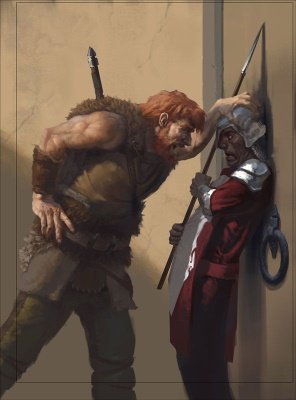

Investigation includes not only the gumshoe kind but also formal research in libraries and guilds as well as talking to people in Port Nyanzaru for information. Investigating costs **1 gold coin per day** in addition to lifestyle expenses.

Investigating commonly involves either **Intelligence** or **Charisma** ability checks with the _Investigation_ skill proficiency, but uses other ability checks and other skill or tool proficiencies for investigating specialized knowledge. Running a stakeout or long-term investigation might require either a **Constitution** or **Wisdom** ability check with your _Investigation_ proficiency or saving throw proficiency.

Generally, only one character can usefully pursue a particular line of investigation at a time, with an optional second character assisting for advantage. Other characters may pursue a different method of investigation or investigate different subjects.

If an investigation involves reading or studying physical objects it may be possible to continue the work when the party leaves Port Nyanzaru and explores the jungle; see the [rules for downtime activities in the jungle](activities_in_the_jungle.md#top) for details.

### Port Nyanzaru: Syndra Silvane and Wakanga O'tamu
Your mentor and patron Syndra Silvane is staying in the merchants' ward of Port Nyanzaru as a guest of the Chultan merchant prince Wakanga O'tamu. Both are capable wizards with an interest in curing the Death Curse, and they'll be happy to assist characters with relevant investigations in whatever way they can. O'tamu's mansion in the merchants' ward has the largest single library in Port Nyanzaru.

> **Character Bonus: Wizards** may use Wakanga O'tamu's library to [copy spells into their personal spellbooks](#copying-spells-into-your-spellbook).

### Port Nyanzaru: Trading in rare books
Port Nyanzaru's volume of trade means that the party has at least a chance of finding any non-secret book they are hunting for. Such rare books can be bought or hunted for in the same way as [buying a magic item](#buying-a-magic-item).

### Port Nyanzaru: Temple of Savras
In the merchants' ward is an opulent temple of Savras, Faerûn deity of divination and fate. For a price they can cast or assist with a ritual spell, as described below.

---

_Wizard and merchant prince Wakanga O'tamu has final legal authority over magic item sales and spellcasting services in Port Nyanzaru. He's hosting Syndra Silvane in his mansion in the Merchants' ward._

# Casting a Ritual Spell
Casting a ritual spell generally involves making ability checks using your spellcasting ability, along with either your _Arcana_, _Religion_, or _Nature_ skill proficiency.

Generally, casting a spell requires downtime days equal to a fixed preparation time plus a number of ritual days for each level of the spell. The specific number of days, and the price for each day, depends on the school the spell belongs to.

The ritual part of the duration is rolled in secret by the DM, and the casters of a ritual have only a vague sense of the remaining duration in terms of "early" and "late" answers.

Spell effects occur after the final day of the ritual: the ritual prepares energy into a leyline that the party may gather at and activate at a time of their choice. Maintaining the leyline after the ritual is done costs the same per day as the ritual itself.

> **Character Bonus:** In addition to the adventuring-focused spells available in the _Player's Handbook_, depending upon their background and character history party spellcasters may also have access to other, more pedestrian ritual spells that would be useful to characters or the party in Port Nyanzaru.

|School|Preparation Days|Ritual Days Per Level|Price Per Day|Note|
|-|-|-|-|-|
|Abjuration|1d20|1d20|1 platinum coin|-|
|Conjuration|1d20|1d20|1 platinum coin|-|
|Divination| * | * | * |See the [Temple of Savras](#port-nyanzaru-temple-of-savras-1) below.|
|Enchantment (temporary)|1d10|1d10|5 gold coins|-|
|Enchantment (permanent)|1d20|1d20|1 platinum coin|-|
|Evocation|1d20|1d20|1 platinum coin|-|
|Evocation (healing)|1d6|1d6|1 platinum coin|Price is multiplied by the spell level.|
|Illusion|1d20|1d6|1 gold coin|-|
|Necromancy|3d20|1d20|2 platinum coins|Disadvantage when rolling the number of preparation days due to grave-robbing.|
|Transmutation|1d20|1d20|1 platinum coin|-|

### Port Nyanzaru: Temple Healing
A variety of shrines around Port Nyanzaru are dedicated to deities of life and medicine, and it's generally easy to find a caster at the listed rate for healing evocation spells.

### Port Nyanzaru: Hiring Mages
If no party spellcaster is assisting with the ritual, the price to hire mages in Port Nyanzaru to cast a non-healing ritual on the party's behalf is **double the price** listed in the table, except for healing spells.

### Port Nyanzaru: Temple of Savras
The immense size and opulence of the temple of Savras in the merchants' ward reflects the popularity, both in Chult and across Faerûn, of seeking divine help in resolving life's practical problems. It also means their answers are accurate, presumably. Grandfather Zitembe is the high priest of Savras, and a popular friend and confidante of many citizens of Port Nyanzaru.

The temple of Savras can provide the ritual spell services shown below at the listed price, but doing so requires at least one party character spend their downtime days assisting the temple's casters.

|Divination Target|Material|Preparation Days|Ritual Days Per Hex|Price Per Day|
|-|-|-|-|-|
|The _Tarrasque_|-|1d20|1d6|5 gold coins|
|Location|Description|1d20|1d20|5 gold coins|
|Location|Party has visited|1d20|3d6|5 gold coins|
|Person|Description|1d20|1d20|2 platinum coins|
|Person|Party has conversed with|1d20|2d10|1 platinum coin|
|Person|Party has a personal item|1d20|3d6|1 platinum coin|
|Person|Party member or close friend|1d20|2d6|5 gold coins|
|_Speak with Dead_|Description|2d20|2d20|2 platinum coins|
|_Speak with Dead_|Party has a personal item|2d20|2d10|1 platinum coin|
|_Speak with Dead_|Party has remains|2d20|3d6|5 gold coins|
|Location of a dead body|Description|2d20|2d20|2 platinum coins|
|Location of a dead body|Party has a personal item|2d20|2d10|1 platinum coin|
|Location of a dead body|Party has remains|2d20|2d6|5 gold coins|
|Location of an object|Description|2d10|1d20|1 platinum coin|
|Location of an object|Party has object|-|-|-|
|History of an object|Description|2d10|1d20|2 platinum coins|
|History of an object|Party has object|2d10|2d10|1 platinum coin|
|The _Soulmonger_|Hope and a literal prayer|10d20|10d20|10 platinum coins|

### Port Nyanzaru: _Teleportation Circles_
Teleporting is an expensive way to travel with obvious advantages. Several large public _teleportation circles_ are available in Port Nyanzaru's harbor ward as well as the merchants' ward, and a few private circles can be found around the city. Finding mages willing to operate those circles on the party's behalf is trivial in either case, although again expensive: the listed **price below is doubled** unless at least one party spellcaster spends downtime days assisting the ritual.

All _teleportation_ spells require **one final downtime day** for the casting of the spell, which requires the party to gather at a particular _teleportation circle_ and stand still for a while.

If you don't have the location mapped and can't measure how many hexes the distance will be, you'll receive **no information** about how many days are remaining before the teleportation ritual manages to locate your target and becomes castable.

Generally, teleportation targets must be outdoors.

|Teleportation Target|Material|Total Ritual Days|Price Per Day|
|-|-|-|-|
|Location in Chult|Description|1d20 per hex tile*|10 platinum coins|
|Location in Chult|Party has an item from there|2d10 per hex tile*|10 platinum coins|
|Location in Chult|Party has visited before|1d10 per hex tile*|50 gold pieces|
|A location in greater Faerûn*|Description|3d20|10 platinum coins|
|A location inside Port Nyanzaru**|Party has visited before|4d20|10 platinum coins|

*If you're asking "why is it faster to..." it's because of the Spellplague and the **Tarrasque**, _obviously_.

**Shopping for this _teleport_ is kind of like going into a shop and saying "Hello! I would like to buy a pair of gloves, a crowbar and a hammer, a balaclava mask, and most importantly: your _finest_ set of lock-picking tools."

> **The _Tarrasque_:** It's impossible to _teleport_ into or out of a hex near the _Tarrasque_'s current position: ending up in the wrong place and other mishaps become more likely the closer you're aiming to the mythological creature. And when the _Tarrasque_'s position is unknown, trying to _teleport_ deep into the jungle becomes a gamble: be prepared to re-orient yourself as your first task upon landing. Although perhaps an irritating problem, it can be thought of as a blessing when you consider the alternative: being able to blindly _teleport_ directly to the _Tarrasque_ itself.

# Buying Mundane Items
Characters do not require downtime days to buy mundane items that cost less than 100 gold coins, and such purchases can be done alongside other downtime activities. A purchase with a price of **100 gold coins or more**, or any purchase involving live animals, generally takes **a single downtime day**. See the [items available for purchase in Port Nyanzaru](list_of_items_available_for_purchase_in_Port_Nyanzaru.md#top) for further information.

# Selling Loot or Items
There are four major markets in Port Nyanzaru, and each day the party may send up to one character per market to take loot or other items from the party inventory to the market to sell. One other character per market may assist to provide advantage; the seller makes a **Charisma** ability check, and over the course of the day can sell items from the party inventory with the total listed price shown on the following table:

|Market|Acceptable goods|Maximum amount sold each day|
|-|-|-|
|Grand Souk|Anything|20 gold coins for each point of Charisma check result|
|Red Bazaar|Common trade goods, mundane items, weapons, armor, and equipment|15 gold coins for each point of the Charisma check result|
|Fish Market|Fish|10 electrum coins per point of Charisma check result|
|Jewel Market|Rare trade goods, gems, treasure, and other expensive items|1 object or 5 platinum coins per point of the Charisma check result|

Generally, the party receives profit equal to half of the listed price for undamaged weapons, armor, equipment, or mundane items; this includes the fees paid to Port Nyanzaru's merchant princes. When selling gems, treasure, or trade goods the party must pay **1 silver coin out of every gold coin** in the listed price to the merchant princes.

# Buying a Magic Item
All magic items are rare and expensive. Even a small and purely decorative magic item is a precious handcrafted object. Most magic items were made in civilizations and cultures far from this place and time, and the knowledge needed to make new ones of the same form may be a carefully-guarded or entirely-lost secret. Permanent magic items are almost never available for sale in Faerûn, but Port Nyanzaru has enough sheer traffic that a buyer keeping a close eye on the Grand Souk and the Jewel Market can occasionally find an offer.

The [scrolls, potions, and common wondrous items](list_of_items_available_for_purchase_in_Port_Nyanzaru.md#wakanga-otamu) that Wakanga O'tamu has for sale can be purchased in the same way as a mundane item.

The DM will randomly determine other magic items that can be found in the markets of Port Nyanzaru, along with their prices. To acquire such an item, make a **Charisma** check: it takes a number of downtime days equal to `1d20+[20 minus the Charisma check result]` in order to find, negotiate, and complete the purchase of such an item.

### Putting down money for a Magic Item
If a character can't afford a magic item right now, but has some coin to put down as a forward payment, they can usually ask a merchant to reserve the item for them until they can gather the final sum. When first making the request, and every three _tendays_ afterwards until they pay the sum, the character needs to make a forward payment equal to a percentage of the final total.

When asking for an item to be reserved, the character makes a **Charisma** ability check: for the first and each tenday payment the character must pay 35% of the total price minus 1% for each point of their check result.

### Hunting down a Magic Item

A character may attempt to hunt down a specific magic item by talking to well-connected international merchants in Port Nyanzaru. If such an item can be found, the item's **price is multiplied by 1d4** and it takes downtime days equal to `3d20+[20 minus a Charisma check result]` to acquire. Characters must have the full payment up front to hunt down a magic item.

# Selling a Magic Item
Few non-adventurers have the wealth or the need to own magic items. Finding a potential buyer for any magic item requires at least `5d20+[20 minus a Charisma check result]` downtime days, and an additional hard [DC 20] **Charisma** check is required to determine the maximum price the buyer is willing to pay.

---

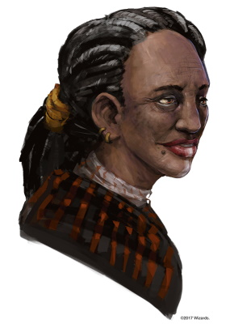

_The Chultan noble Zhanthi is a descendant of one of the founders of the city, and she's long been the wealthiest merchant prince. Zhanthi controls the exclusive and highly-secure Jewel Market, where most trade in magic items, armor, and other expensive items occurs._

# Fighting

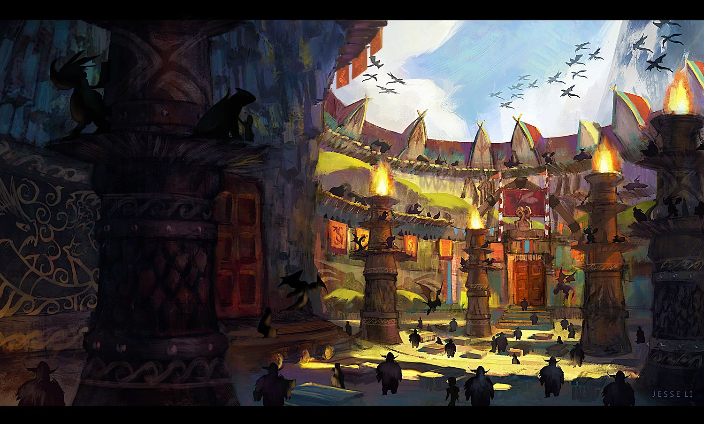

If you're not getting enough combat in your Dungeons & Dragons, for the price of just **one downtime day** I can provide an interesting fight at the arena of your choice: _**The Grand Coliseum**_, _**The Executioner's Run**_, or _**The Thundering Lizard Tavern**_. Winners earn prizes, but _everyone_ earns experience points.

---

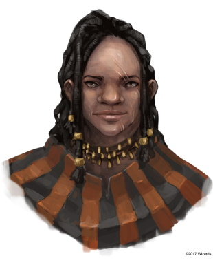

_Ex-gladiator Ekene-Afa is the merchant prince of mercenaries in Port Nyanzaru, and also regulates all combat within the city._

# Dinosaur Racing

Characters can do more than just [carouse](#carousing) and [relax](#relaxing) at Port Nyanzaru's famous tenth-day dinosaur races: they may opt to join the celebrated but dangerous ranks of Port Nyanzaru's dinosaur riders themselves. Characters can race individually, or two characters can participate riding a single dinosaur.

Racing involves a sequence of ability checks: most of the checks use the newly available [**_Riding_**](character_creation.md#riding) skill proficiency, or less commonly the _Animal Handling_ skill proficiency, and characters who aren't _proficient_ in _Riding_ won't quality for any races. If, on the other hand, a character would like to try racing a rampage-prone tyrannosaur or triceratops with no _Animal Handling_ proficiency: good luck.

### The Dinosaurs
Several of the larger species are restricted by regulation: only juvenile dinosaurs below a certain weight are allowed to race. An adult dinosaur may get special permission to participate if [Ifan Talro'a](list_of_items_available_for_purchase_in_Port_Nyanzaru.md#ifan-talroa) knows both the rider and the beast and trusts that the dinosaur will remain under control.

|Dinosaur|Class|Rider Size|Speed|Skill Check DC|AC|Hit Points|Attack|Damage|Constitution|
|--------|-----|----------|-----|--------------|--|----------|------|------|------------|
|Allosaur, young|2-legged|Medium|50/80|16 __*__|13|30|+6|1d10 + 3|15 (+2)|
|Deinonychus|2-legged|Small|40/60|12 __*__|13|26|+4|1d8 + 2|14 (+2)|
|Tyrannosaur, young|2-legged|Medium|50/100|18 __*__|13|46|+6|1d12 + 3|17 (+3)|
|_Other **_|-|-|40/60|12|12|24|+3|1d8 + 2|17 (+3)|
|Dimetrodon|4-legged|Small|30/50|8|12|19|+3|2d6 + 1|15 (+2)|
|Hadrosaur|4-legged|Medium|40/50|12|12|24|+3|1d8 + 2|16 (+3)|
|Triceratops, young|4-legged|Medium|50/75|16 __*__|13|30|+6|1d10 + 3|15 (+2)|

__*__ There is a risk that these dinosaurs may go berserk during a race if a _Riding_ or _Animal Handling_ ability check is failed badly enough.

_**_ Pick your favorite dinosaur and tell me why it's special, then I'll add some bonuses to these stats.

### Practicing racing on off-days
On non-race days a character may spend their day in the Tiryki anchorage [training](#training-with-a-skill-or-tool) in _Riding_ with a particular type of dinosaur.

> **Character Bonus:** A character training in _Riding_ who is _proficient_ in **Animal Handling** can make a **Wisdom** (Animal Handling) check and subtract that many downtime days from the required number of days to reach the next level of _Riding_. Characters may do this once when they start training in _Riding_ and again each time they gain a +1 bonus from training.
>
> If a character rolls high enough to reduce the required days below one, then the character has revealed a natural talent for working with that kind of animal, and immediately gains the +1 bonus. The overflow days are then subtracted from the next level's requirement along with the results of the next Wisdom (Animal Handling) check.

### Renting a dinosaur
Many racing dinosaurs are owned by investors who don't race themselves; a rider who wants to race cheaply can rent one such dinosaur in order to qualify for a spot in a race.

Generally, a rentier will demand **2d4 gold coins** to use a dinosaur for a day's races, or 1 gold coin to spend a day training with a dinosaur. They may waive the fees if they know the rider and believe they can profitably bet on them.

### The day of the race
Citywide races occur on the last day of each _tenday_, simply named **tenth-day**. A typical race day has three races: one for **four-legged beasts**, one for **two-legged beasts**, and one no-holds-barred "**unchained**" race. The four-legged dinosaurs are generally considered easier to handle than the two-legged ones. The dinosaurs are stoutly muzzled and have their claws and horns blunted in all but the unchained race.

A character may participate in multiple races on a single day, but they have **disadvantage on saving throws** during their second race, and if they race a third time they also suffer **disadvantage on ability checks**.

Very few of the owners who rent out dinosaurs are willing to risk their animals in the unchained race, so characters must generally bring one of their own to participate.

### Betting on party members
If a member of the party becomes a dinosaur racer, they or any other party member may place bets on their race results. There is no official bookmaker for the races and no formal prizes, so making money involves searching through the crowds and convincing individual bookies to accept your bets.

During a race day, a character watching or participating in the races can make a **Charisma** check to go through the crowd and place bets: they have a maximum betting limit for the next race equal to `[1 platinum coin per Charisma check result]`. Each betting character chooses how much of their limit they are actually willing to risk; the race is run, and if the favored character wins, anyone who placed bets on the winning character receives **double their risked coin back**.

> **Character Bonus:** As a character races in events they will start to get noticed more and more by the regular crowds and bookies at the races, who will be carefully watching and updating their odds every race.
>
> Every time a character wins a race, the default Charisma multiplier of 1 platinum coin betting limit for that character is reduced by `[1 gold coin per Charisma check result]`, and every time a character loses a race the amount that can be bet on them per race increases by `[1 gold coin per Charisma check result]`.

Betting on racers that aren't party members is usually equivalent to [gaming](#gaming).

### Your Very Own Dinosaur
Most racers use rented or borrowed animals, but a character may choose to purchase their own mount. To do so they must deal with [Ifan Talro'a](list_of_items_available_for_purchase_in_Port_Nyanzaru.md#ifan-talroa) or one of his animal trainers, who must approve the transaction even if the character is buying from a private owner.

If a character has an initial down payment of 25% or so, they can purchase a dinosaur on a loan, using the same rules as [putting down money for a Magic Item](#putting-down-money-for-a-magic-item).

A character who wishes to raise a wild dinosaur from an egg or juvenile can do so as a [special project](#developing-relationships-investments-and-special-projects).

_The merchant prince Ifan Talro'a controls all sales of beasts and beast training in Port Nyanzaru._

# Hunting Pirates
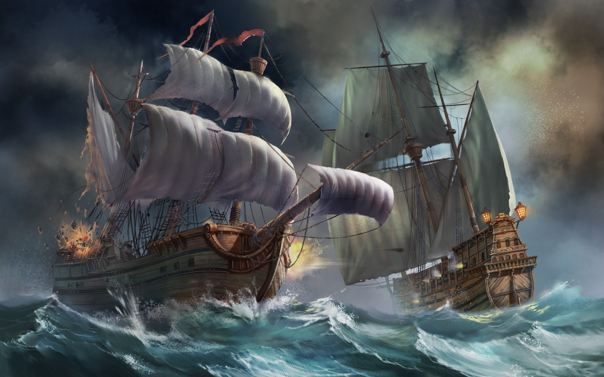
Port Nyanzaru has a problem with pirates, and both Harbormaster Zindar and the Blaze of Fort Beluarian need individuals with initiative and pluck to get out there and hunt them. A crew of pirate hunters might start out its journey escorting a merchant ship leaving the Bay of Chult, and then spend its time patrolling and setting ambushes until its crew is exhausted.

### Going on a hunt with The Brazen Pegasus
A ship named The Brazen Pegasus sails out of Port Nyanzaru. The sixteen-person crew of the Pegasus takes a wide variety of jobs doing whatever they can, and often fall back on pirate hunting when better opportunities can't be found. A character may sign up with Captain Ortimay to join The Brazen Pegasus on a pirate hunting voyage as a crew member, and sail the Shining Sea while the rest of the party is doing other business in Port Nyanzaru.

Pirate hunting involves the newly-available skill proficiency [_**Sailing**_](character_creation.md#sailing). Hunting pirates is a combination of _Sailing_ ability checks and combat, and a character must be good at one or the other, preferably both, to impress Captain Ortimay and join The Brazen Pegasus's crew.

A character or characters joining The Brazen Pegasus on a hunt will spend **2d20+20 downtime days** at sea, and **can't return early** based on what happens with the rest of the party: even if they arrange to use _sending_ or some other method to communicate with the rest of the party, the characters will only be a minority vote within the Pegasus's crew.

> **Character Bonus:** A character proficient in _Sailing_ may make a Charisma (_Sailing_) ability check and either add or subtract 1 day from the duration of the voyage for each point of the check result; a second proficient character on the crew may assist to provide advantage on the check.
>
> If the characters change their mind during the same voyage they may make a new check to modify the duration in the opposite direction from how they previously modified it, but they can't make two checks in a row in the same direction.

For each day a crew spends hunting, roll a [Random Encounter Check](rules_for_random_encounters.md#top), and the DM will describe any random encounter that occurs.

### Booty
Pirate hunters are expected to seize their payment from the goods they re-steal from the pirates: the more pirates you catch, the more you'll earn. Failed hunts provide experience points and injuries but not treasure.

For each potential ship target, the DM will roll one treasure hoard of level 1d12 from the tables in Chapter 7: Treasure of the _Dungeon Master's Guide_. The general booty value of a target can be identified by the features of the ship and how low it's riding in the water; the same is true for pirates eyeing the Brazen Pegasus when it's hauling loot back to Port Nyanzaru.

> **Shares:** If a hoard is successfully looted, and only one party member is participating, that character will get a 1/20 share of the hoard: it's split with the sixteen existing Pegasus crew members, one extra share each for Captain Ortimay and mate Ruddell, and an extra half share each for the quartermaster and the cook. If two characters participate they each get a 1/21 share, if three participate they each get a 1/22 share, and so on. If any of the Brazen Pegasus's original crew die during the hunt, their share will be paid to their surviving kin.

> **Magic Items:** Generally, any magic items the crew finds are put up for sale upon returning the Port Nyanzaru, and the profit from the sale is split among the shares as normal. If party members participated in the hunt they have a right of first refusal to buy the item from the Pegasus crew, and they have advantage on the Charisma check to 
[put down a forward payment to reserve the Magic Item](#putting-down-money-for-a-magic-item).

> **Plot Armor:** Player characters that fall overboard or go down with a sinking ship will always wash up on the shores of Chult, due to the _Tarrasque_.

# Sailing
**The other, more precise and boring use for [_Sailing_](character_creation.md#sailing).**

A **sailing ship** is an expensive but fast way to get to the various bays of Chult for the start of an expedition.

If the party is travelling via sailing ship, characters can spend downtime days pursuing any of the same downtime activities that are available in the jungle; see the [rules for downtime activities in the jungle](activities_in_the_jungle.md#top) for details.

Characters may also try to assist with the day's sailing, as described here.

### Port Nyanzaru: The Brazen Pegasus

The party can speak to Captain Ortimay to buy passage on her ship, The Brazen Pegasus, which can eventually be found in Port Nyanzaru's maze-like docks.

While the party travels as passengers on The Brazen Pegasus, up to three characters _proficient_ in _Sailing_ may spend downtime days assisting the crew by making one _Sailing_ ability check per day:

- The Brazen Pegasus moves **one** additional hex for the day if the character's _Sailing_ check beats a **Moderate difficulty** [DC 15].

- The Brazen Pegasus moves **two** additional hexes that day if the check beats a **Hard difficulty** [DC 20].

- If the character's _Sailing_ check fails to beat an **Easy difficulty** [DC 10] or rolls a **Natural 1**, then the character instead **interferes** with the crew's smooth operation, and the ship moves **1 fewer hex** that day.

> **Character Bonus:** A character can attempt to assist the crew by using _Survival_, _Perform_, or some other skill or tool they are proficient with, provided that you can tell me a story about it.

---

### Your Very Own Ship
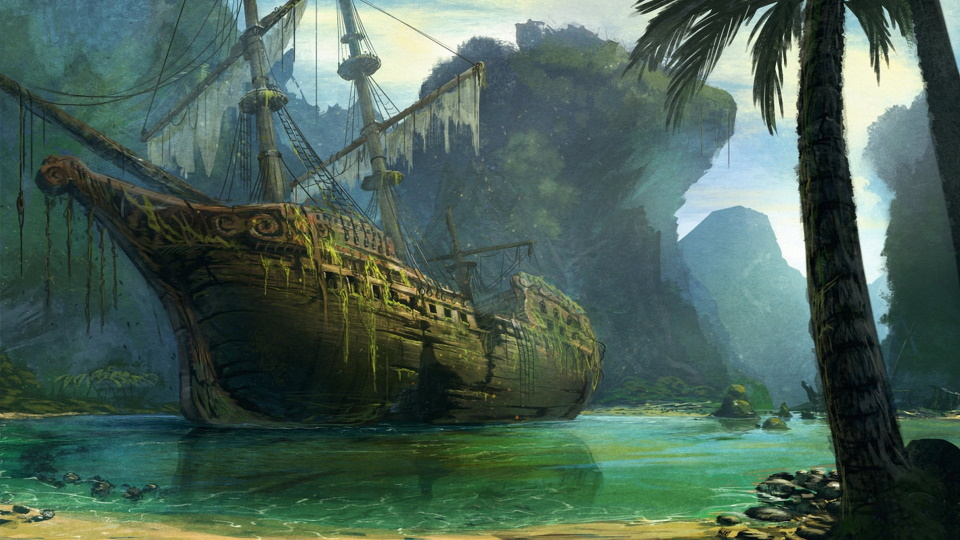

Acquiring and maintaining ownership of a sailing ship, particularly one that isn't actively worked to earn a profit on the high seas, is difficult, but entirely possible during the party's adventures in Chult.

While sailing their own ship, up to three characters may work as crew members in the same way as on the Brazen Pegasus. An **additional three characters can assist** the first three to provide advantage on checks. Because of their existing rapport party members can even try to contribute if they aren't _proficient_ in _Sailing_.

##### This fully armed and operational battle station
To be fully crewed a sailing ship requires crew members equal to its normal speed in (Chultan 10-mile) hexes per day, which is **10 hexes per day** and **10 crew members** for the Brazen Pegasus and similar ships.

If a ship lacks a full crew, its normal speed is one hex for each crew member it does have. Additional crew members don't add speed above the ship's normal maximum.

##### Red sky in the morning, sailors take warning
**Caution!** As long as at least one character crewing the ship is _proficient_ in _Sailing_, other characters may opt to rely on that character for direction and do a _**cautious**_ job: they skip making an ability check that day but can still contribute to the ship's normal speed.

##### Gotta spend coin to make coin
As per the _Player's Handbook_, it costs **2 gold coins per day** to employ a skilled hireling, including a sailor. Sailors who are mistreated, or significantly cheaper sailors, might mutiny, steal the ship while the party is ashore, or simply abandon their post at the first available opportunity.

Skilled sailors are proficient in _Sailing_ and generally have a total proficiency and ability bonus of **+7** for all _Sailing_ checks, depending on their price. If the crew's morale is low from the difficulty of the journey, or from being away from port for too long, their _Sailing_ proficiency bonus will drop.

> **Character Bonus:** One member of the party and one optional assistant may make a **Hard difficulty** [DC 20] **Charisma** ability check to improve the crew's morale, as long as the low morale isn't being caused by the antics of the party itself.

##### The most important part
Two characters from the three core crew members serve as the **Captain and First Mate**. At least one of the two must be _proficient_ in _Sailing_; otherwise you're not so much a crew with officers as you are a bunch of morons stranded on a boat lost at sea.

When either the Captain or the First Mate roll using _Sailing_ to assist the ship, if they are _proficient_ in _Sailing_, in lieu of the normal bonus to speed for the day they instead achieve the following:

- The party ship moves **one** extra hex that day if the officer's _Sailing_ check beats an **Easy difficulty** [DC 10].

- The party ship moves **two** extra hexes if the _Sailing_ check beats a **Moderate difficulty** [DC 15].

- The party ship moves **three** extra hexes for the day if the check beats a **Hard difficulty** [DC 20].

- A _proficient_ officer only **interferes** with the ship's operations if they _fumble_ by failing to beat a **Very Easy difficulty** [DC 5] or rolling a **Natural 1**.

If the party encounters another ship or a sea creature, and starts communicating with them, it will be up to the Captain and First Mate to do the communication.

> _the party may not suddenly make the bard Captain just to deal with an encounter; they need some time to really get_ into _the character, you know?_

> **Character Bonus:** One character who is not sailing may serve as the ship's Cook: the other characters should be suspicious of the Cook, because many renowned ships' cooks are charlatans.

> **Plot Armor:** Player characters that fall overboard or go down with a sinking ship will always wash up on the shores of Chult, due to the _Tarrasque_. Ships or boats owned by the party do not have _plot armor_.

---

# Aremag

The ancient dragon turtle Aremag patrols the Bay of Chult, demanding treasure from the many ships passing through. Although there's too much traffic for Aremag to bother every single ship that sails by, make no mistake about the danger: Aremag won't hesitate to sink an uncooperative or fast-talking ship so that she can simply pick out the treasure at her leisure. Most Port Nyanzaru citizens have little sympathy for captains [foolish enough to irritate the famous beast](dramatis_personae.md#aremag).

# Sign up for a Class in Adventuring
A character can spend **30 downtime days** and **1 platinum coin per day** to train at class skills and other talents they use while adventuring; at the end of the process the character receives [**1 Experience Chunk**](character_creation.md#gaining-levels).

Characters with enough Experience Chunks may level up at the end of any long rest, including while in the jungle or dungeon. Characters travelling in the jungle should be finding Experience Chunks from adventuring, and they can't train in a class as a downtime activity.

Characters don't require any special or additional training to level up or to multiclass, beyond collecting enough Experience Chunks.

---

> **_The Adventurer's League_** strictly regulates the sources of the Experience ~~Chunks~~ Checkpoints that its members are allowed to use. A character who is a member of the League will have to travel to the League headquarters, along the Wizards' Reach in the Inner Sea nation of Algarond, and get approval from the League's powerful Bureaucrats before they may even consider enrolling in an adventuring class.

---

# Retraining
A character can spend **10 downtime days** and **1 gold coin per day** to reselect any number of options in their class features, or to reselect a single ability score advancement/feat.

Characters can also retrain while the party is exploring in the jungle.

> **Character Bonus:** A character subtracts one day from the time required to retrain for each point of their **Intelligence** ability bonus. If the character has an Intelligence penalty they instead add one day for each point of the penalty.

---

> **_The Adventurer's League_** has its own rules and methods which its members must use to reselect character choices.

---

# Training with a Skill or Tool

> **_The Adventurer's League_** has no truck with __any__ of this nonsense.

---

A character can train to add a permanent +1 to their proficiency bonus for a particular skill or tool, whether or not they are currently _proficient_ with it. A character may train multiple times to increase their bonus further in the same skill or tool, or to train in different ones.

Training requires **10 downtime days** plus **10 more days** for each point of existing proficiency bonus for that skill. It costs **1 gold coin per day** in addition to lifestyle expenses, and a character can't earn coin from working on days they are training.

You may be able to continue training when the party leaves Port Nyanzaru; see the [rules for downtime activities in the jungle](activities_in_the_jungle.md#top) for more details.

> **Character Bonus:** A training character with an **Intelligence** ability bonus subtracts one downtime day from every ten required days for each point of their Intelligence bonus. If the character has an Intelligence penalty they instead add that many days to each multiple of ten.

If a character trains a skill or tool they aren't _proficient_ with, the character doesn't become _proficient_ until their training bonus reaches the standard proficiency bonus for their current level. If a character's proficiency bonus increases because of levelling up, they only increase the proficiency bonus of the skills and tools they are _proficient_ with at that moment.

> **Character Bonus: Bards and Rogues** with the expertise class feature may use that feature to double the effective bonus to +2.
Until they are _proficient_, bards with the jack-of-all-trades class feature may use either their jack-of-all-trades bonus or their training bonus for ability checks.

> _for now let's cap the maximum proficiency bonus at +12, or up to a +6 training bonus. in 5e your final proficiency bonus will by +6, so this could double it_

> _wow! training six times in a proficient skill during tier 1 would require 210 downtime days, and it would take 330 days to train eight times in a non-proficient one in order to eventually achieve +12! even more days are required as you advance in tier!_

---

# Studying a Language

Port Nyanzaru's volume of trade and cosmopolitan citizenship means that a character can easily find teachers and studying materials for any non-secret language. Studying a new language costs **1 gold coin per day** in addition to lifestyle expenses. As you spend more downtime days on studying a language, you develop more and more ability to use it:
|Downtime Days|Competency|
|-|-|
|30 days|You can slowly talk through simple conversations and read or write individual common words.|
|90 days|You can read complete sentences, talk plainly at full speed, and with difficulty understand (but not create) complicated expressions.|
|150 days|You can write complete sentences, contribute to complicated conversations with a heavy accent, and read extended text at full speed. You can now [investigate in Port Nyanzaru](#investigating) with this language.|
|250 days|You have the competency of a fluent speaker and a minor accent. You are now _proficient_ in the language.|

You can continue studying a language when the party leaves Port Nyanzaru; see the [rules for downtime activities in the jungle](activities_in_the_jungle.md#top) for more details.

> **Character Bonus:** A character studying a language can make an **Intelligence** ability check and subtract the result from the number of days needed to achieve the next level of competence. Characters may do this once when starting the study of a language and again each time they achieve a new level of competency.

> **Character Bonus:** Characters who choose the newly-available [_Anthropologist_ background](character_creation.md#anthropologist) require only **half the normal downtime days** to earn each level of language competence when studying a new language. They additionally begin the game with **two additonal language proficiencies** of their player's choice.

---

> Even **_The Adventurer's League_** can approve of such a wholesome, clean, and above all _vanilla_ activity as learning a language. On the other hand, the League also carefully regulates the number of downtime days characters are allowed to spend on officially-approved activities.

---

# Teaching Another Character
You may spend your downtime days assisting another character who is studying a skill, tool, or language, provided you are fully _proficient_ in it yourself. You can assist a character who is retraining class features if you share at least one of those class features, or any character who is retraining ability scores/feats. You can only teach a character who is training in a class if you have more levels in that class then the student does.

The student you teach makes progress **twice as fast**, but must **spend twice as much coin per day** on the activity. You do not receive any part of their fees.

A student can receive a bonus from only one teacher at a time, and a teacher can only provide a bonus to one student.

Characters can teach while the party is travelling in the jungle.

> **Character Bonus:** If you'd like to try a less conservative pedagogy, you may optionally try to push your student harder. For every tenday you spend teaching, make an **Intelligence** ability check. If your check result beats an easy difficulty [DC 10] then your student makes progress twice as fast during that tenday. If your result beats a moderate difficulty [DC 15] then the student instead works at triple speed for a tenday, and if your check result beats a hard difficulty [DC 20] your student makes forty days' progress in a single tenday. If you _fumble_ by failing a very easy difficulty [DC 5] or rolling a **Natural 1**, your student makes no progress during that tenday.
>
> The fees the student pays are doubled, regardless of how much help (if any) you end up giving them.

---

> **_The Adventurer's League_**'s incredibly complex and utterly labyrinthine rules for [_The Acceptable Uses Of Downtime Days_](https://media.wizards.com/2020/dnd/downloads/ALPGv92.pdf) has no precedent for its members "teaching" each other (or perhaps my own meager searching in that immense tome is simply inadequate for the enormity of the task of finding it), and the League's ancient Bureaucrats would likely look askance at the suggestion of such an unorthodox idea.

---

# Copying Spells into your Spellbook
A **Wizard** may spend downtime days to copy spells into their personal spellbook. Please double-check with the DM to ensure the spells you're looking for will be useful and fun during your adventures in Chult.

Searching [Wakanga O'tamu's extensive library](#port-nyanzaru-syndra-silvane-and-wakanga-otamu) for a spell and copying it down requires **2 downtime days per level** of the spell, and **5 platinum coins** per day. You may copy a cantrip in a single downtime day.

If you have a specific spellbook you've looted or found in Chult, you may copy spells in **half the downtime days and total price** as a spell from O'tamu's library.

A standard wizard's spellbook costs 5 platinum coins and has 100 vellum pages. Each spell requires 1 page per spell level.

# Developing Relationships, Investments, and Special Projects
A character can invest time and coin into developing relationships, investments, or other special projects in Port Nyanzaru. Such a project might involve:

- Establishing or maintaining a relationship with a particular person in Port Nyanzaru.
- Establishing a reputation, or attempting to change someone's reputation.
- Starting or acquiring a business.
- Assembling followers and/or forming an organization.
- Maintaining a character's membership in a Port Nyanzaru organization.
- Dealing with Port Nyanzaru city government officials in the Goldenthrone palace.
- Atoning for misdeeds with charitable works.
- Crafting an item.
- Raising or training an animal.
- Speculating and advising on an investment opportunity.
- Establishing a permanent resource or benefit for the party.

# Looking for a Side Quest
Wow I sure have typed up a lot of options at this point, _but!_ there are also a few small "side quests" to be found around Port Nyanzaru. Thanks for reading, and welcome to the fantastic city of **Port Nyanzaru**, the starting base camp for your adventures in [**_Tomb of Annihilation_**](README.md#top)!

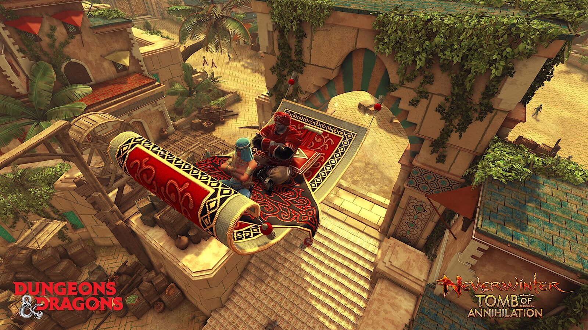

---

[Back to top](#top)

---

> _Like this sheet of activities for Port Nyanzaru? Read about how I used 5e's rules for downtime days to develop it:_ [The Incredible Power in the Nine Sublime Pages of _Player's Handbook_ Chapter Eight](../../homebrew/5e_phb_chapter_eight.md#top)

