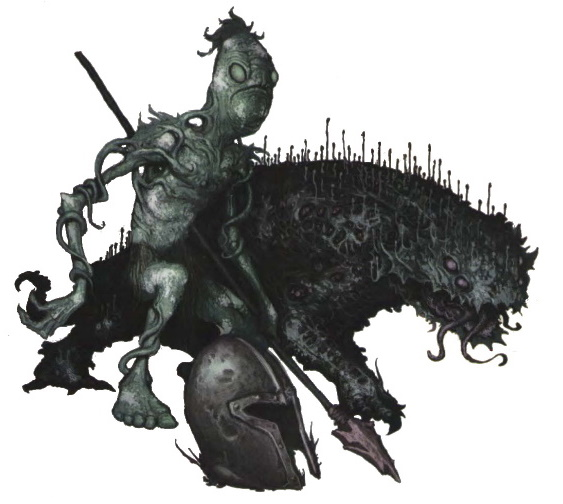

###### top

# Tomb of Annihilation Character Creation

Welcome to _Dungeons & Dragons_!

When playing D&D you are going to be creating and using a **player character**, one member of a party of adventurers who are **working together to complete a quest**. Although D&D characters can get into quite a strange variety of adventures, _generally_ adventuring involves travelling into undeveloped wilderness, exploring ruins and dungeons, and fighting monsters. Your character should be one who's prepared to fight and to adventure: generally, all the standard character classes have the skills and equipment you need.

A socialite from a wealthy noble family, a hermit who's never seen a city before Port Nyanzaru, or a dwarf utterly dedicated to their family and clan, are each potentially useful and interesting player characters, but consider why such a character is motivated to live the adventuring life (and work with the party) instead of the more stable life available at home. Additionally, your character shouldn't be one who's **unable to work cooperatively** with other people, such as a thief who tries to steal or hide treasure from the rest of the party, or someone who starts fights in every town they visit. This adventure is a story about a team of capable (and _generally_ decent) adventurers working together to defeat the extraordinary challenges of the Chultan jungle and the Tomb of Annihilation.

With all that in mind, take a look through the background information available on [the peninsula of Chult](introduction.md#welcome-to-chult), [the Chultan people](chultans.md#top), and [the city of Port Nyanzaru](Port_Nyanzaru.md#top) to get ideas for your character! Then come back here for the formal rules on how to create them.

> **The Adventurer's League** has its own rules for character creation, although you're still welcome to look through the background information for inspiration, or to take one of the official backgrounds from _Tomb of Annihilation_ or the _Sword Coast Adventurer's Guide_.

- Backgrounds [options](#background-options)
- My [Character Creation Rules](#my-character-creation-rules)
- Tomb of Annihilation [Character Options](#tomb-of-annihilation-character-options)
  - Druid [_Wild Shape_ options](#druids)
  - Ranger [Favored Terrains](#rangers)
- New Tomb of Annihilation [skill proficiencies](#further-information)
  - [**_Camping_**](#camping)
  - [**_Riding_**](#riding)
  - [**_Sailing_**](#sailing)

# Background Options
Quick summary of various background options from the _Player's Handbook_, _Tomb of Annihilation_, and _Sword Coast Adventurer's Guide_.

> \* means a homebrew tweak

|Background|Skills|Tools|Languages|Coins|Items|Feature|Source|
|-|-|-|-|-|-|-|-|
|Acolyte|Insight and Religion|-|2|15 gold|A holy symbol, a prayer book or prayer wheel, 5 sticks of incense, vestments, and common clothes.|Shelter of the Faithful|[SRD](https://5thsrd.org/character/backgrounds/)|
|Anthropologist|Insight and History|-|2|10 gold|A leather-bound diary with ink and pen, a set of travelers' clothes, and a trinket of special significance to your adopted culture.|Adept Linguist|_ToA_|
|Archeologist|History and Survival|Either cartographer's tools or navigator's tools|1|25 gold|A wood case containing an unlabelled map, a bullseye lantern, a set of traveler's clothes, and a trinket recovered from a dig site.|History Knowledge|_ToA_|
|Charlatan|Deception and Sleight of Hand|Disguise hit and forgery kit|-|15 gold|Fine clothes, a disguise kit, and the forged items needed for your preferred con.|False Identity|_PHB_|
|City Watch|Insight, Athletics or Investigation|-|2|10 gold|Uniform, a horn for summoning help, and a set of manacles.|Find the nearest guard station or nearby criminal dens.|_SCAG_|
|Courtier|Insight, Persuasion|-|2|10 gold|A set of fine clothes.|Master of court bureaucracy and records, and who to ask for favors.|_SCAG_|
|Criminal|Deception and Stealth|Thieves' tools and one type of gaming set|-|15 gold|A crowbar and dark common clothes with a hood|Criminal Contact|_PHB_|
|Entertainer|Acrobatics and Performance|Disguise kit and one type of musical instrument|-|15 gold|Your musical instrument, a trinket from a lover, and a costume.|By Popular Demand|_PHB_|
|Faerûn [Faction](dramatis_personae.md#player-factions) Agent|Insight plus one Int, Wis, or Cha skill|-|2|15 gold|Badge or emblem of your faction, a seminal text or code book, and a set of common clothes.|Safe Haven|_SCAG_|
|Far Traveller|Insight, Perception|One musical instrument or gaming set|1|5 gold|One set of traveler's clothes, your proficient instrument or game, a crude map of Faerûn, a piece of jewelry worth 1 platinum coin.|All Eyes on You|_SCAG_|
|Folk Hero|Animal Handling and Survival|Land vehicles plus one type of artisan's tools|-|10 gold|Your artisan's tools, a shovel, an iron pot, and common clothes.|Rustic Hospitality|_PHB_|
|Guild Artisan|Insight and Persuasion|One type of artisan's tools|1|15 gold|Your artisan's tools, a set of traveler's clothes, and a letter of introduction from your guild.|Guild Membership|_PHB_|
|Clan Crafter|History, Insight|One type of artisan's tool|Dwarvish, or another language if you already speak it.|5 gold|Your artisan's tools, a marking chisel with your clans' maker's mark, traveler's clothes, a gem worth 1 platinum coin.|Respect of Dwarves everywhere|_SCAG_|
|Hermit|Medicine and Religion|Herbalism kit|1|5 gold|A herbalism kit, a scroll case full of personal notes, a winter blanket, and common clothes.|Unique and powerful Discovery|_PHB_|
|Inheritor|Survival plus one from Arcana, History, or Religion|One gaming set or musical instrument|1|15 gold|Your inheritance (one mundane object), a set of traveler's clothes, and your gaming set or instrument.|DM decides your inheritance|_SCAG_|
|Knightly Order|Persuasion plus one from Arcana, History, Nature, or Religion|One gaming set or musical instrument|1|10 gold|Traveler's clothes and a signet, banner, or seal from your order|Well-regarded|_SCAG_|
|Noble|History and Persuasion|One type of gaming set|1|25 gold|Fine clothes, a signet ring, and a scroll of pedigree.|Position of Privilege|_PHB_|
|Waterdhavian Noble|History and Persuasion|One gaming set or musical instrument|1|20 gold|Fine clothes, a signet ring or brooch, a scroll of pedigree, and a skin or fine _zzar_ or wine.|Kept in Style|_SCAG_|
|Outlander|Athletics and Survival|Herbalism kits*, one musical instrument, or one martial weapon*|1|10 gold|A hunting trap, a trophy from a successful hunt, and a set of traveler's clothes.|Excellent memory for terrain and foraging|_PHB_|
|Uthgardt Outlander|Athletics and Survival|One instrument or set of artisan's tools|1|10 gold|A hunting trap, a totemic token or set of tattoos, and traveler's clothes.|Uthgaardt Heritage|_SCAG_|
|Sage|History and Arcana|-|2|10 gold|Common clothes, writing tools, and a letter from a dead colleague asking a question you haven't yet solved.|Researcher|_PHB_|
|Cloistered Scholar|History plus one of Arcana, Nature, or Religion|-|2|10 gold|Your cloisters' scholarly robes, a writing kit, a borrowed research book.|Library access|_SCAG_|
|Sailor|Athletics, Perception, and [_Sailing_](#sailing)* |Water vehicles and navigator's tools|1* |10 gold|50 feet of silk rope, a lucky charm, and common clothes.|Ship's Passage|_PHB_|
|Soldier|Athletics and Intimidation|Land vehicles and one type of gaming set|-|10 gold|An insignia of rank, a trophy from a victory, your gaming set, and common clothes|Military Rank|_PHB_|
|Mercenary Veteran|Athletics and Persuasion|Land vehicles plus one type of gaming set|-|10 gold|Uniform, an insignia of your rank, and your gaming set.|Identify mercenaries and their companies|_SCAG_|
|Urban Bounty Hunter|Two from Deception, Insight, Persuasion, or Stealth|Choose two from: a gaming set, an instrument, or thieves' tools.|-|20 gold|Clothes "appropriate to your duties".|Ear to the Ground|_SCAG_|
|Urchin|Sleight of Hand, Stealth|Disguise kit, thieves' tools|-|10 gold|A precious item to remember your parents by, a pet mouse, common clothes, and a trinket from the city you grew up in.|City Secrets|_PHB_|

### My Character Creation Rules

# Character Options

A character may choose options from the following 5th Edition _Dungeons & Dragons_ sources:

1. The _**Player's Handbook**_.
2. _**Xanathar's Guide to Everything**_.
3. One other official WotC sourcebook, including but not limited to:
   1. _**Tomb of Annihilation**_, this adventure. _ToA_ options are described on this page.
   2. _**The Sword Coast Adventurer's Guide**_, aka the 5th edition forgotten realms campaign setting. _SCAG_ backgrounds are listed above.

> The [_Basic Rules_](https://www.dndbeyond.com/sources/basic-rules) and the [_5th Edition System Reference Document_](https://5thsrd.org/) are free resources for players without a _Player's Handbook_; they contain a subset of the PHB's options.

I might approve _Unearthed Arcana_ and non-WotC options, and will probably approve any "variant" optional rule for characters found in one of the three sources listed above.

# Ability Scores

Determine a character's starting ability scores with one of the following two methods:

either the _**Standard Array**_

1. Assign the six numbers 15, 14, 13, 12, 10, 8, to the six ability scores in whatever order you desire.

or the _**Dungeon Master's Favorite**_

2. Roll each ability score **in order** by rolling 4d6 and adding the three highest d6 results together. When you are done generating all of the character's scores, perform **exactly one swap** of two ability scores of your choice. Reminding me that you used this method may result in your character getting _Inspiration_. Thank you to [DM David](https://dmdavid.com/tag/organized-play-versus-random-ability-scores/) for describing this method.

# Hit Points
You should roll your hit points when you level up, cowards. Live a little! You may take the full hit points for your first level as normal.

# Gaining Levels
Advancing in levels is determined by a character's **Experience Chunks**, which are otherwise identical to the so-called experience "checkpoints" described on _Xanathar's Guide_ page 173.

While a character is lower than 5th level (tier 1), they require `4` Experience Chunks in order to level up.

From level 5 onwards, a character needs `8` Experience Chunks per level instead.

Characters may level up at the **end** of any long rest.

# Feats
Characters may select feats to replace ability score improvements they get from leveling up. Humans may take the variant human feature described in the PHB.

# Starting Equipment and Wealth
A character's starting equipment is the accumulation of all the following:
- The equipment listed for the character's **class**.
- The equipment listed for the character's **background**.
- If you have a _Player's Handbook_, you may roll for coins based on the **Starting Wealth by Class** table on the first page of _Player's Handbook_ Chapter 5: Equipment.
  - You may also roll for one random **TRINKET!**

For this campaign, each character also gets:
- A single _Potion of Healing_:
  - **Heals 2d4+2 hit points**.
  - A character must **spend their action** on their turn to chug the entire potion or administer it to another character.
- Syndra Silvane has given each member of the party **5 platinum coins** for their initial expenses in Port Nyanzaru.

[Coins in Port Nyanzaru](coinage.md#top)

# Trinkets
Remember that all 5e characters get to roll on the _Trinkets_ table on the final two pages of PHB Chapter 5: Equipment! If you don't have a _Player's Handbook_ we'll let you roll at the first session. Let me know about your character's trinket, or lack thereof!

##### _Tomb of Annihilation_ character options

# Special _Tomb of Annihilation_ Equipment
See the [items available for purchase in Port Nyanzaru](Port_Nyanzaru_items.md#top).

# Factions
The same [five factions](dramatis_personae.md#player-factions) as The Adventurer's League, or you can tell me about a new one.

# Druids
## _Wild Shape_ options

[Circle of the Moon](https://www.dndbeyond.com/classes/druid#CircleoftheMoon) druids gain access to higher-level _Wild Shapes_, and access to some shapes earlier, than [other druids](https://www.dndbeyond.com/classes/druid#WildShape-167).

---

|Wild Shape|CR|Size|Notes|Source|Moon Circle lvl|Other druids|
|-|-|-|-|-|-|-|
|[Axe beak](https://5thsrd.org/gamemaster_rules/monsters/axe_beak/)|1/4|Large|-|Monster Manual|2|2|
|[Giant Lizard](https://5thsrd.org/gamemaster_rules/monsters/giant_lizard/)|1/4|Large|Climbing speed.|Monster Manual|2|2|
|Hadrosaurus|1/4|Large|-|ToA or Volo's|2|2|
|Velociraptor|1/4|Tiny|Realistically turkey-sized.|ToA or Volo's|2|2|
|Jaculi|1/2|Large|Snake with chamaeleon camouflage.|ToA or Volo's|2|4|
|Deinonychus|1|Medium|6-ft tall _Jurassic Park_ "velociraptors".|ToA or Volo's|2|8|
|[Giant Hyena](https://5thsrd.org/gamemaster_rules/monsters/giant_hyena/)|1|Large|-|Monster Manual|2|8|
|Allosaurus|2|Large|-|Monster Manual|6|-|
|Ankylosaurus|3|Huge|-|Monster Manual|9|-|
|Stegosaurus|4|Huge|-|ToA or Volo's|12|-|
|Brontosaurus|5|Gargantuan|-|ToA or Volo's|15|-|
|[Triceratops](https://5thsrd.org/gamemaster_rules/monsters/triceratops/)|5|Huge|-|Monster Manual|15|-|
|[Mammoth](https://5thsrd.org/gamemaster_rules/monsters/mammoth/)|6|Huge|-|Monster Manual|18|-|
|[Tyrannosaurus Rex](https://5thsrd.org/gamemaster_rules/monsters/tyrannosaurus_rex/)|8|Huge|-|Monster Manual|20|-|

---

|Swimming Wild Shape|CR|Size|Notes|Source|Moon Circle lvl|Other druids|
|-|-|-|-|-|-|-|
|Dimetrodon|1/4|Medium|Swimming speed.|ToA or Volo's|4|4|
|[Crocodile](https://5thsrd.org/gamemaster_rules/monsters/crocodile/)|1/2|Large|Swimming speed.|Monster Manual|4|4|
|[Plesiosaurus](https://5thsrd.org/gamemaster_rules/monsters/plesiosaurus/)|2|Large|Swimming speed.|Monster Manual|6|-|
|[Giant Crocodile](https://5thsrd.org/gamemaster_rules/monsters/giant_crocodile/)|5|Huge|Swimming speed.|Monster Manual|15|-|

---

|Flying Wild Shape|CR|Size|Notes|Source|Moon Circle lvl|Other druids|
|-|-|-|-|-|-|-|
|[Flying Snake](https://5thsrd.org/gamemaster_rules/monsters/flying_snake/)|1/8|Tiny|Flying speed.|Monster Manual|8|8|
|Pteranodon|1/4|Medium|Flying speed.|Monster Manual|8|8|
|Quetzalcoatlus|2|Huge|Flying speed.|Volo's|8|-|

---

# Rangers
## Favored terrain options in Chult
From most to least useful, IMO:
- Jungle
- The Underdark and other underground areas
- Rivers and the Chultan interior (swamps and plateaus)
- Two choices from:
  - Mountains
  - Coasts and seas
  - Volcanos and wastelands
  
The [Natural Explorer](https://5thsrd.org/character/classes/ranger/#natural-explorer) feature says you can't become lost in your favored terrain except by magical means, which is true. The incredibly-magical _Tarrasque_ is currently prowling the wildernesses of Chult, however, and rest assured that _every_ character in this adventure, no matter their class or power level, will be given not only the opportunity but the privilege of getting lost in [the unmapped hexes of](scenario.md#top) Chult.

## Recommended favored enemies
I've been trying to cram every memorable creature in the 5e Monster Manual into my Chult prep, but some types will nonetheless be more common than others. Again, from most to least useful IMO:
- Monstrosities, including most Underdark creatures as well as the most powerful Yuan-ti
- Undead
- Shapechanger humanoids (includes Yuan-ti spies and [were-tigers](introduction.md#dangers-of-chult)), plus one other [type of humanoid](chultans.md#top)
- Beasts including dinosaurs, Plants, and fungis (which are just Plants)
- Constructs, Oozes, Aberrations, Elementals, and Ethereal Plane creatures
- Two choices from:
  - Dragons
  - Giants
  - Demons
  - Devils
  - Shadowfell creatures (except for undead)
  - Faewild creatures

The Yuan-ti speak Primordial.

_Vegepygmies, one of the many terrifying plant-based dangers in Chult._

### Further information

##### New Skill Proficiency:
# _**Camping**_ 
### Commonly Intelligence or Wisdom
Characters can do [advanced activities while camping](camping.md#top) in the jungle using a new skill proficiency available to them called _**Camping**_. _Camping_ is usually applied to Intelligence or Wisdom checks, but other ability checks are often involved in _Camping_ as well.

> **All adventurers** have the option of selecting _Camping_ to replace one of their starting skill proficiencies.

See the [list of camping activities](camping_activities.md#top)

|Ability|Two Example Uses|
|-------|----------------|
|Strength|Chop firewood. Dig and rearrange the campground to be more comfortable.|
|Dexterity|Manipulate meat on a grill. Set up a shelter with rope and tarps.|
|Constitution|Survive underdone cooking. Endure bugs or irritating background noise.|
|**Intelligence**|**Figure out tasty and safe recipes from available ingredients. Think of a way to rearrange the camp to be more comfortable.**|
|**Wisdom**|**Notice that an ingredient has gone bad. Control a campfire's flame by rearranging the wood.**|
|Charisma|Keep a lively conversation going around the campfire. Talk shop with explorers or others who spend their time in the wilderness.|

> Camping does not replace and only occasionally overlaps with _Survival_: _Survival_ is about **safely** travelling through the wilderness and avoiding the many dangers and risks found in the wild; _Camping_ is about making a campsite more **comfortable** for a party of characters to rest in. The knowledge from _Survival_ (or _Nature_) can sometimes provide an advantage on a camping task, but neither includes the specific practical knowledge of _Camping_. The _Survival_ expert's answer to "how do we rest here" is "get over yourself and hunker down and bear it".

---

##### New Skill Proficiency: 
# _**Riding**_
### Commonly Dexterity
Riding a dinosaur at top speed, in the midst of dozens of other huge beasts in what is essentially a stampede, is a far more physical and strenuous activity than simply "handling" one. The [dinosaur racers of Port Nyanzaru](Port_Nyanzaru_activities.md#dinosaur-racing) use a new skill proficiency available to characters called _**Riding**_. A character's _Riding_ proficiency is usually applied to a **Dexterity** check, but racing involves all of a character's abilities at one point or another.

> **Character Bonus:** During character creation any character who is, or has the option to be, proficient in _Animal Handling_ may select _Riding_ to replace one of their skill proficiencies.
 
|Ability|Two Example Tasks|
|-|-|
|Strength|Pull the reins on a massive triceratops. Dig your heels into a dinosaur's thick feathers and hide.|
|**Dexterity**|**Dodge swinging tails and horns. Direct your mount with the reins.**|
|Constitution|Endure a strike by a dinosaur limb. Endure the rough ride, noise, smell, dust, and kicked-up debris of a race.|
|Intelligence|Predict that your mount will be spooked by something up ahead. Diagnose and treat a dinosaur when it's unhealthy.|
|Wisdom|Notice a subtle change in the stampede around you. Notice when a dinosaur or rider is hurt or becoming tired.|
|Charisma|Impress the crowd. Get a favor from another rider.|

Similarly to tools, characters are separately proficient with different species of rideable mount.

When managing a mount in combat, a character may use their proficiency bonus if they are _proficient_ in either _Riding_ or _Animal Handling_.

> **Character Bonus:** A character [training](Port_Nyanzaru_activities.md#training-with-a-skill-or-tool) in _Riding_ who is _proficient_ in **Animal Handling** can make a **Wisdom** (Animal Handling) check and subtract that many downtime days from the required number of days to reach the next level of _Riding_. Characters may do this once when they start training in _Riding_ and again each time they gain a +1 bonus from training.
>
> If a character rolls high enough to reduce the required days below one, then the character has revealed a natural talent for working with that kind of animal, and immediately gains the +1 bonus. The overflow days are then subtracted from the next level's requirement along with the results of the next Wisdom (Animal Handling) check.

---

##### New Skill Proficiency:
# _**Sailing**_
### Commonly Dexterity or Intelligence
Joining a [pirate-hunting crew](Port_Nyanzaru_activities.md#hunting-pirates) and sailing out of Port Nyanzaru during downtime uses a new skill proficiency available to characters called _**Sailing**_. A character's _Sailing_ proficiency is most often applied to **Dexterity** or **Intelligence** checks, but when the seas get rough other ability checks involving _Sailing_ are needed as well.

> **Character Bonus:** Any character with the _Sailor_ background, or any sea-related background, gains a bonus proficiency in _Sailing_.

|Ability|Two Example Tasks|
|-|-|
|Strength|Move the ship's cannons into position and aim and fire them. Quickly raise the anchor.|
|**Dexterity**|**Manage the ship's sails and rigging. Quickly climb to the crow's nest.**|
|Constitution|Resist waves sweeping over the deck. Avoid seasickness from terrible weather.|
|**Intelligence**|**Read charts and navigate using the sky. Figure out the best way to rig the sails.**|
|Wisdom|Detect a coming change in the weather. Spot a rare and dangerous feature of the sea.|
|Charisma|Work smoothly with other crew members during a crisis. Raise the crew's spirits.|

Characters sailing an unfamiliar ship require some time to adjust to their new vessel, but characters don't have to establish a separate proficiency for separate types of ships.

---

[Back to top](#top)

[Adventure Introduction](introduction.md#top)

[Dramatis Personae](dramatis_personae.md#top)

[Tomb of Annihilation homepage](README.md#top)

