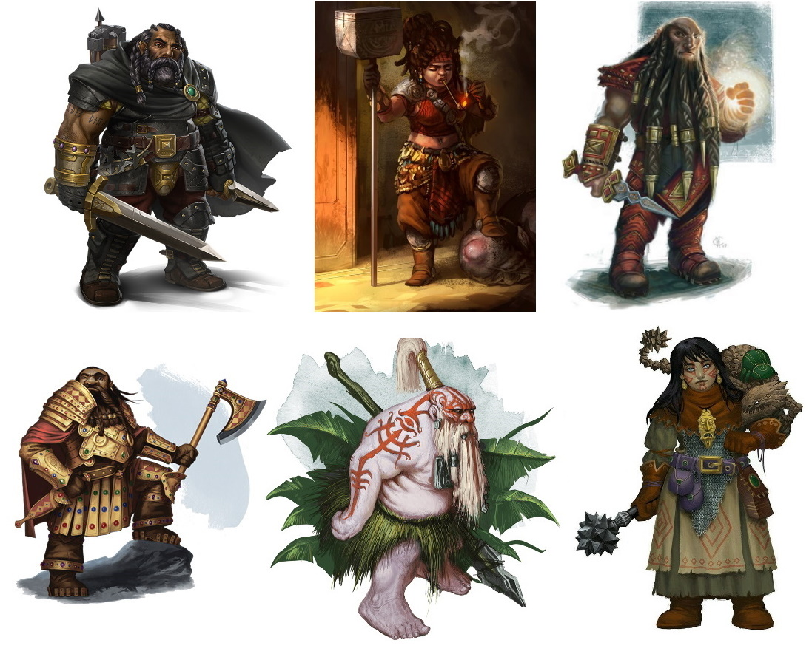

###### top

##### Tomb of Annihilation

__Native cultures of Chult__
- [Humans](#humans)
- [Orcs and Half-Orcs](#orcs-and-half-orcs)
- [Tabaxi](#tabaxi)
- [Goblins and Hobgoblins](#batiri-goblins-and-hobgoblins)
- [Grungs](#grungs)
- [Elves and Half-Elves](#elves-and-half-elves)
- [Tlincalli](#tlincalli)
- [Dragonborn](#dragonborn)
- [Lizardfolk](#lizardfolk)
- [Aarakocra](#aarakocra)
- [Dwarves](#dwarves)
- [Thri-Kreen](#thri-kreen)
- [Tieflings and Aasimar](#tieflings-and-aasimar)
- [Pterafolk](#pterafolk)
- [Gnomes and Halflings](#gnomes-and-halflings)
- [Tortles](#tortles)
- [Aldani](#aldani)

---

[Further Reading](#further-reading)

# Native inhabitants of Chult

Port Nyanzaru is a cosmopolitan city built on international trade: people from all parts of Faerûn, as well as travellers from the far West continents of Anchorome and Kara-Tur, can be found in the city. The following are some examples from local Chultan cultures:

> If you want to play a monstrous character, or one that needs other special rules, you must have your own personal copy of the relevant sourcebook, often **Volo's Guide to Monsters**.

# Humans

# Orcs and Half-Orcs

# Tabaxi

# Batiri Goblins and Hobgoblins

# Grungs

# Elves and Half-Elves

# Tlincalli

# Dragonborn

# Lizardfolk

# Centaurs

# Thri-Kreen

# Dwarves

# Aarakocra

# Tieflings and Aasimar

# Pterafolk

# Gnomes and Halflings

# Tortles

# Aldani

# Further Reading

- [__Tomb of Annihilation__ adventure introduction](introduction.md#top)
  - [Welcome to Chult](introduction.md#welcome-to-chult)
- [Dramatis Personae](dramatis_personae.md#top)
- [Welcome to Port Nyanzaru!](Port_Nyanzaru.md#top)
- [Character creation](character_creation.md#top)
  - [Background options](character_creation.md#background-options)
- [Tomb of Annihilation homepage](README.md#top)

---

[Back to top](#top)

