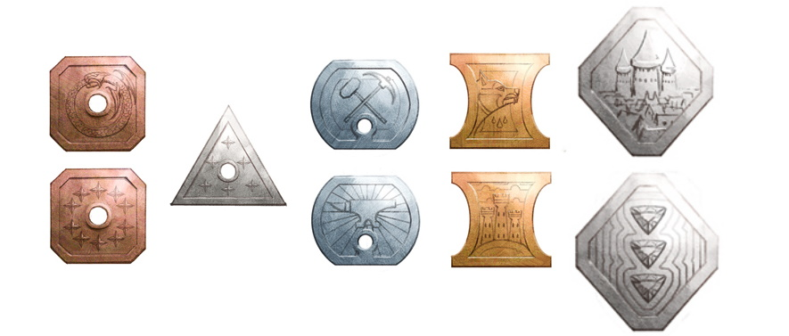

###### top

##### Tomb of Annihilation

# Coins in Port Nyanzaru

The government of Port Nyanzaru doesn't issue its own currency. Citizens use a motley mix of foreign coins, and will generally accept metal coins or bits brought back by adventurers from the ruins of ancient Faerûn civilizations.

The coins of most cultures on Faerûn fall into one of five broad categories:

- 10 _Copper_ coins are worth a single silver coin or piece.

- 5 _Silver_ pieces are worth one electrum coin.
 
- 2 **Electrum** coins (or ten _Silver_) are worth one gold coin or piece.
 
- 10 **Gold** coins or pieces are worth a single platinum coin.
 
- A single _**Platinum**_ coin is therefore worth one thousand copper ones.

- A wide variety of _**Gems**_ are also used in Port Nyanzaru as currency. Depending upon the type of jewel, an individual gem may range in value from a single platinum coin to as much as **five hundred platinum coins**.

[_Waterdeep_ coins](https://forgottenrealms.fandom.com/wiki/Currency)

---

[Items available for purchase in Port Nyanzaru](list_of_items_available_for_purchase_in_Port_Nyanzaru.md#top)

[Activities in Port Nyanzaru](activities_in_Port_Nyanzaru.md#top)

[Tomb of Annihilation homepage](README.md#top)

