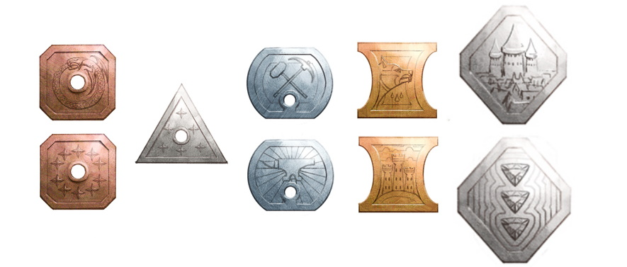
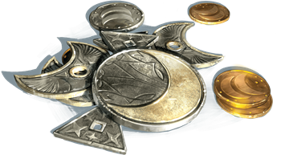

###### top

##### Tomb of Annihilation

# Coins in Port Nyanzaru

The merchant princes of Port Nyanzaru don't currently mint their own currency. Citizens use a motley mix of coins minted by older Chultan cities, foreign coins, [trade goods](https://5thsrd.org/adventuring/equipment/trade_goods/), and other small tokens of value. Port Nyanzaru merchants will generally accept metal coins or bits brought back by adventurers from the ruins of ancient civilizations in Chult or elsewhere in Faerûn.

The coins of [most cultures on Faerûn](https://forgottenrealms.fandom.com/wiki/Currency) fall into one of [five broad categories](https://5thsrd.org/adventuring/equipment/coins/):

- 10 _Copper_ coins are worth a single silver coin or piece.

- 5 _Silver_ pieces are worth one electrum coin.
 
- 2 **Electrum** coins (or ten _Silver_) are worth one gold coin or piece.
 
- 10 **Gold** coins or pieces are worth a single platinum coin.
 
- A single _**Platinum**_ coin is therefore worth one thousand copper ones.

- A wide variety of _**Gems**_ are also used in Port Nyanzaru as currency. Depending upon the type of jewel, an individual gem may range in value from a single platinum coin to as much as **five hundred platinum coins**.

---

> _Coins issued by the wealthy Sword Coast city of Waterdeep._

---

## Banking in Port Nyanzaru
When they travel into the jungle it's generally assumed that the party leaves most of their coins and other treasure in Port Nyanzaru. Characters may choose to carry around pocket change or specific jewels, but they risk losing anything they carry. Human robbers, goblin thieves, and flooding from heavy rain all have the potential to take items, including treasure, from the party. There are numerous places to safely store items in the city: two obvious options are getting a safebox in the [Hall of Gold](dramatis_personae.md#mother-of-prosperity-sibonseni) or leaving items in the care of Syndra Silvane.

> __Bank Error In Your Favor:__ For simplicy of gameplay ignore all banking or storage fees.

---

> _Coins from the Elven city of Silverymoon._

---

### Elsewhere in Port Nyanzaru

[Districts and Locations in Port Nyanzaru](Port_Nyanzaru.md#districts-and-locations-in-port-nyanzaru)

[Activities in Port Nyanzaru](Port_Nyanzaru_activities.md#top)

[Items available for purchase in Port Nyanzaru](Port_Nyanzaru_items.md#top)

---

[Tomb of Annihilation homepage](README.md#top)

