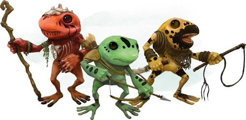

###### top

## Tomb of Annihilation
### _Dramatis Personae_

# Inhabitants of Chult

### Chultan Humans

---

### Lizardfolk

---

### Tabaxi

---

### Batiri Goblins

---

### Tortles

---

### Pterafolk

---

### Aarakocra

---

### Grungs

---

### Yuan-ti
Millennia ago, all of Faerûn suffered under the cruelty of the Yuan-ti, a world-spanning empire of humans who worshipped serpents as the ultimate symbol of beauty and power. At the apex of their civilization, the high priests of the Yuan-ti performed an unholy ritual with thousands of human sacrifices in order to make themselves immortal, and to transform their bodies into the form of immense and powerful serpents.

The ritual was disrupted, however, and the Yuan-ti were instead transformed into hideous half-human forms. Their empire fell to ruin, and the surviving Yuan-ti were driven out of civilization into the wilderness. They have remained hidden in the wilds and shadows ever since, nursing their ancient grievances and watching for an opportunity to return to their rightful place as rulers of Faerûn.

### _Port Nyanzaru:_

# Syndra Silvane
SIN-draw sil-VAIN is a Tethyrian human mage and **the party's employer and patron**. She's a trusted friend and mentor who has contracted the **Death Curse**; the disease is now so severe that Syndra can barely walk, and only slowly and with a cane. Syndra has brought the party to Port Nyanzaru in order to locate the source of the Death Curse, an artifact known as the Soulmonger, somewhere deep in the jungles of Chult.

In Port Nyanzaru, Syndra is staying in the merchants' ward as a guest of the merchant prince and wizard Wakanga O'tamu.

# The Merchant Princes

_From left to right: Ekene-Afa, Ifan Talro'a, Jessamine, Jobal, Kwayothé, Zhanthi, Wakanga O'tamu_

Port Nyanzaru is controlled by a council of seven merchant princes, powerful native Chultans who organized a rebellion and took control of Nyanzaru from the nation of Amn nine years ago. They conduct official city business in the Goldenthrone palace in the Merchant's Ward.

Each merchant prince **controls all selling and trading of certain types of goods** in Port Nyanzaru, although black market goods can sometimes be found outside the city walls.

More information on the merchant princes can be found as part of the page on [items available for purchase in Port Nyanzaru](list_of_items_available_for_purchase_in_Port_Nyanzaru.md#top).

# Zindar
ZIN-dar is a golden half-dragon sorcerer, and **Port Nyanzaru's Harbormaster**, and he's responsible for safely coordinating the vast amount of traffic that flows through the port. He's a common sight during the day in the harbor ward, where he can be seen flying, _sending_, and scrying across the maze-like harbor, trying to keep track of all the ships under his authority. The seven-foot stature of a half-dragon, and an occasional display of his magical prowess, is enough to ensure that the bookish Zindar never gets any real trouble from the many captains and crews upset daily by the port's delays and regulations.

# Sibonseni, Mother of Prosperity
SEH-bone-SEN-ay is Port Nyanzaru's **high priestess of Waukeen**, the deity of trade and wealth, and one of the most important people in Nyanzaru besides the merchant princes. The **Hall of Gold** in the market ward is an opulent temple to Waukeen.

# Grandfather Zitembe
zeh-TEM-bay is the high priest at the **Temple of Savras** in Port Nyanzaru.

# The Brazen Pegasus
A fast [sailing ship available for hire](activities_in_Port_Nyanzaru.md#sailing) somewhere in the labyrinthian harbor ward of Port Nyanzaru. The crew of the Pegasus takes jobs where they can find them, and often fall back on pirate hunting. They're usually on the lookout for skilled sailors and soldiers who might have an interest in joining the Pegasus, [hunting pirates out of the Bay of Chult](activities_in_Port_Nyanzaru.md#hunting-pirates).

### Captain Ortimay Swift and Dark
OR-teh-may is the captain of the Brazen Pegasus and a rock gnome.

### First mate Grig Ruddell
First mate of the Brazen Pegasus, an Illuskan human.

### _Organizations:_

# The Ytepka Society
The yeh-TEP-kah Society, also known as the **Triceratops Society**, is an anonymous and obscure organization with the declared aim of protecting Chultans from tyrants and the abuses of the powerful. Those who upset the Society quietly receive a triceratops-shaped token as a warning to change their ways.

The Ytepka Society is widely known to have had a major role in organizing the merchant princes to take control of **Port Nyanzaru** from Amn. Rumors abound about who is still working with the Society today, and what their current purposes might be.

# The Flaming Fists

The official mercenary company of the wealthy foreign city of **Baldur's Gate**, who serve as guards of the city's interests at home and beyond. Their primary task on Chult is to protect ships flying the flag of Baldur's Gate from pirates; the same ships depend on Port Nyanzaru as a way station, so the Fists are also prepared to defend the Chultan city from being overrun by the undead. To accomplish these ends the Flaming Fists built **Fort Beluarian**, their headquarters on Chult.

### Liara Portyr
lee-AR-ah por-TEER is the current commander of Fort Beluarian, and holds the Flaming Fist rank of *Blaze*. She is a human soldier.

# Player Factions

_From left to right: Harpers, Zhentarim, Lords' Alliance, Emerald Enclave, Order of the Gauntlet._

# The [Order of the Gauntlet](https://dnd.wizards.com/dungeons-and-dragons/story/factions)
The Order is a group of paladins, clerics, and other worshippers of Tyr, Helm, and Torm, who have joined together in order to oppose and destroy the many forces of elemental evil in Toril. The foreign Order established **Camp Righteous** deep in the jungle of Chult in order to destroy the undead menace there, but as the undead became more aggressive the camp was overrun. Undeterred, the Order has established **Camp Vengeance** even deeper in the interior, where they now continue their efforts to purge the undead from the jungle.

### Niles Breakbone
The current commander of Camp Vengeance is a human noble.

# The [Zhentarim](https://dnd.wizards.com/dungeons-and-dragons/story/faction/zhentarim)
Zhentarim mercenaries are renowned across Faerûn as the best money can buy, and the **foreign mercenary company** is commonly employed in Chult to provide city guards, personal bodyguards, and protection for mines and logging camps in the jungle.

# The [Harpers](https://dnd.wizards.com/dungeons-and-dragons/story/faction/harpers)
An underground network of individuals who work to oppose tyrants and the powerful.

# The [Emerald Enclave](https://dnd.wizards.com/dungeons-and-dragons/story/faction/emeraldenclave)
A group of druids, rangers, and others that oppose threats to the natural world and helps others survive the many perils of the wild.

# The [Lords' Alliance](https://dnd.wizards.com/dungeons-and-dragons/story/faction/lordsalliance)
A loose coalition of Sword Coast cities and nations working together for mutual defense. Lords' Alliance members are generally concerned with events in the Sword Coast area, significantly North of Chult.

### _Historical and Famous Figures:_

# Aremag
An ancient **dragon turtle** that still patrols the Bay of Chult, demanding treasure from the many ships passing through.

# The _Tarrasque_
Tall tales of the return of the _Tarrasque_ have always been a popular topic in the taverns of Faerûn, but something has been subtly different since you arrived in Port Nyanzaru. Many Chultans are still mocking the stories told by travellers who claim to have been to the deepest jungles of the interior, but others have a quiet seriousness and urgency to their questioning. With the recent rise of the Death Curse, the growing aggressiveness of the undead, and the re-awakening of long-dormant volcanoes, it's no wonder that Chultans are considering the further catastrophic possibility of the return of the _Tarrasque_. If the mythological prophecy __is__ finally occurring, and the _Tarrasque_ __has__ risen, then it is coming to consume, and bring the apocalyptic final end to, the entire world of Toril.

Beginning with Chult.

_Mythological depictions of the coming of the **Tarrasque**._

# Na N'buso
An ancient Chultan king. A modern statue of Na N'buso in full regalia graces the entrance to the harbor of Port Nyanzaru.

# Drizzt Do'Urden
A famous drow elf known throughout Faerûn. The stories of the adventures of Drizzt and his companions in the Icewind Dale are a popular request for bards across the forgotten realms of Faerûn.

# Ras Nsi
RAZ nuh-SEE was a warlord who tried to conquer the Chultan city of **Mezro** with an undead army a little over a century ago. He was defeated, but his undead hordes flooded into the jungle-choked interior of Chult and drove the native inhabitants out.

# Volothamp "Volo" Geddarm

VOH-loh-thamp geh-DARM is a famed human explorer currently in Port Nyanzaru as part of a book tour across Faerûn.

50 gold coins will get a character a signed copy of _**Volo's Guide to Monsters**_ in a durable hardcover binding with vellum pages, suitable for strenuous jungle adventuring. Volo claims the book has accurate information on creatures and monsters across Faerûn, including a thoroughly-researched section about those inhabiting Chult.

---

# **_Acererak_**
Born to an Age that was already forgotten long before the earliest writings of the most ancient elves, Acererak is an immortal _**Lich**_ of unimaginable and sublime power. Wielding magic that dwarfs that of Faerûn's greatest deities, Acererak travels far and wide through the Astral Plane, wandering the uncounted worlds that can be reached from there while watching and manipulating the lives of both mortals and gods for his own amusement.

Obscure texts tell the story of an ancient world named **Oerth**, where Acererak constructed an immense dungeon that he filled with powerful artifacts made from fragments of his own power. Vast armies' worth of adventurers were lured to their final death by the treasure in that ancient slaughterhouse, arrogantly underestimating the power and cruelty of Acererak.

Today, only a few fragments of that story are still remembered in Faerûn, where they're retold as the popular but now mostly-untrue legends of the [_**Tomb of Horrors**_](https://en.wikipedia.org/wiki/Tomb_of_Horrors).

---

# Further reading

[Adventure introduction](introduction.md#top)

[Activities in Port Nyanzaru](activities_in_Port_Nyanzaru.md#top)

[Coins in Port Nyanzaru](coinage.md#top)

[Character creation](character_creation.md#top)

[Tomb of Annihilation homepage](README.md#top)

---

[Back to top](#top)

