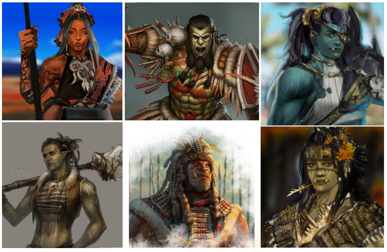
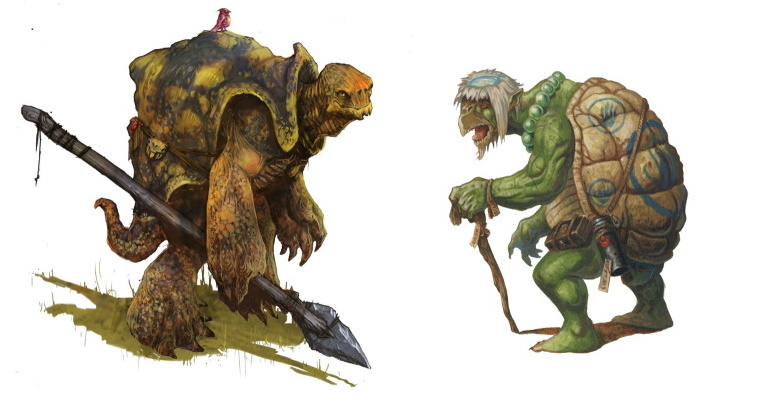
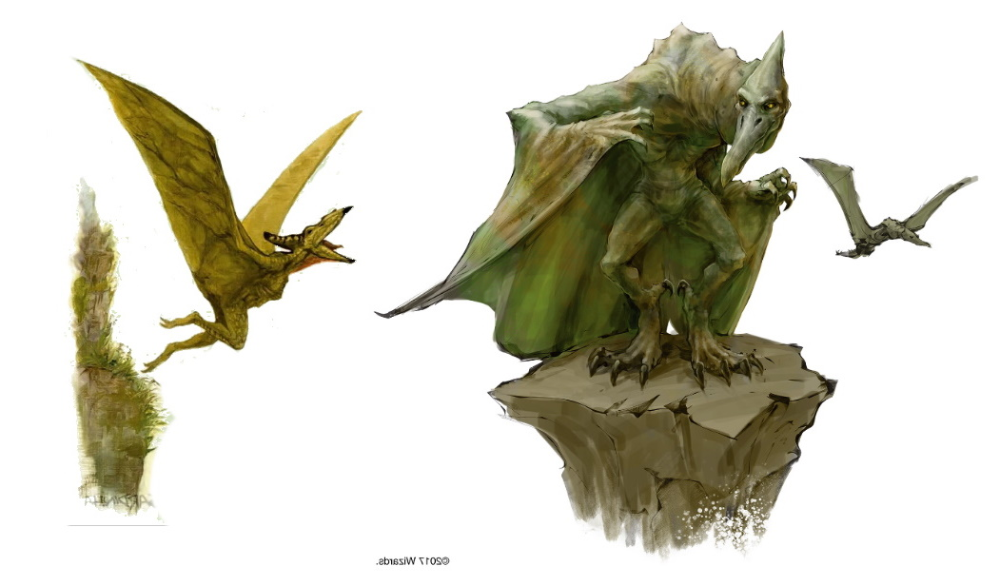
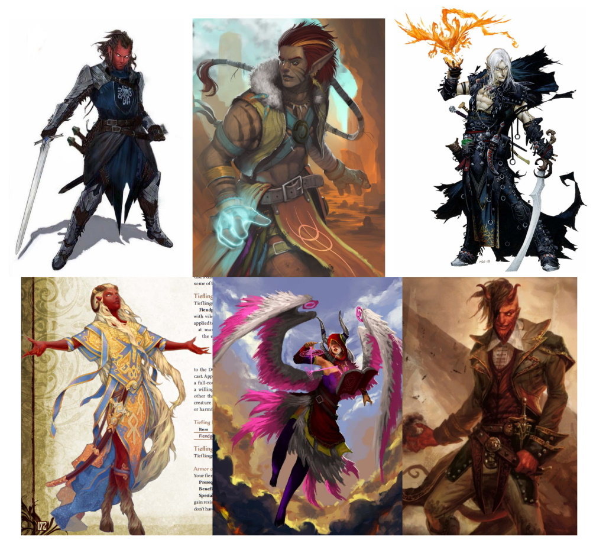
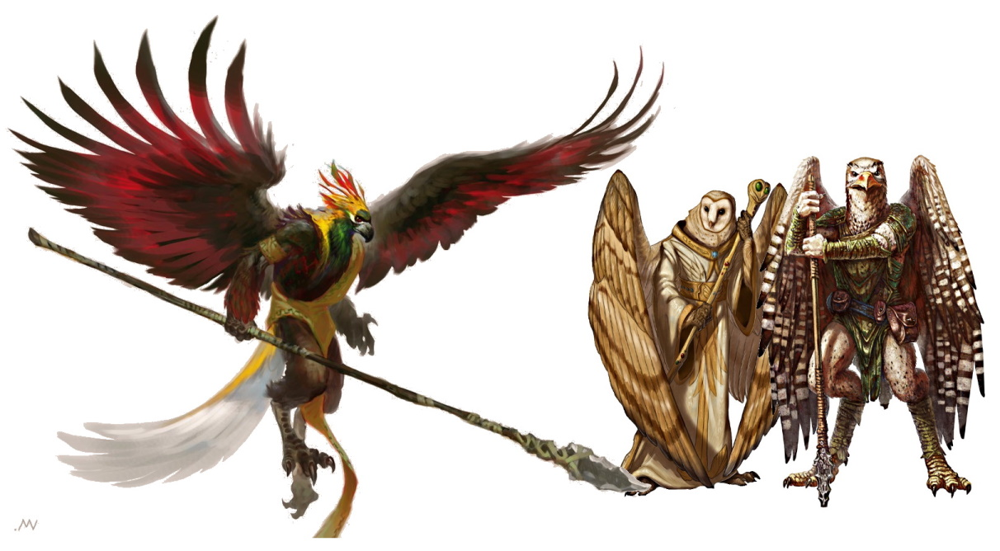

###### top

# Tomb of Annihilation Dramatis Personae

- [Native inhabitants of Chult](#native-inhabitants-of-chult)
- [Port Nyanzaru](#port-nyanzaru)
    - [The _Brazen Pegasus_](#the-brazen-pegasus)
- [Organizations](#organizations)
    - [Player Factions](#player-factions)
- [Historical and Famous Figures](#historical-and-famous-figures)

# Native inhabitants of Chult

Port Nyanzaru is a cosmopolitan city built on international trade: people from all parts of Faerûn, as well as travellers from the far West continents of Anchorome and Kara-Tur, can be found in the city. The following are some examples from local Chultan cultures:

> If you want to play a monstrous character, or one that needs other special rules, you must have your own personal copy of the relevant sourcebook, often **Volo's Guide to Monsters**.

---

### Humans

---

### Orcs and Half-Orcs

---

### Tabaxi

---

### Batiri Goblins and Hobgoblins

---

### Elves and Half-Elves

---

### Lizardfolk

---

### Dragonborn

---

### Dwarves

---

### Tortles

---

### Pterafolk

---

### Tieflings and Aasimar

---

### Aarakocra

---

### Gnomes and Halflings

---

### Thri-Kreen

---

### Grungs

---

### Yuan-ti
Millennia ago, all of Faerûn suffered under the cruel, world-spanning empire of the Yuan-ti: humans who worshipped serpents as the ultimate symbol of beauty and power. At the apex of the Yuan-ti's civilization, their high priests performed an unholy ritual with thousands of living sacrifices in order to make themselves immortal, and to transform their bodies into the form of immense and powerful serpents.

The ritual was disrupted, however, and the Yuan-ti were instead transformed into hideous half-human forms. The high priests turned on each other, sparking a brutal civil war across the entire empire. In response, the many conquered peoples of Faerûn began to resist the empire and throw off the yoke of the Yuan-ti.

The surviving Yuan-ti were eventually driven out of their conquered lands and into the swampy wildernesses that they had originally emerged from. They have remained hidden in the wilds and in the shadows ever since, nursing their ancient grievances and searching for an opportunity or source of power that can return them to their rightful place as immortal conquerors of Faerûn.

### _Port Nyanzaru:_

# Syndra Silvane
SIN-draw sil-VAIN is a [Tethyrian](https://forgottenrealms.fandom.com/wiki/Tethyrian) mage and **the party's employer and patron**. She's a trusted friend and mentor who has contracted the **Death Curse**; the disease is now so severe that Syndra can barely walk, and only slowly and with a cane. She has taken to wearing a silver mask and hood to hide the progression of the Death Curse.

Syndra has brought the party to Port Nyanzaru in order to locate the source of the Death Curse, an artifact known as the Soulmonger, somewhere deep in the jungles of Chult. In Port Nyanzaru, Syndra is staying in the merchants' ward as a guest of the merchant prince and wizard Wakanga O'tamu.

# The Merchant Princes

> _Ekene-Afa - Ifan Talro'a - Jessamine - Jobal_
>
> _Kwayothé - Wakanga O'tamu - Zhanthi_

Port Nyanzaru is controlled by a council of seven merchant princes, powerful native Chultans who organized a rebellion and took control of the city from the nation of Amn nine years ago. They conduct official city business in the Goldenthrone palace in the merchants' ward.

Each merchant prince **controls all selling and trading of certain types of goods** in Port Nyanzaru, although black market goods can sometimes be found outside the city walls.

More information on the individual merchant princes can be found as part of the page on [items available for purchase in Port Nyanzaru](list_of_items_available_for_purchase_in_Port_Nyanzaru.md#top).

# Sibonseni, Mother of Prosperity
Mother of Prosperity SEH-bone-SEN-ay is Port Nyanzaru's **high priestess of Waukeen**, the deity of trade and wealth, and the most powerful person in Port Nyanzaru besides the merchant princes. Many international merchants come to Port Nyanzaru just to seek out Sibonseni and her advice or blessing for important business deals. Among the city's own citizens, the Mother of Prosperity is known as a generous sharer of the wealth Waukeen has brought her temple. Nevertheless, the **Hall of Gold** in the market ward is by far the largest and most opulent temple in Port Nyanzaru.

# Grandfather Zitembe
Grandfather zeh-TEM-bay is the high priest at the [**Temple of Savras**](activities_in_Port_Nyanzaru.md#port-nyanzaru-temple-of-savras), Faerûn deity of divination and fate, in Port Nyanzaru. Despite a slowly-growing list of eccentricities, Zitembe remains a trusted confidante of the city's wealthiest and most powerful figures. No Port Nyanzaru merchant will complete a deal without at least one visit to the temple of Savras in the merchants' ward.

# Erlathan Naeynore
The owner and usual bartender at the [Thundering Lizard Inn and Tavern](activities_in_Port_Nyanzaru.md#port-nyanzaru-the-thundering-lizard-tavern). Erlathan made his fortune as a gladiator in the Grand Coliseum, and in spite of the stern tone he sometimes takes with fools he tolerates quite a lot of rough behavior inside the Thundering Lizard.

# Kaya
The owner of [Kaya's House of Repose](activities_in_Port_Nyanzaru.md#port-nyanzaru-kayas-house-of-repose). Kaya's inn is priced for a modest lifestyle and is in a residential section of the market ward. Kaya strictly enforces quiet hours after sundown, with the depicted hammer if necessary.

# Xandala Cinder
Xandala is a half-elf sorcerer searching in Port Nyanzaru for information about her father, Artus, or his lost expedition that travelled up the river Tath. The Cinder family has significant wealth, and Xandala will reward anyone who can bring her information about where Artus's small party travelled in Chult, or their final destination.

# Harbormaster Zindar
ZIN-dar is a bronze half-dragon sorcerer and Port Nyanzaru's Harbormaster: he's responsible for safely coordinating the vast amount of traffic that flows through the port. He's a common sight during the day in the harbor ward, where he can be seen flying, [_sending_](https://5thsrd.org/spellcasting/spells/sending/), and [_scrying_](https://5thsrd.org/spellcasting/spells/scrying/) across the maze-like harbor, trying to keep track of all the ships under his authority. The seven-foot stature of a half-dragon, and an occasional display of his magical prowess, is enough to ensure that the bookish Zindar never gets any real trouble from the many captains and crews upset daily by the port's delays and regulations.

> Zindar has been discreetly asking around for someone trustworthy to assist him with tracking down criminal activity at night in Port Nyanzaru's [harbor ward](Port_Nyanzaru.md#harbor-ward).

# Lerek Dashlynd
Lerek Dashlynd is a rogue and broker who represents powerful Waterdhavian commercial interests, and he's looking for an accurate map with the locations of the two ruined Chultan settlements **Nangalore** and **Oralunga**. Lerek has posted a public offer to provide a [sailing ship](activities_in_Port_Nyanzaru.md#your-very-own-ship) to any explorer who trades him a map that can be verified by divination magic.

# The Brazen Pegasus
Somewhere in the labyrinthian harbor ward of Port Nyanzaru is a fast sailing ship that can be [hired](activities_in_Port_Nyanzaru.md#sailing) to take explorers to one of Chult's [many bays](introduction.md#six-facts-about-chult) to start their expedition into the jungle. Captain Swift and Dark and her crew on The Brazen Pegasus take whatever jobs they can find, and often fall back on protecting ships from the pirates of the Shining Sea. While in Port Nyanzaru they're usually on the lookout for skilled sailors and soldiers who might have an interest in joining the Brazen Pegasus's crew, [hunting pirates out of the Bay of Chult](activities_in_Port_Nyanzaru.md#hunting-pirates).

> ## Captain Ortimay Swift and Dark
> OR-teh-may Swift and Dark is the captain of the Brazen Pegasus and a rock gnome. Like many gnomes, she has a diverse variety of interests and an impatient passion for life, but above all else Captain Swift and Dark has an unmistakable _talent_ for hunting pirates.
> 
> 

> ## First Mate Grig Ruddell
> An Illuskan human and the first mate on the Brazen Pegasus. Ruddell has a retiring personality, and is definitely getting too old for the life of a sailor, but his literal retirement gave Grig enough cabin fever that he was eventually driven back out onto the Brazen Pegasus and the Shining Sea.
> 
> 

### _Organizations:_

# The Ytepka Society
The yeh-TEP-kah Society, also known as the **Triceratops Society**, is an anonymous and obscure organization with the declared aim of protecting Chultans from the abuses of tyrants and malicious foreign powers. Those who upset the Society quietly receive a triceratops-shaped token as a [warning](list_of_items_available_for_purchase_in_Port_Nyanzaru.md#jessamine) to change their ways.

The Ytepka Society is widely known to have had a major role in organizing the merchant princes to take control of **Port Nyanzaru** from Amn. Rumors abound about who is still working with the Society today, and what their current purposes might be.

---

# The Flaming Fists
The official mercenary company of the wealthy foreign city of **Baldur's Gate**, who serve as guards of the city's interests at home and abroad. Their primary task on Chult is to protect ships flying the flag of Baldur's Gate from pirates; the same ships depend on Port Nyanzaru as a way station, so the Fists are also prepared to defend the only surviving Chultan city from being overrun by the undead. To accomplish these ends the Flaming Fists built **Fort Beluarian**, their headquarters on Chult.

> ## Blaze Liara Portyr
> 
> lee-AR-ah por-TEER is the current commander of Fort Beluarian, and holds the Flaming Fist rank of *blaze*. The blaze Portyr is a career soldier who comes from the important Portyr family in Baldur's Gate. She's related to one of the four current Lords of Baldur's Gate, but as a blaze she answers only to Grand Duke Ulder Ravengard, a fellow career officer of the Flaming Fist.
> 
> 

# Player Factions

_From left to right: Harpers, Zhentarim, Lords' Alliance, Emerald Enclave, and the Order of the Gauntlet._

# The Harpers
An underground network of freedom-loving bards, rogues, mages, and others who [work throughout](https://dnd.wizards.com/dungeons-and-dragons/story/faction/harpers) Faerûn to oppose tyrants and the abuses of the powerful.

> ## Nivri Snowfang
> Nivri Snowfang is a Harper _bright candle_, and Harper members' official contact in Port Nyanzaru (and therefore all of Chult). Snowfang lives a comfortable life skimming from the immense wealth of Port Nyanzaru, enjoying the local luxuries, racing in the difficult two-legged dinosaur races and betting on herself, all while keeping an ear to the ground for information useful to the Harpers. [Syndra Silvane](#syndra-silvane) is a Harper _wise owl_, and Nivri is one of Silvane's trusted contacts for scrounging up information on Chult and the Soulmonger.
> 
> 

# The Zhentarim
Zhentarim mercenaries are renowned across Faerûn as the best money can buy, and the foreign mercenary company is [commonly employed](https://dnd.wizards.com/dungeons-and-dragons/story/faction/zhentarim) in Chult to provide city guards, personal bodyguards, and protection for mines and logging camps in the jungle.

> ## Kuraz
> Kuraz the orc is the _viper_ in charge of day-to-day Zhentarim operations in Chult. There are plenty of opportunities in Chult for an ambitious young Zhent to make a name for themself, but the lazy Kuraz considers his current station to be a rather cushy gig: he's content to stay out of trouble with [Ekene-Afa](list_of_items_available_for_purchase_in_Port_Nyanzaru.md#ekene-afa) and sell the Black Network's services as a legitimate mercenary company. When not dealing with Zhentarim business in the merchants' ward, Karuz is usually either carousing in the vicinity of one of Port Nyanzaru's various [combat arenas](activities_in_Port_Nyanzaru.md#fighting), or parading around on his showy, but rather tame, personal tyrannosaur.
> 
> 

# The Lords' Alliance
A loose coalition of Sword Coast cities, lords, and merchants working together to defend civilization, keep the peace, and maintain stability in the face of the incredible powers and forces that wreak havoc across Faerûn. Lords' Alliance members are usually concerned with events in the Sword Coast area, [significantly North](introduction.md#welcome-to-chult) of Chult, but the various Lords maintain [agents and spies](https://dnd.wizards.com/dungeons-and-dragons/story/faction/lordsalliance) almost everywhere in Faerûn.

> ## Tsaubra McGee
> Tsaubra McGee is a golden dragonborn, an honorably-retired paladin, and a popular _master_ in Port Nyanzaru's [dyers' guild](Port_Nyanzaru.md#market-ward). Tsaubra's work selling and managing large dying jobs gives him access to people and places all over the city, and the _stingblade_ is able to spy for the Open Lord of Waterdeep while throwing suspicion off his behavior with either the excuse of gathering info for future guild work, or explaining it away as a part of his well-publicized artistic eccentricity. Tsaubra used to own and race a triceratops, but he's now trying to keep a lower profile: he can still be found in the crowd most tenth-days carousing and gambling on the races.
> 
> 

# The Emerald Enclave
An ancient organization of druids, rangers, and others who oppose threats to the natural world, and help the innocent survive the many perils of the wild. The Emerald Enclave does have members who patrol the deep Chultan jungles, but almost all Enclave members [operate in isolation](https://dnd.wizards.com/dungeons-and-dragons/story/faction/emeraldenclave), and Chult is far too large for any single individual to ever master.

> ## Danbul Thistletop
> The lightfoot halfling Danbul Thistletop is an _autumn reaver_ in the Emerald Enclave, and he's members' point of contact in Port Nyanzaru and the Bay of Chult. He has an affinity for all the dinosaurs of Chult, and Danbul can usually be found at or summoned to the [Tiryki anchorage](Port_Nyanzaru.md#tiryki-anchorage) within a few days. He's an utterly ruthless [gamer](activities_in_Port_Nyanzaru.md#gaming) and dinosaur racer.
> 
> 

# The Order of the Gauntlet
Paladins and clerics of the deities Tyr, Helm, and Torm recently established the Order of the Gauntlet in order to better fight the evils of Faerûn. In Chult, the foreign Order established **Camp Righteous** deep in the jungle in order to fight the undead menace there and provide assistance to travellers. As the undead became more aggressive in the past few years Camp Righteous was overrun. Undeterred, the Order has established **Camp Vengeance** even deeper in the interior, where they [continue their efforts](https://dnd.wizards.com/dungeons-and-dragons/story/faction/ordergauntlet) to purge the undead from the jungle.

> ## Malexus
> A tiefling bard named Malexus is the Order's agent in Port Nyanzaru itself, outside of Camp Vengeance. Malexus's status as a _white hawk_ in the Order of the Gauntlet is only a semi-open secret, which allows him to more easily keep an eye on the merchants, clerics, and mages that keep Camp Vengeance supplied, all while listening for information that might be useful to the Order in the streets of the international city. Most days Malexus can be found alongside his beloved dimetrodon [performing](activities_in_Port_Nyanzaru.md#port-nyanzaru-street-performers) in Port Nyanzaru for a carefully-placed crowd, often in the Grand Souk, or one of the many Port Nyanzaru taverns where business deals are negotiated.
> 
> 

> ## Vindicator Niles Breakbone
> The current commander of Camp Vengeance is a young and untested [Chondathan](https://forgottenrealms.fandom.com/wiki/Chondathan) noble named Niles Breakbone. He's a paladin of [Tyr](https://forgottenrealms.fandom.com/wiki/Tyr), and a newly-minted _vindicator_ of the Order, who has come to Chult with a vague dream of somehow ending the undead plague that has stolen the Chultans' homeland from them. The Silverymoon [bloodhawk](https://5thsrd.org/gamemaster_rules/monsters/blood_hawk/) depicted in his portrait died shortly after Niles entered the jungle, and since arriving at Camp Vengeance vindicator Breakbone has been struggling to train a baby pteradon in falconry.
> 
> 

### _Historical and Famous Figures:_

# Aremag

A gargantuan dragon turtle called Aremag patrols the Bay of Chult, demanding treasure from ships passing through on their way to or from Port Nyanzaru. There's too much traffic for Aremag to catch every single ship that sails through, and Aremag doesn't appreciate slow or uncomprehending crews who delay her hunting. Aremag won't hesitate to sink an uncooperative or fast-talking ship so that she can simply pick out the treasure at her leisure later that night, when the bay is less busy.

Although a drag on trade, many citizens of Port Nyanzaru have become fond of Aremag because she's a famous symbol of the city, or perhaps because so many of the captains sunk by the gargantuan beast, after being rescued by a more sensible captain, later turn out to be loud and arrogant fools. Aremag is quite happy with her straightforward life of intimidating tiny ships and collecting a hoard of exotic treasures, and the beast is largely unaware of the concerns of the city.

# The _Tarrasque_
Tall tales of the return of the _Tarrasque_ have always been a popular topic in the taverns of Faerûn, but something has been subtly different since you arrived in Port Nyanzaru. Many Chultans are still mocking the storytellers who claim to have been to the deepest jungles of the interior, but others have a quiet seriousness and urgency to their questioning. With the recent rise of the Death Curse, the growing aggressiveness of the undead, and the re-awakening of long-dormant volcanoes, it's no wonder that Chultans are considering the further catastrophic possibility of the return of the _Tarrasque_. If the mythological prophecy __is__ finally occurring, and the _Tarrasque_ __has__ risen, then it is coming to consume - and bring the apocalyptic final end to - the entire world of Toril.

Beginning with Chult.

_Mythological depictions of the coming of the **Tarrasque**._

# Na N'buso
An ancient Chultan king. A modern statue of Na N'buso in full regalia graces the entrance to the harbor of Port Nyanzaru.

# Drizzt Do'Urden
A famous drow elf known throughout Faerûn. The stories of the adventures of Drizzt and his companions in the Icewind Dale are a popular request for bards across the forgotten realms of Faerûn.

# Ras Nsi
RAZ nuh-SEE was a warlord who tried to conquer the Chultan city of **Mezro** with an undead army a little over a century ago. He was defeated, but his undead hordes flooded into the jungle-choked interior of Chult and drove the native inhabitants out.

# Volothamp "Volo" Geddarm

VOH-loh-thamp geh-DARM is a famed human explorer currently in Port Nyanzaru as part of a book tour across Faerûn.

50 gold coins will get your character a signed copy of _**Volo's Guide to Monsters**_ in a durable hardcover binding with vellum pages, suitable for strenuous jungle adventuring. Volo claims the book has accurate information on creatures and monsters across Faerûn, including a thoroughly-researched section about those inhabiting Chult.

# **_Acererak_**
Born to an Age that was already forgotten before the earliest elven civilizations laid their first brick, Acererak is an immortal _**Lich**_ of unimaginable and sublime power. Wielding magic that easily dwarfs that of Faerûn's greatest deities, Acererak travels far and wide through the Astral Plane, wandering the uncounted worlds that can be reached from there while watching and manipulating the lives of both mortals and gods for his own amusement.

[Obscure texts](https://en.wikipedia.org/wiki/Tomb_of_Horrors) tell the story of an ancient world named **Oerth**, where Acererak constructed an immense dungeon that he filled with powerful artifacts made from fragments of his own power. Vast armies' worth of adventurers were lured to their final death by the treasure in that ancient slaughterhouse, arrogantly underestimating the power and cruelty of Acererak.

Today, only a few fragments of that myth are still remembered in Faerûn, where they're retold as the popular, but now mostly untrue, stories of the _**Tomb of Horrors**_.

---

[Back to top](#top)

# Further Reading

- [__Tomb of Annihilation__ adventure introduction](introduction.md#top)
  - [Welcome to Chult](introduction.md#welcome-to-chult)
- [Welcome to Port Nyanzaru](Port_Nyanzaru.md#top)
- [Character creation](character_creation.md#top)
  - [Background options](character_creation.md#background-options)
- [Tomb of Annihilation homepage](README.md#top)

