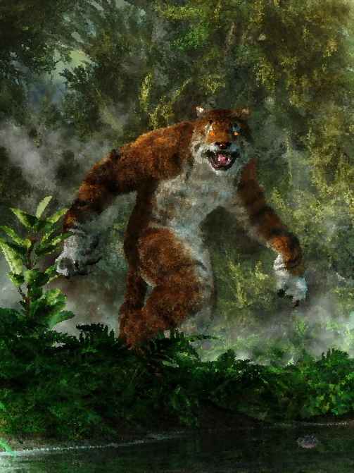

###### top

##### Tomb of Annihilation

# Adventure Introduction

## Welcome to _**Tomb of Annihilation**_, an adventure for Dungeons & Dragons!

This story takes place in the forgotten realms of Faerûn, on the strange world of Toril. The year is 1496 by dale-reckoning when you first receive the upsetting news: your trusted friend and mentor **Syndra Silvane** has contracted the **Death Curse**. Once a rare affliction, over the past year the Death Curse has begun afflicting far more people all across the continent of Faerûn, particularly adventurers and ex-adventurers. Those stricken with the Curse begin to weaken and wither away, suffering day by day until the wasting disease kills them. The disease can't be cured with any kind of magical healing, and those killed by it **can't be magically resurrected**.

Desperately searching for a treatment, your mentor Syndra has become convinced that the Death Curse is being caused by a malevolent artifact known as the **Soulmonger**, located somewhere in the unmapped jungles on the southern peninsula called **Chult**.

Now, Syndra has gathered you and the other members of your party in **Port Nyanzaru**, the last city in Chult, to work together in the hope of finding and somehow disabling the Soulmonger, before it ends the life of not only Syndra but all adventurers who would dare stand against the elemental evils of Faerûn.

---

_Somewhere in the jungles of **Chult**, the Soulmonger leeches life from those stricken by the Death Curse._

# Welcome to Chult!

# Six facts about Chult

1. Chult is a peninsula in the far southwest of the continent of Faerûn. Dense and inhospitable jungle chokes the entire land, and mountain ranges to the south, west, and north make accessing the interior ever more difficult.

2. Chult is hot, humid, and rainy throughout the year. Temperatures vary from 70F to over 100F, while rain varies from a steady mist to drenching downpours. Biting insects are a year-round menace.

3. Dinosaurs rule the wild jungles of Chult, particularly deep in the Valley of Dread. In Port Nyanzaru they are used as beasts of burden and butchered for meat.

4. Over a century ago the warlord Ras Nsi raised an undead army to conquer Mezro. He was defeated, but his undead hordes swarmed into the jungle and drove Chult's inhabitants to the exterior of the peninsula.

5. After the Chultans were driven from the interior, the Spellplague and later the two Sunderings each struck the world of Toril, warping and reshaping reality and geography all across Faerûn. Since those times a reliable map of Chult's interior has yet to be re-cartographed.

6. Numerous settlements remained on the Chultan coast despite the undead presence, but in recent years all except Port Nyanzaru have fallen to ruin. Long-dormant volcanoes have awakened and the undead have become more aggressive in the past few years, making the land of Chult more dangerous than ever.

# Dangers of Chult

- Insects spreading disease
- Were-tigers
- Dinosaurs
- Undead

# Further reading

[Dramatis Personae](dramatis_personae.md#top)

[Welcome to Port Nyanzaru](Port_Nyanzaru.md#top)

[Tomb of Annihilation homepage](README.md#top)

---

[back to top](#top)

