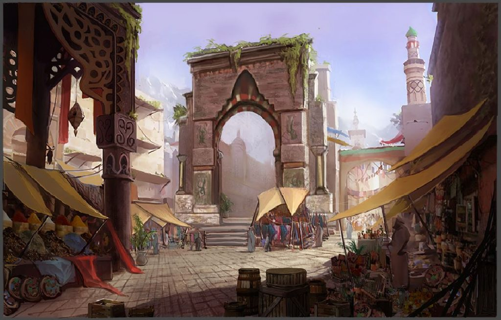
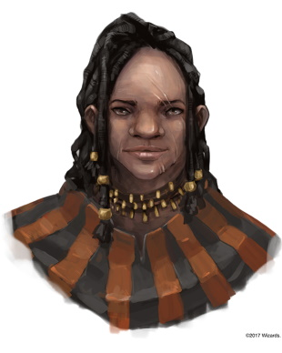
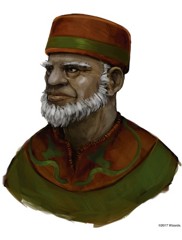
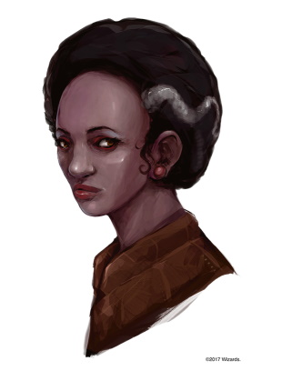
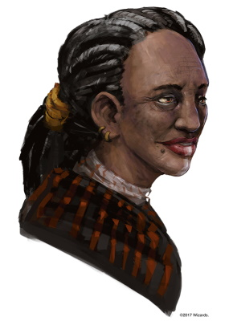
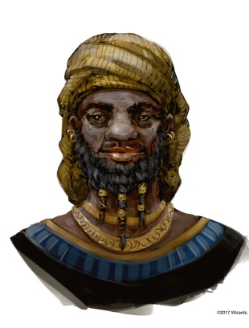

###### top

##### Tomb of Annihilation
# Items available for purchase in Port Nyanzaru

## The Merchant Princes

_From left to right: Ekene-Afa, Ifan Talro'a, Jessamine, Jobal, Kwayothé, Zhanthi, Wakanga O'tamu_

Each of the seven merchant princes who rule Port Nyanzaru controls the selling and trading of certain types of goods in Port Nyanzaru. In order to purchase any goods or services you'll have to deal with one of the princes or their organizations.

- [Ekene-Afa](#ekene-afa) is an ex-gladiator who controls the sale and trade of weapons, shields, travelling gear, rain catchers, saddles, wagons, and canoes.
- [Ifan Talro'a](#ifan-talroa) controls the sale of beasts and beast training, including the dinosaurs used as pack animals throughout Port Nyanzaru. He's also responsible for overseeing the [tenth-day dinosaur races](activities_in_Port_Nyanzaru.md#dinosaur-racing).
- [Jessamine](#jessamine) is the only public representative of Port Nyanzaru's assassin's guild, and controls the sale of [poisons](list_of_poisons.md#top) and [medicinal Chultan plants](list_of_chultan_plants.md#top).
- [Jobal](#jobal) is an ex-guide and the merchant prince with authority over all of Port Nyanzaru's jungle guides, and the matchmaker for most of them.
- [Kwayothé](#kwayothé) is the high priestess in the temple of Sune, and additionally a merchant prince who controls the sale and production of tej, wine, ale, fruit, oil, perfume, and insect repellant. This also gives her immense authority over most restaurants, taverns, ceremonies, and celebrations in Port Nyanzaru.
- [Zhanthi](#zhanthi) is a noble who runs the Jewel Market, an exclusive and high-end market for the sale of [art, jewelry, gems](activities_in_Port_Nyanzaru.md#selling-loot-or-items), metal armors, and magic items.
- [Wakanga O'tamu](#wakanga-otamu) is the mage with authority over all [magic item sales](activities_in_Port_Nyanzaru.md#buying-a-magic-item) in Port Nyanzaru, though such sales are rare even in Port Nyanzaru's massive markets. Common potions and scrolls are [available for purchase](#magic-items), however.

## Mundane Items
All [mundane items in the _Player's Handbook_](https://5thsrd.org/adventuring/equipment/adventuring_gear/) are available for purchase at their normal price, except that **heavy armor** is rare in Chult and costs triple the normal price. The tables on this page show additional items not found in the _Player's Handbook_.

## The Four Markets
There are four major markets in Port Nyanzaru, each specializing in different types of goods. The party can [buy or sell items](activities_in_Port_Nyanzaru.md#buying-mundane-items) by visiting the appropriate market during their [downtime days](activities_in_Port_Nyanzaru.md#downtime-day-activities).

|Market|Usual Goods|Ward|
|-|-|-|
|Grand Souk|International trade, which could include almost anything|Merchants' Ward|
|Jewel Market|Art, rare trade goods, gems, treasure, and other expensive items|Merchants' Ward|
|Red Bazaar|Groceries and everyday supplies, dinosaur meat, common trade goods, mundane items, weapons, armor, equipment|Market Ward|
|Fish Market|Fish|Market Ward|

# Ekene-Afa

eh-KEE-nee AH-fah is a Chultan ex-gladiator who rose from the pits of Port Nyanzaru's Grand Coliseum to become a mercenary captain and merchant prince. Today, as a merchant prince Ekene-Afa has authority over all mercenary contracts involving Port Nyanzaru, as well as the sale and trade of **weapons, shields, travelling gear, rain catchers, saddles, wagons, and canoes**.

Ekene-Afa can be a wrathful and mercurial leader, and the people who succeed in her personal mercenary organization **The Velociraptor Company** are those that can stay calm and think quickly in the face of a suddenly-angry boss with a history of killing people for sport.

The bulk of Port Nyanzaru's mercenaries are foreigners like the Zhentarim, however, and Ekene-Afa must also carefully and dispassionately watch and manipulate them in order to ensure the city's newly-won independence isn't threatened or undermined. In this task she at least has the rare boon of the full and unanimous support of the other merchant princes.

| Item | Price | Notes |
|-|-|-|
| Canoe | 50 gold coins | Carries six characters. |
| Rain Catcher | 1 gold coins | Can hold up to 8 gallons of rainwater. |
| Yklwa | 1 gold coins | Simple melee weapon: 1d8 piercing damage, thrown 10/30 ft |
| _+1 Ammunition_ | 5 platinum coins per piece | Magical: +1 to attack rolls and damage |
| _+1 Wooden Shield_ | 45 platinum coins | Magical: +1 to AC |
| _+1 Dagger_ | 50 platinum coins | Magical: +1 to attack rolls and damage |
| _+1 Yklwa_ | 50 platinum coins | Magical: +1 to attack rolls and damage |

A **yklwa** (YICK-ul-wah) is a 3-foot wooden shaft with a steel or stone blade up to 18 inches long.

# Ifan Talro'a

EE-fawn tal-ROH-ah is a Chultan noble who controls the sale of **beasts and beast training**. He's also responsible for Port Nyanzaru's dinosaur races, and every tenth-day finds Ifan staying busy in the trainer and rider pavilions making sure the races are run smoothly and safely.

The roughnecks who train dinosaurs in the Tiryki anchorage are far from being "an organization", but they generally trust Ifan, and respect that his responsibilities and commandments are important for maintaining peace and steady business with the rest of the city. From the city's perspective, Ifan controls the vital infrastructure and resource that is the city's dinosaurs, and he's one of very few people who can reliably manage the rowdy Tiryki trainers. Ifan relies on a handful of trusted lieutenants to carry out errands and deal with the variety of trainers under his authority.

| Trained Animal | Price |
|-|-|
| Flying Monkey | 10 platinum coins |
| Giant Lizard | 10 platinum coins |
| Hadrosaur | 10 platinum coins |
| Ankylosaur | 25 platinum coins |
| Deinonychus | 25 platinum coins |
| Flying Snake | 25 platinum coins |
| Triceratops | 50 platinum coins |

Characters can learn to ride and race dinosaurs, and can [participate in Port Nyanzaru's tenth-day dinosaur races](activities_in_Port_Nyanzaru.md#dinosaur-racing).

# Jessamine

JESS-ah-meen is a Chultan ex-assassin who controls the buying and selling of **plants, poison, and assassination**. She is the only public face of an anonymous guild of professional assassins in Port Nyanzaru who sell their brutal service to wealthy foreign visitors.

Jessamine is the sole person in Port Nyanzaru with the authority to issue *sanctions*, writs that allow for legal assassinations in the city by approved methods, usually poison or a single stab with a blade. Sanctions are rarely sold and are extremely expensive.

[Chultan Plants](list_of_chultan_plants.md#top)

[Poisons](list_of_poisons.md#top)

# Jobal

joh-BAWL is a Chultan ex-guide who manages the loose network of Port Nyanzaru **guides who are available to assist travellers in Chult**; he also has authority over the deals involved when large organized expeditions into the jungle purchase bulk supplies from Port Nyanzaru. Jobal is gregarious and charismatic, and he constantly wanders the city keeping in contact with people and listening for problems and opportunities. Any guide you hire out of Port Nyanzaru will pay a part of their fee to Jobal; most are independent operators but are happy to rely on Jobal to match them with customers.

# Kwayothé

kway-OH-thay is the Port Nyanzaru high priestess of Sune, deity of love and beauty. As high priestess she's responsible for managing both the temple of Sune in the merchants' ward as well as the public baths maintained in the market ward by the temple. As one of the seven merchant princes she controls the sale of **tej, wine, ale, fruit, oil, perfume, and insect repellant**, and her portion of the Port Nyanzaru economy is the largest in terms of the population it employs: Kwayothé has authority over most restaurants, taverns, grocers, ceremonies, celebrations, and many other parts of day-to-day life in the city. Most of those who are thus employed don't directly work for Kwayothé, but she does maintain a significant formal organization to enforce her regulations and fees. Additionally, Kwayothé directly owns several of the largest companies involved in the production of the goods she controls.

> **Tej** is Chult's alcohol of choice, an amber-colored fermented drink made from honey.

|Item|Price|Notes|
|-|-|-|
| Tej, mug | 4 copper coins | 6 copper coins in Fort Beluarian |
| Tej, 1-gallon cask | 2 silver coins | 3 silver coins in Fort Beluarian |
| Insect Repellant Incense | 1 silver coin for a block of incense | When lit, it burns for 8 hours and repels non-monstrous insects in a 20-foot radius. |
| Insect Repellant Salve | 1 gold coin for a gourd or vial containing 20 applications of an odorless grease. | One application protects one character from non-monstrous insects for 24 hours. |

> homebrew: Monstrous insects are _frightened_ by insect repellant if they fail an **easy** [DC 10] Constitution saving throw when they first encounter it. A frightened insect may repeat the saving throw at the beginning of each of its turns, ending the condition on a success.

# Zhanthi

JOHN-thee is a Chultan noble who holds the monopoly on the sale of **gems, jewelry, cloth, and armor** in Port Nyanzaru. Zhanthi manages all of the activity in the Jewel Market except for magical items, which are under the authority of Wakanga O'tamu. Zhanthi and Kwayothé are two of the wealthiest merchant princes, and Zhanthi pays high salaries to keep the Jewel Market well-staffed with reliable and trustworthy people.

> **Heavy armor** is rare in Chult due to the climate and costs triple the normal price. Most types of medium and heavy armor can only be found for sale in the Jewel Market.

# Wakanga O'tamu

wah-KANG-gah oh-TAH-moo is a Chultan wizard with authority over all Port Nyanzaru business deals involving **magic items and lore**. Much like their absentminded merchant prince, the various mages of Port Nyanzaru are unorganized but usually don't cause too much trouble. Wakanga is only occasionally found in the Jewel Market, and trusts Zhanthi to resolve issues in his absence.

#### Magic Items
These basic magic items are commonly produced in Port Nyanzaru and are usually available for purchase in the Jewel Market. Additional magic items are sometimes available for sale in the Jewel Market and occasionally in the Grand Souk; see [buying a magic item](activities_in_Port_Nyanzaru.md#buying-a-magic-item) as an activity in Port Nyanzaru.

| Item | Price |
|-|-|
| Spell scroll, cantrip | 5 platinum coins |
| Spell scroll, 1st-level | 10 platinum coins |
| Spell scroll, 2nd-level | 55 platinum coins |
| Potion, common | 5 platinum coins |
| Potion, uncommon | 30 platinum coins |
| Wondrous item, common | 15 platinum coins |

## Spell Scrolls

A spell scroll bears the words of a single spell, written in a mystical cipher. If the spell is on your class’s spell list, you can read the scroll and cast its spell without providing any material components. Otherwise, the scroll is unintelligible. Casting the spell by reading the scroll requires the spell’s normal casting time. Once the spell is cast, the words on the scroll fade, and it crumbles to dust. If the casting is interrupted, the scroll is not lost.

If the spell is on your class’s spell list but of a higher level than you can normally cast, you must make an ability check using your spellcasting ability to determine whether you cast it successfully. The DC equals 10 + the spell’s level. On a failed check, the spell disappears from the scroll with no other effect.

All the spell scrolls sold by Wakanga have a **save DC of 13** and a spell **attack bonus of +5**, regardless of level.

If a spell has a material component with a listed price, that price is added to the price of scrolls containing that spell.

---

## Common Potions
### 5 platinum coins

#### Potion of Healing
You regain **2d4+2 hit points** when you drink this potion. The potion’s red liquid glimmers when agitated.

#### Potion of Climbing
When you drink this potion, you gain a climbing speed equal to your walking speed for 24 hours. During this time, you have advantage on Strength (Athletics) checks you make to climb. The potion is separated into brown, silver, and gray layers resembling bands of stone. Shaking the bottle fails to mix the colors.

---

## Uncommon Potions
### 30 platinum coins

#### Potion of Animal Friendship
When you drink this potion, for the next 24 hours you can cast the _animal friendship_ spell (save DC 13) at will. Agitating this muddy liquid brings little bits into view: a fish scale, a hummingbird tongue, a cat claw, or a squirrel hair.

#### Potion of Fire Breath
After drinking this potion, you can use a bonus action to exhale fire at a target within 30 feet of you. The target must make a DC 13 Dexterity saving throw, taking 4d6 fire damage on a failed save, or half as much damage on a successful one. The effect ends after you exhale the fire three times or when 24 hours have passed.

This potion's orange liquid flickers, and smoke fills the top of the container and wafts out whenever it is opened.

#### Potion of Greater Healing
You regain **4d4+4 hit points** when you drink this potion. The potion’s red liquid glimmers when agitated.

#### Potion of Growth
When you drink this potion, you gain the "enlarge" effect of the _enlarge/reduce_ spell for 1d4 hours (no concentration required). The red in the potion's liquid continuously expands from a tiny bead to color the clear liquid around it and then contracts. Shaking the bottle fails to interrupt this process.

#### Potion of Hill Giant Strength
When you drink this potion, your Strength score changes to 21 for 1 hour. The potion has no effect on you if your Strength is equal to or greater than that score.

This potion's transparent liquid has floating in it a sliver of fingernail from a hill giant.

#### Philter of Love
The next time you see a creature within 10 minutes after drinking this philter, you become **charmed** by that creature for 1 hour. If the creature is of a species and gender you are normally attracted to, you regard it as your true love while you are charmed. This potion's rose-hued, effervescent liquid contains one easy-to-miss bubble shaped like a heart.

#### Potion of Poison
This concoction looks, smells, and tastes like a potion of healing or other beneficial potion. However, it is actually poison masked by illusion magic. An _identify_ spell reveals its true nature.

If you drink it, you take 3d6 poison damage, and you must succeed on a DC 13 Constitution saving throw or be poisoned. At the start of each of your turns while you are poisoned in this way, you take 3d6 poison damage. At the end of each of your turns, you can repeat the saving throw. On a successful save, the poison damage you take on your subsequent turns decreases by 1d6. The poison ends when the damage decreases to 0.

#### Potion of Resistance
When you drink this potion, you gain resistance to one type of damage for 24 hours. You can purchase a potion of resistance for acid, cold, fire, force, lightning, necrotic, poison, psychic, radiant, or thunder damage.

#### Oil of Slipperiness
This sticky black unguent is thick and heavy in the container, but it flows quickly when poured. The oil can cover a Medium or smaller creature, along with the equipment it's wearing and carrying (one additional vial is required for each size category above Medium). Applying the oil takes 10 minutes. The affected creature then gains the effect of a _freedom of movement_ spell for 8 hours.

Alternatively, the oil can be poured on the ground as an action, where it covers a 10-foot square, duplicating the effect of the _grease_ spell in that area for 8 hours.

#### Potion of Water Breathing
You can breathe underwater for 24 hours after drinking this potion. Its cloudy green fluid smells of the sea and has a jellyfish-like bubble floating in it.

---

## Common Wondrous Items
### 15 platinum coins

#### Alarm Bell
This tiny gold bell lacks a clapper but hums when held up to your ear. It has 3 charges.

By speaking a command word you can expend one of the bell's charges and cast _alarm_. When the spell is cast, the bell rises in the air and moves to float 10 feet above the area, door, or window that was targeted. Another command word causes the _alarm_ to end and the bell to float back to your hand.

If the _alarm_ spell's 8 hour duration would expire and the bell still has charges, instead a charge is expended and the duration is extended by 8 hours; otherwise the _alarm_ expires and the bell floats to the ground.

The bell regains 1d3 charges every day at dawn. If the bell's last charge is expended, roll a d20. On a 1, the bell crumbles into gold dust and is destroyed.

#### Chultan Candle
This wax candle smells of menga leaves and burns with a copper flame that is not extinguished when immersed in water. It provides light and heat like an oil lamp, but can burn for up to 24 hours.

#### Staff of Dinosaur Calls
This wooden staff is decorated with dinosaur carvings. It has 10 charges. While holding it, you can use an action to expend 1 charge from the staff and cause it to create the sounds of any species of dinosaur, including sounds such as roars, mating and social calls, or the whines of a wounded dinosaur in pain.

The staff regains 1d6 + 4 expended charges daily at dawn. If you expend the last charge, roll a d20. On a 1, the staff explodes in a harmless cloud of dino feathers and is lost forever.

#### Wand of Pyrotechnics
This wand has 7 charges. While holding it, you can use an action to expend 1 of its charges and create a harmless burst of multicolored light at a point you can see up to 60 feet away. The burst of light is accompanied by a crackling noise that can be heard up to 300 feet away. The light is as bright as a torch flame but lasts only a second.

The wand regains 1d6 + 1 expended charges daily at dawn. If you expend the wand’s last charge, roll a d20. On a 1, the wand erupts in a harmless pyrotechnic display and is destroyed.

---

[Back to top](#top)

[Activities in Port Nyanzaru](activities_in_Port_Nyanzaru.md#top)

[Coins in Port Nyanzaru](coinage.md#top)

[Tomb of Annihilation homepage](README.md#top)

