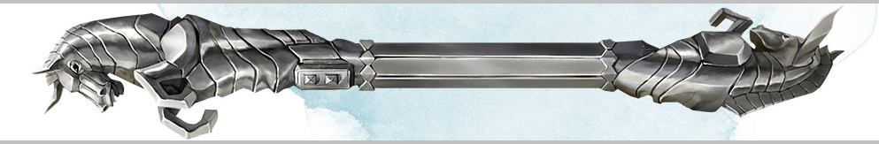
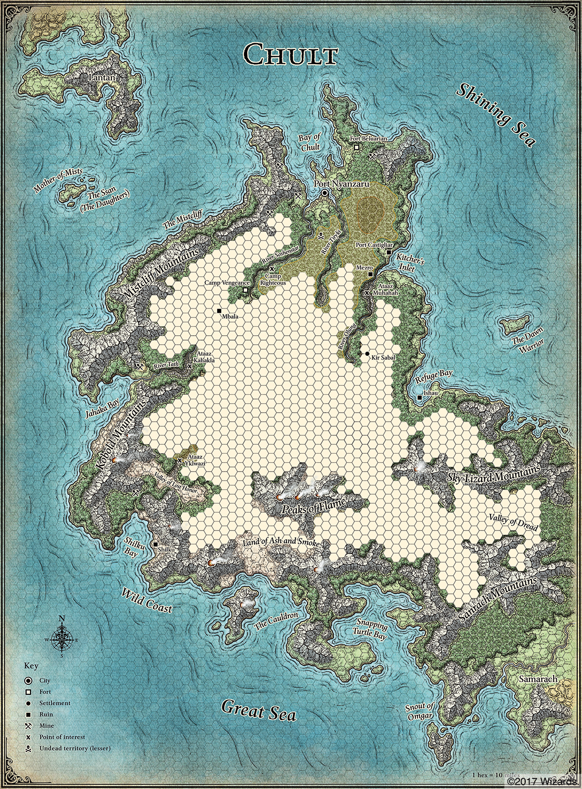
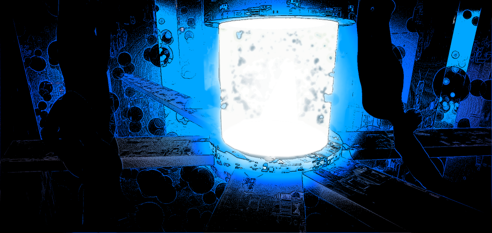

###### top

##### Tomb of Annihilation

# Travelling through the jungles of Chult

[Summary of these jungle travel rules](summary_of_travel_rules.md#top)

## Step 1: Weather
Each day roll a d20:

| Roll | Weather |
|-|-|
|**1-3**|Clear Skies|
|**4-15**|Light Rain|
|**16-19**|Heavy Rain|
|**20**|Tropical Storm|

#### Light Rain
- 1 mile max vision radius.

#### Heavy Rain

- 200 ft (40 squares) max vision radius.
- Missile weapon ranges are halved.
- All creatures get disadvantage on Wisdom (Perception) ability checks relying on sight or sound.
- Everything is lightly obscured.
- Open flames are extinguished.

#### Tropical Storms

- All the effects of heavy rain.
- Disadvantage on Wisdom checks to avoid getting lost.
- Canoes and ships can't safely travel.
- If the party doesn't take shelter during a tropical storm, each character gains a level of exhaustion and must pass an easy [DC 10] **Constitution** saving throw or else immediately gain another level of exhaustion.

## Step 2: Choose Direction and Pace
1 hex on the map of Chult = 10 miles or 15 kilometers

### Moderate Pace
- 1 hex per day on land or walking along rivers.
- 2 hexes per day with a canoe on a river, lake, or shore. A canoe costs 50 gold coin in Port Nyanzaru and carries six characters.
- 10 hexes per day as a passenger on a sailing ship. Passage can be bought for 10 gold coin per day per passenger, with fast pace costing double.

### Fast Pace
- 50% chance each day of moving one additional hex, resulting in moving 2 hexes if walking or 3 if in a canoe.
  - On a sailing ship fast pace instead adds 1d8 hexes of movement every day.
- All characters take a -5 penalty to their passive Wisdom (Perception) check.
- -5 penalty on Constitution saving throws caused by running low on water.
- -5 penalty on Wisdom checks to navigate and avoid getting lost.

### Slow Pace
- 50% chance each day of moving one fewer hex, resulting in no movement if walking or one hex of movement if in a canoe.
  - On a sailing ship slow pace instead subtracts 1d6 hexes of movement every day.
- Can try to surprise or sneak past random encounters.
- +5 bonus on Wisdom checks to navigate and avoid getting lost.

## Step 3: Navigate
If the party is entering or leaving a **not-yet-mapped** hex, one character must make a **Wisdom** (Survival) ability check. One other character may assist to provide advantage, but only if they are proficient in Survival. If the Wisdom check fails then the party is **lost in the jungles of Chult**, and moves in a random direction instead of the intended one.

- **easy** [DC 10] for coasts and lakes
- **moderate** [DC 15] for jungles, mountains, plateaus, rivers, swamps, and wastelands

Take a -5 penalty to the Wisdom check if the party is moving at a fast pace, or a +5 bonus to the check if the party is moving at a slow pace.

## Step 4: Random encounters
See the [rules for random encounters](rules_for_random_encounters.md#top).

Random encounters will not be scaled or modified for your level. My intention is that random encounters should rarely result in combat.

## Step 5: Survive

### Exhaustion

A variety of dangers in Chult can give characters levels of **exhaustion**. Characters can accumulate multiple levels of exhaustion, and those with the condition suffer cumulative penalties with each new level:

1. Disadvantage on ability checks
2. Speed halved
3. Disadvantage on attack rolls and saving throws
4. Hit point maximum halved
5. Speed reduced to 0
6. Death

### Dehydration
You need 2 gallons of water per day in Chult, or you will gain a level of exhaustion at the end of the day. If you already have levels of exhaustion, you will instead gain two levels of exhaustion.

If you drink only 1 gallon of water per day, you can make a moderate [DC 15] **Constitution** saving throw to avoid gaining levels of exhaustion. You have disadvantage on this saving throw if you are wearing medium armor, heavy armor, or heavy clothing, and you take a -5 penalty to this saving throw if the party is moving at a fast pace.

### Starvation
You need 1 lb of food per day. You can go without food for a number of days equal to 3 + your **Constitution** modifier. After that you will gain a level of exhaustion at the end of every day.

You can eat only half rations to stretch supplies; this counts as half a day without food.

### Recovery
A long rest (8 hours) after getting a full day's worth of food and water will remove one level of exhaustion.

## Bonus: Foraging

Up to two characters who are not navigating today but are proficient in Survival may forage. Each character rolls a **Wisdom** (Survival or Nature) ability check and compares against the DC to see if anything is found. For each successful forage check the party gains **1d6 + character's Wisdom modifier** in either pounds of food or gallons of potable water.

- **easy** [DC 10] in coasts, jungles, and rivers
- **moderate** [DC 15] in mountains, plateaus, swamps, and lakes
- **hard** [DC 20] in wastelands
- **+5 DC** in black skull-and-crossbones zones
- **+10 DC** in red skull-and-crossbones zones
- disadvantage on the Wisdom check if today's weather is **heavy rain or a tropical storm**

Take a -5 penalty to the Wisdom check if the party is moving at a fast pace, or a +5 bonus to the check if the party is moving at a slow pace.

### Foraging Plants
A character may choose one or more of the useful Chultan plants listed in the [items available for purchase in Port Nyanzaru](list_of_items_available_for_purchase_in_Port_Nyanzaru.md#chultan-plants) under Jessamine, and attempt to find those plants instead of food and water. On a successful forage check the character finds **1d6 + their Wisdom modifier** uses of one random plant from the types they chose to look for that day.

### Rain Catchers
A rain catcher can be purchased in Port Nyanzaru for 1 gold coin. When set up overnight it will collect **1d3 gallons of potable water** in light rain, or **1d6+2 gallons** in heavy rain. If the rain catcher is left stationary throughout the day it can collect the same amount again, holding a maximum of 8 gallons at any one time.

During a tropical storm the rain catcher can collect the equivalent of heavy rain, but a character must remain with it and pass a moderate [DC 15] **Wisdom** (Survival) check every 12 hours or the rain catcher will be destroyed. The character maintaining the rain catcher must pass an easy [DC 10] **Constitution** saving throw once per day or else suffer 1 level of exhaustion.

## Bonus: Diseases

### Shivering Sickness

> _**Not In Play:** I won't force you to buy and track insect repellant. You might still get Shivering Sickness from monsters._

At the end of a long rest, if you didn't apply **insect repellent** since the prior long rest, you must make a DC 11 **Constitution** saving throw or begin exhibiting the symptoms of shivering sickness 2d6 hours later. At the end of each long rest, you may repeat the saving throw and recover from the sickness if you succeed.

While sick you have disadvantage on ability checks and attack rolls. You also **only recover half the normal hit points when spending hit dice**, and **no hit points from taking a long rest**.

### Throat Leeches

If you drink **tainted water** you must make a DC 12 **Constitution** saving throw or contract throat leeches. 1d6 hours later you will gain a level of exhaustion that can't be removed until you are cured of the leeches.

At the end of each long rest, you must repeat the saving throw. On a failure, gain one level of exhaustion, but on a successful save instead remove one level of exhaustion. When a successful saving throw removes your last level of exhaustion you recover from the throat leeches.

[Back to top](#top)

[Summary of these jungle travel rules](summary_of_travel_rules.md#top)

[Tomb of Annihilation homepage](README.md#top)

