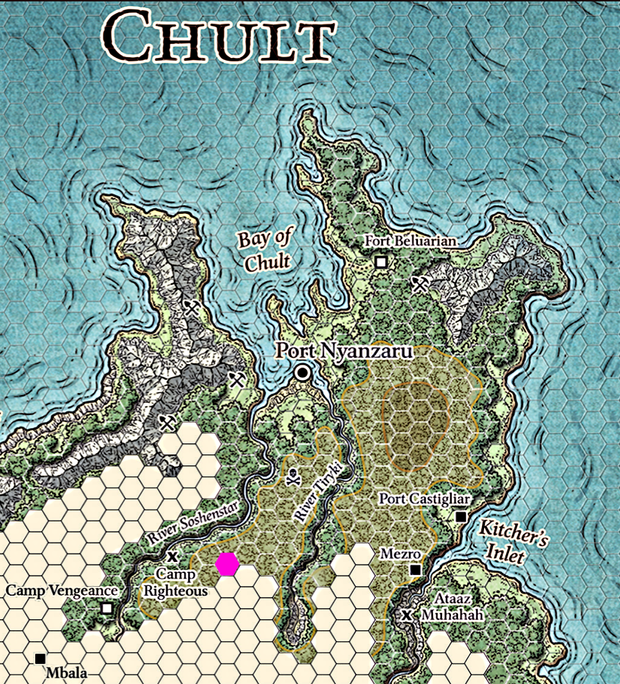
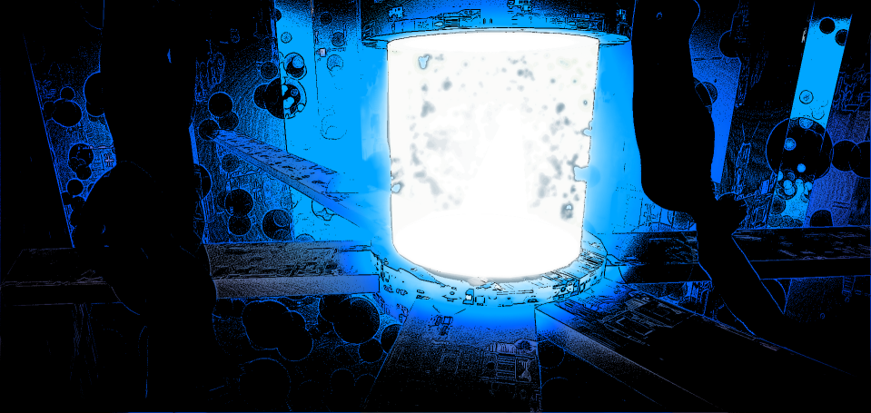

###### top

##### Tomb of Annihilation

# Scenario

The scenario I'll be running, either for a one-shot or as the first session of a new campaign, is based on `DDAL07-04`: [A Walk in the Park](http://dndadventurersleague.org/storyline-seasons/tomb-of-annihilation/tomb-of-annihilation-adventures/), but I've re-arranged the adventure to run backwards, beginning in the dungeon and ending with activities in town:
- Having completed their initial investigations into the _Soulmonger_ in Port Nyanzaru, the party learned of a band of rogues that had set up camp deep in the jungle and stumbled upon something related to the undead hordes that occupy most of Chult. For their first shakedown run into the jungle, the party decided to investigate the camp.
- After a tenday's travel walking up the river Soshenstar, the party arrived at their destination deep in the Chultan jungle.
- **The session will begin** with the party approaching the camp.
- After completing their objectives there, the party must navigate and hack their way through the jungle to get back home to Port Nyanzaru:
  - Normally I say the party can only become lost in hexes that aren't yet mapped, and therefore would be able to get back to Port Nyanzaru without issue, however for this first session we'll run through the getting-lost rules in the mapped jungle.
  - It should take about 10-15 days/ability checks.
- Once they get back to the city, the party will inform Syndra Silvane of whatever they found, and learn some more about the _Death Curse_.
- Finally, the party will have a chance to [have some fun in Port Nyanzaru itself](Port_Nyanzaru_activities.md#top), which **will conclude the session**.

The session is Tier 1, and will be appropriate for characters from level 1 up to level 4.

I'm looking forward to being your DM, and I hope you're looking forward to your adventures in the jungles of Chult, in **_Tomb of Annihilation_**!

---

# Further reading

[Adventure Introduction](introduction.md#top)

[Activities in Port Nyanzaru](Port_Nyanzaru_activities.md#top)

[Character creation](character_creation.md#top)

[My Tomb of Annihilation homepage](README.md#top)

---

_do not neglect the Soulmonger. its Curse will come for you as well_

[back to top](#top)

