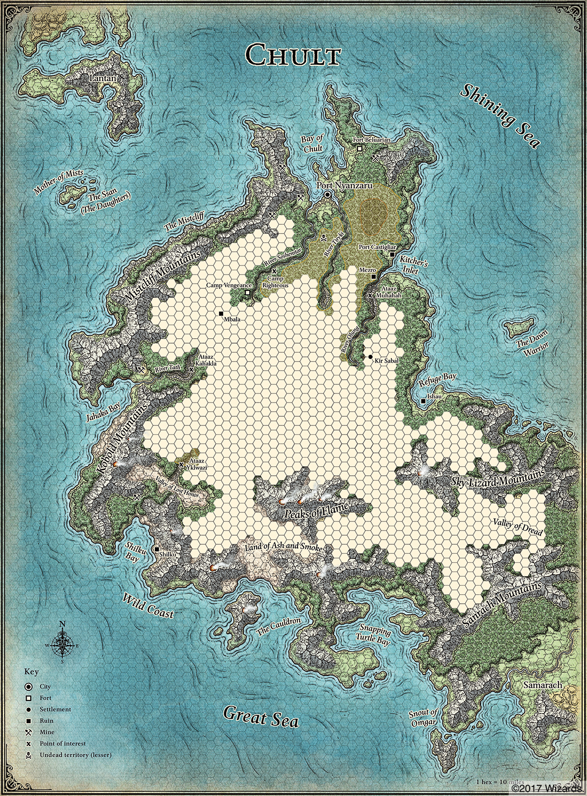

###### top

##### Tomb of Annihilation
# Rules for travelling across Chult

[Full rules for travelling in the jungle](travelling_full.md#top)

# The Travel Loop

For each day of travelling do the following:

1. **Weather**
   1. The day's weather is rolled on a d20.
1. **Dawn**
   1. Characters have completed their long rest, and may now recover health and/or level up. The long rest is successful even if there was a random encounter, unless the party completely broke camp in the night.
3. **Morning**
   1. Characters may do a [final round of chores](camping_activities.md#morning-activities) around the camp to improve the final Camp Goodness score, or do a [final short rest activity](short_rest_activities.md#top) before starting the day.
   2. Generally, each character's chore or activity is resolved by rolling a single ability check.
4. **Hit the road!**
   1. Calculate the final Camp Goodness score, and roll for a bonus on the [_Camp Bonuses Payouts_ table](random_camping_bonus_payouts.md#top) based on how successfully the party rested over the duration they were camping.
5. **Choose Direction and Pace**
    1. The party chooses one of the six compass directions to head in, and whether they're moving at a _**fast**_, _**moderate**_, or _**slow pace**_.
6. **Morning Travel**
   1. **Navigate**
       1. If the party is entering or leaving a not-yet-mapped hex, one character must attempt a **Wisdom** (Survival) ability check.
       2. One other character may provide advantage if they are proficient in Survival.
       3. If the check fails, the party becomes lost and moves in a random direction.
   2. **Random Encounters**
       1. Roll two Random Encounter Checks (d20s) for the day: one for the morning and one for the afternoon.
       2. If the face on the die is equal or lower to the _Random Encounter Number_ (which is **_5_**), the DM will describe a random encounter.
7. **Lunch**
   1. The party usually takes a [short rest](short_rests.md#top).
   2. If the party skips their short rest, increase their Random Encounter Armor Class for the afternoon random encounter by 1d4, up to a maximum of 20.
8. **Afternoon Travel**
   1. Repeat the morning steps of navigating and checking for a random encounter.
9. **Search for a campsite**
   1. One character and one optional assistant must roll a **Wisdom** (_Survival_) ability check to find a campsite and establish its initial Camp Goodness.
   1. The party may make further searches if they are unhappy with the first site. They may make their final decision from among any of the campsites found that day, regardless of the order they were found.
10. **Evening**
    1. Characters may [choose to do camping chores](camping_activities.md#evening-activities) to improve the Camp Goodness score, or they may do any [short rest activity](short_rest_activities.md#short-rest-activities) for buffs or healing.
    1. Generally, each character's chore or activity is resolved by rolling a single ability check.
11. **Supper**:
    1. Each character consumes 2 gallons of water and 1 lb of food every day.
    1. If either runs out you will begin to suffer the extremely fun condition _**exhaustion**_, which will rapidly kill you.
12. **The Night Watch**
    1. A single Random Encounter Check is rolled for the night.
    1. If something is encountered, one random character from the party is selected be on watch at the time the encounter happens. Other characters might be awake as well.
    1. **The Alarm:** Any characters awake and watching the perimeter make a **Wisdom** (_Perception_) ability check to detect the encounter. Their result will determine which members of the party are _surprised_ if combat starts.
    1. **The Random Encounter** will be described by the DM.
13. Restart the loop.

## Step 5: Survive

### Exhaustion

A variety of dangers in Chult can give characters levels of **exhaustion**. Characters can accumulate multiple levels of exhaustion, and those with the condition suffer cumulative penalties with each new level:

1. Disadvantage on ability checks
2. Speed halved
3. Disadvantage on attack rolls and saving throws
4. Hit point maximum halved
5. Speed reduced to 0
6. Death

### Dehydration
You need 2 gallons of water per day in Chult, or you will gain a level of exhaustion at the end of the day. If you already have levels of exhaustion, you will instead gain two levels of exhaustion.

If you drink only 1 gallon of water per day, you can make a moderate [DC 15] **Constitution** saving throw to avoid gaining levels of exhaustion. You have disadvantage on this saving throw if you are wearing medium armor, heavy armor, or heavy clothing, and you take a -5 penalty to this saving throw if the party is moving at a fast pace.

### Starvation
You need 1 lb of food per day. You can go without food for a number of days equal to 3 + your **Constitution** modifier. After that you will gain a level of exhaustion at the end of every day.

You can eat only half rations to stretch supplies; this counts as half a day without food.

### Recovery
A long rest (8 hours) after getting a full day's worth of food and water will remove one level of exhaustion.

## Bonus: Foraging

Up to two characters who are not navigating today but are proficient in Survival may forage. Each character rolls a **Wisdom** (Survival or Nature) ability check and compares against the DC to see if anything is found. For each successful forage check the party gains **1d6 + character's Wisdom modifier** in either pounds of food or gallons of potable water.

- **easy** [DC 10] in coasts, jungles, and rivers
- **moderate** [DC 15] in mountains, plateaus, swamps, and lakes
- **hard** [DC 20] in wastelands
- **+5 DC** in black skull-and-crossbones zones
- **+10 DC** in red skull-and-crossbones zones
- disadvantage on the Wisdom check if today's weather is **heavy rain or a tropical storm**

Take a -5 penalty to the Wisdom check if the party is moving at a fast pace, or a +5 bonus to the check if the party is moving at a slow pace.

### Foraging Plants
A character may choose one or more of the useful Chultan plants listed in the [items available for purchase in Port Nyanzaru](Port_Nyanzaru_items.md#chultan-plants) under Jessamine, and attempt to find those plants instead of food and water. On a successful forage check the character finds **1d6 + their Wisdom modifier** uses of one random plant from the types they chose to look for that day.

### Rain Catchers
A rain catcher can be purchased in Port Nyanzaru for 1 gold coin. When set up overnight it will collect **1d3 gallons of potable water** in light rain, or **1d6+2 gallons** in heavy rain. If the rain catcher is left stationary throughout the day it can collect the same amount again, holding a maximum of 8 gallons at any one time.

During a tropical storm the rain catcher can collect the equivalent of heavy rain, but a character must remain with it and pass a moderate [DC 15] **Wisdom** (Survival) check every 12 hours or the rain catcher will be destroyed. The character maintaining the rain catcher must pass an easy [DC 10] **Constitution** saving throw once per day or else suffer 1 level of exhaustion.

[Back to top](#top)

[Full rules for travelling in the jungle](travelling_full.md#top)

[Tomb of Annihilation homepage](README.md#top)

