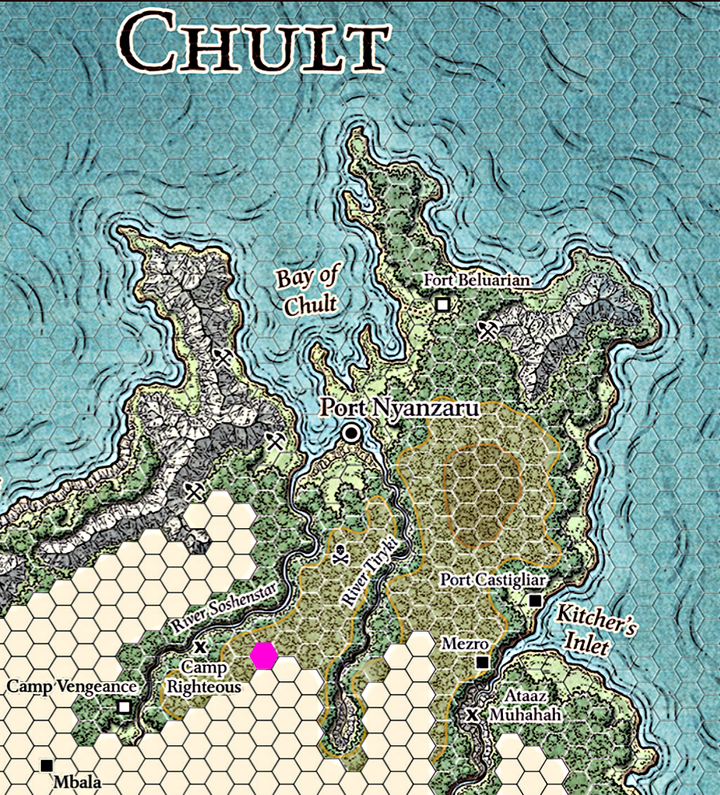

###### top

##### Tomb of Annihilation
# Rules for travelling across Chult

_Sample from the Chult hex map._

---

# The Travel Loop

For each day of travelling do the following:

|Step|Description|
|-|-|
|1. Dawn|The party's long rest is complete, and characters may heal or level up.|
|2. Weather|A plain d20 determine's [the day's weather](#weather).|
|3. Travel|The party chooses whether they're moving at a [slow, moderate, or fast pace](#paces). Each character may choose to do one [travel activity](#travel-activities) by rolling an ability check.|
|4. Random Encounter|A d20 is rolled, and if it's equal to or greater than the party's [Random Encounter Armor Class](/5e/random_encounters.md#random-encounter-checks) (which is usually `16`) the DM will describe a random encounter.|
|6B. Forced March|If the party is unhappy with the distance they ended up travelling today, they may choose to move up to 4 additional hexes, but each party member must make a [CON saving throw](#6b-forced-march) or else suffer a level of _exhaustion_.|
|5. Choose a campsite|The party moves on the Chult hex map. Party members will make WIS (_Survival_ or _Camping_) [ability checks to locate campsites](#travel-activities), and the party will select one.|
|6. Evening activities|Unless the party force-marched, each member of the party may choose to do an [evening activity](#evening) by rolling a single ability check.|
|7. Supper|Each character must consume 2 pounds of food and 2 gallons of water or suffer [_exhaustion_](#exhaustion).|
|8. Night Watch|New weather is rolled, and a new [Random Encounter Check](/5e/random_encounters.md#random-encounter-checks) is made. If a random encounter occurs then a single member of the party is selected at random to be awake and on watch. They must make a WIS (_Perception_) check to determine which members of the party are _surprised_ in combat.|

### Step 1
# Dawn
Characters have completed their [long rest](long_rests.md#top), and may now recover health and/or level up.

The long rest is successful even if there was a random encounter, unless the party completely broke camp in the night.

### Step 2
# Weather
The day's weather is rolled on a d20:

| Roll | Weather |[Rain Catcher](#rain-catchers) |Max Ground Vision|Max Flying Vision|Flying bonus to checks|
|-|-|-|-|-|-|
|**1-5**|Clear Skies|-|1 hex|4 hexes|+6|
|**6-10**|Light Rain|1d3 gallons|1/2 hex|2 hexes|+4|
|**11-15**|Moderate Rain|1d4+1 gallons|1/10 hex|1 hex|+2|
|**16-19**|Heavy Rain|1d6+2 gallons|40 squares|1/2 hex|-|
|**20**|Tropical Storm|\*|40 squares|-|-|

#### Heavy Rain

- All creatures get disadvantage on WIS (Perception) ability checks relying on sight or sound.
- Everything is lightly obscured.
- Missile weapon ranges are halved.
- Open flames are extinguished.

#### Tropical Storms

- All the effects of heavy rain.
- Disadvantage on WIS ability checks while travelling.
- Canoes and ships can't safely travel.
- If the party doesn't take shelter during a tropical storm, each character must pass a Moderate difficulty **CON** saving throw `DC 15` or else gain a level of exhaustion.

### Step 3
# Travel
The party chooses whether they're moving at a _**fast**_, _**moderate**_, or _**slow pace**_.

## Paces
|Pace|Walking|Canoeing|Sailing|Notes|
|-|-|-|-|-|
|Slow|1d4 hexes|2d4 hexes|2d8 hexes|Party members gain a +5 bonus on ability checks while travelling. The party can try to surprise or sneak past random encounters.|
|Moderate|1d6 hexes|2d6 hexes|2d10 hexes|-|
|Fast|2d4 hexes|2d8 hexes|2d12 hexes|Party members take a -5 penalty to travelling ability checks, and a -5 penalty on CON saving throws vs _exhaustion_.|

The party only gains bonuses for slow pace if they choose that pace. If an effect [such as encumbrance](pack_animals.md#top) limits the party to slow pace they don't gain bonuses, nor if they try to move at a swifter pace but are reduced to a slow pace later in the day.

> __Character Bonus:__ As part of the [Natural Explorer](http://5thsrd.org/character/classes/ranger/#natural-explorer) feature of __Rangers__, "travelling through difficult terrain doesn't slow your group's travel". Everywhere in Chult is difficult terrain, therefore:
> 
> If the party is travelling through the [favored terrain](character_creation.md#rangers) of one or more of their __Rangers__, the party may roll one extra die for the day's distance.

## Travel Activities
Each party member may opt to perform one of the following tasks by rolling an ability check. A maximum of two characters can work on the same task. If no-one performs a task and the party needs to roll a check, the party rolls a d20 with disadvantage and adds the highest proficiency bonus among party members, and no ability bonus.

|Task|Check|Proficiency|Effect|
|-|-|-|-|
|Search for Campsites|WIS|_Survival_ or _Camping_|Generates a campsite option at the end of the party's travelling day, with a starting Camp Goodness equal to half your check result.|
|Navigate|WIS or INT *|_Survival_, cartographer's tools, or navigator's tools|If the check fails the party becomes lost: they move only part of their intended movement, and then move 1d6 hexes in a random direction. Until the party succeeds on a subsequent Navigate check, each day after that the party moves in a random direction.|
|Watch for Enemies|WIS *|_Perception_|Determines at [what distance](/5e/random_encounters.md#encounter-distance) the party spots the day's random encounter, if any.|
|Cover Tracks|WIS|_Survival_|Increases the party's Random Encounter AC by 1 (Moderate) or 2 (Very Hard), to a maximum of 20. On a fumble, decrease the party's REAC by 1.|
|Follow Tracks|WIS|_Survival_|Difficulty varies based on what you're tracking.|
|Hunt or Forage|DEX, WIS, or INT|_Survival_ or _Nature_|The party gains [1d6 + your WIS modifier](#foraging-food-and-water) in either pounds of food or gallons of water.|
|Forage Medicine|WIS or INT|_Medicine_, _Nature_, or a herbalist's kit|Gain [1d6 + your WIS modifier](#foraging-medicines) in either healer's kit charges or one kind of [medicinal Chultan plant](chultan_plants.md#top).|
|Handle Animals|WIS *|_Animal Handling_|For [most animals](pack_animals.md#top): if you fail the check the party is limited to slow pace today.|
|Watch the Weather|WIS *|_Survival_ or _Sailing_|The DM prerolls the upcoming weather rolls and informs the party: 1 roll if you beat a Moderate difficulty, 2 rolls for a Hard difficulty, or 3 rolls if you beat Very Hard.|
|-|-|-|Any number of party members may each do one [short rest activity](short_rest_activities.md#top) or one [downtime activity](jungle_activities.md#top).|

\* If two characters work on this task then one of them is providing advantage to the other: they each make a check, and the higher of their two results is used.

> __Character Bonus:__ As part of the [Natural Explorer](http://5thsrd.org/character/classes/ranger/#natural-explorer) feature of __Rangers__, "Even when you are engaged with another activity while travelling, you remain alert to danger".
> 
> If the party is travelling through the [favored terrain](character_creation.md#rangers) of a ranger, the ranger may make an extra bonus roll to _Watch for Enemies_. The highest _Watch for Enemies_ check result among all rolls is used for the final result.
> 
> A ranger who focuses on _Watching for Enemies_ may make two rolls: their normal one plus their bonus one. Bonus rolls from rangers don't count against the two-character-per-task limit.

### Step 4
# Random Encounter
Roll a Random Encounter Check (plain d20) for the day. If the face on the die is equal or higher than the party's _Random Encounter Armor Class_ (which is normally `16` and has a maximum of 20), the DM will describe a random encounter.

Some travelling random encounters are resolved with [simplified rules](quick_random_encounters.md#top).

### Step 5
# Find a campsite
If the party is unhappy with the distance they travelled, they may now optionally [force themselves to go on](#6b-forced-march) to travel up to 4 additional hexes.

Party members who were _searching for campsites_ make their ability checks, and the DM will present one or more campsite options to the party, who will choose one.

### Step 6
# Evening Activities
Each party member may opt to perform one of the evening tasks by rolling an ability check, using the same rules as the morning tasks.

## 6B. Forced March
Instead of doing evening activities, the party may opt to continue travelling in the evening to cover more ground. They may move up to 4 extra hexes, but each party member must make a CON saving throw or suffer a level of exhaustion. The difficulty is 8 + 3 for each forced march hex (11, 14, 17, 20).

## Camping Activities
|Task|Check|Proficiency|Effect|
|-|-|-|-|
|Cook|WIS or INT *|_Camping_ and/or cook's tools|Camp Goodness is increased by your check result. You suffer disadvantage unless someone Keeps the Fire.|
|Keep the Fire|STR or WIS *|_Camping_|The Cook gets advantage tonight (Hard) or suffers disadvantage if you fumble (or if no-one keeps the fire). Camp Goodness is increased by half your check result.|
|Set Up Camp|STR or DEX|_Camping_|Camp Goodness is increased by half your check result.|
|Secure the Perimeter|WIS|_Survival_|Increases the party's Random Encounter AC for the night by 1 (Moderate) or 2 (Very Hard), to a maximum of 20. On a fumble, decrease the party's REAC by 1.|
|Night Watch|WIS or CON|_Perception_|If your check beats a Hard difficulty, you'll be awake and watching the perimeter this evening along with whoever is randomly selected to be on watch. Elves and Half-Elves get a respective +5 and +2 bonus on this check because Elves meditate instead of sleep.|
|Hunt or Forage|DEX, WIS, or INT|_Survival_ or _Nature_|The party gains 1d6 + your WIS modifier in either pounds of food or gallons of water.|
|Forage Medicine|WIS or INT|_Medicine_, _Nature_, or a herbalist's kit|Gain 1d6 + your WIS modifier in either healer's kit charges or one kind of [medicinal Chultan plant](chultan_plants.md#top).|
|Handle Animals|WIS *|_Animal Handling_|Depends upon the animal. Pack animals generally don't need to be handled in the evening.|
|Watch the Weather|WIS *|_Survival_ or _Sailing_|The DM prerolls the upcoming weather rolls and informs the party: 1 roll if you beat a Moderate difficulty, 2 rolls for a Hard difficulty, or 3 rolls if you beat Very Hard.|
|-|-|-|Any number of party members may each do one [short rest activity](short_rest_activities.md#top) or one [downtime activity](jungle_activities.md#top).|

\* If two characters work on this task then one of them is providing advantage to the other.

### Step 7
# Supper
Each character consumes 2 gallons of water and 2 pounds of food every day.

If either runs out you will begin to suffer the extremely fun condition [_exhaustion_](#exhaustion), which will rapidly kill you.

### Step 8
# The Night Watch
A single Random Encounter Check is rolled for the night. A separate Weather roll is made for the evening period.

If something is encountered, one random character from the party is selected to be awake and watching the perimeter at the time the encounter happens. Other characters might be awake as well.

**The Alarm:** Any characters awake and watching the perimeter make a **WIS** (_Perception_) ability check to detect the encounter. The highest check result will determine which members of the party are _surprised_ if combat starts.

> **Sleeping characters** generally begin _Prone_ and with their items and [armor](https://5thsrd.org/adventuring/equipment/armor/#getting-into-and-out-of-armor) not equipped. If on a battlemap all of a character's equipment will be in the same tile they start the combat in.
>
> If a sleeping character "must be shaken awake" they don't roll initiative until someone spends an _action_ to wake them up. Starting on the **third turn**, any character still sleeping rolls initiative with disadvantage, and at the start of each of their turns they may make a new WIS (Perception) check to try to wake up: if they succeed they may immediately take their full turn.

|Check Result|Difficulty|Status|Sleeping Characters|
|-|-|-|-|
|Below 5 or a Natural 1|Fumble|No alarm: awake characters are _Surprised_|Moderate WIS (Perception) check or you must be shaken awake, and you're _Surprised_ unless the check beats a Very Hard difficulty.|
|5|Very Easy|Late alarm|Easy WIS (Perception) check or must be shaken awake, and you're _Surprised_ unless the check beats a Hard difficulty.|
|10|Easy|Slow alarm|If you _fumble_ a WIS (Perception) check you must be shaken awake, and you're _Surprised_ unless the check beats a Moderate difficulty. |
|15|Moderate|Alarm|-|
|20|Hard|Early alarm|Your items are equipped, but [not your armor](https://5thsrd.org/adventuring/equipment/armor/#getting-into-and-out-of-armor).|
|25|Very Hard|Early warning|All your items and armor are equipped. Any player may reposition their character on the battle map before initiative is rolled.|
|30|Nearly Impossible|Saw them coming a long way off|The party can ambush the intruders, and if combat starts the other side is _surprised_ for the first turn.|

# Restart the Loop
The morning sun has [vanquished the horrible night](#step-1).

# Exhaustion

A variety of dangers in Chult can give characters levels of **exhaustion**. Characters can accumulate multiple levels of exhaustion, and those with the condition suffer cumulative penalties with each new level:

1. Disadvantage on ability checks
2. Speed halved
3. Disadvantage on attack rolls and saving throws
4. Hit point maximum halved
5. Speed reduced to 0
6. Death!

### Water Requirements
A character needs to drink 2 gallons of water per day in Chult, or they will gain a level of exhaustion at the end of the day. If they already have levels of exhaustion, they will instead gain two levels of exhaustion.

If a character drinks only 1 gallon of water per day, they can make a CON saving throw of moderate difficulty to avoid gaining levels of exhaustion. Characters wearing medium armor, heavy armor, or heavy clothing suffer disadvantage on this check, and characters take a -5 penalty to this saving throw if the party is moving at a fast pace.

A Faerûn gallon [weighs](pack_animals.md#top) 6.5 lbs, and a Chultan waterskin can hold a maximum of one gallon.

### Food Requirements
Every character eats 2 pounds of food per day. A character can go without food for a number of days equal to 3 + their **CON** modifier. After that they gain a level of exhaustion at the end of every day.

A character can eat only half rations to stretch supplies; this counts as half a day without food.

# Recovery
A long rest (8 hours) after getting a full day's worth of food and water will remove one level of exhaustion.

### Foraging Food and Water

Up to two characters who are not navigating today but are proficient in Survival may forage. Each character rolls an appropriate ability check and compares against the DC to see if anything is found. For each successful forage check the party gains **1d6 + character's WIS modifier** in either pounds of food or gallons of potable water.

- **easy** in coasts, jungles, and rivers
- **moderate** in mountains, plateaus, marshes, and lakes
- **hard** in wastelands and near volcanos
- **+5 DC** in black skull-and-crossbones zones
- **+10 DC** in red skull-and-crossbones zones
- -5 penalty to the WIS check if today's weather is **heavy rain or a tropical storm**

Take a -5 penalty to the WIS check if the party is moving at a fast pace, or a +5 bonus to the check if the party is moving at a slow pace.

### Foraging Medicines
A character may choose one or more [medicinal Chultan plants](chultan_plants.md#top), and attempt to find those plants instead of food and water. On a successful forage check the character finds **1d6 + their WIS modifier** uses of one random plant from the types they chose to look for that day.

In addition to Chultan plants, a character may also forage to recover charges in a healer's kit.

### Rain Catchers
A rain catcher can be purchased in Port Nyanzaru for 1 gold coin. When set up overnight it will collect the amount of rainwater specified in the [weather table](#weather). If the rain catcher is left stationary throughout the day it can collect the same amount again, holding a maximum of 8 gallons at any one time.

During a tropical storm the rain catcher can collect the equivalent of heavy rain, but a character must remain with it and pass a **WIS** (_Survival_) check of moderate difficulty every 12 hours or the rain catcher will be destroyed. The character maintaining the rain catcher must pass a **CON** saving throw of easy difficulty once every 24 hours or else suffer a level of exhaustion.

[Back to top](#top)

[Tomb of Annihilation homepage](README.md#top)

